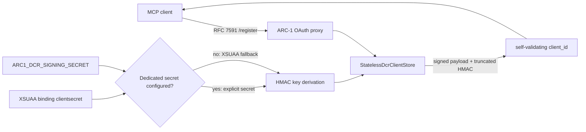
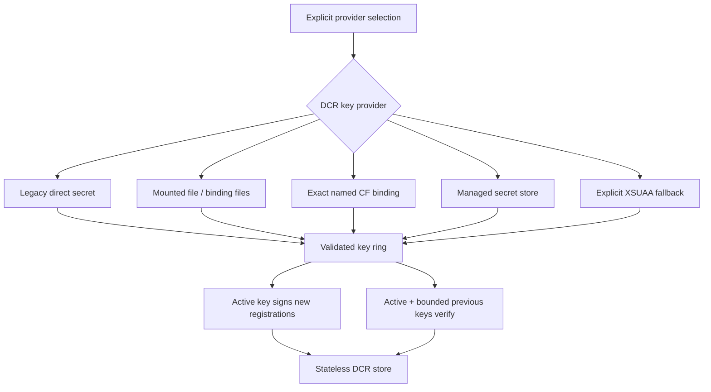

# Durable OAuth DCR signing-key lifecycle

**Status:** Research and architecture recommendation; no implementation selected yet

**Date:** 2026-07-31

**Roadmap:** [SEC-15](../../docs_page/roadmap.md#sec-15)

**Trigger:** [PR #607](https://github.com/arc-mcp/arc-1/pull/607), closed pending this broader design decision

**Detailed PR evidence:** [PR #607 deep review](pull-requests/607-dcr-signing-secret-from-bound-service.md)

## Executive conclusion

ARC-1 cannot simultaneously provide all four of these properties without putting durable state
somewhere outside the application process:

1. a signing key that survives application replacement and horizontal scale;
2. no administrator or infrastructure provisioning step;
3. no durable platform service, mounted secret, or registration database; and
4. intentional, recoverable rotation rather than accidental global revocation.

The key is the persistence mechanism in ARC-1's current stateless DCR design. Generating it inside a
new application instance is therefore not an out-of-the-box solution; it merely recreates the
original restart problem. Deriving it from a public, stable identifier makes it forgeable. Deriving
it from the XSUAA binding secret keeps setup simple but couples DCR continuity to the binding
lifecycle.

We recommend **not merging an implementation that merely scans `VCAP_SERVICES` for a conveniently
named field**. PR #607 is directionally useful because service bindings are the right delivery
channel on Cloud Foundry, but its generic first-match lookup does not define ownership, lifecycle,
rotation, ambiguity, recovery, or non-Cloud-Foundry behavior.

The recommended product direction is:

- define a platform-neutral DCR key-provider and key-ring contract first;
- support explicit secrets and mounted files for portable deployments;
- support an **exactly named** Cloud Foundry service binding, including file-based binding delivery,
  without scanning unrelated services;
- retain XSUAA derivation only as an explicitly observable compatibility fallback;
- make the normal BTP MTA path bind an existing, externally owned secret service first;
- evaluate an MTA-owned, generated user-provided service as an optional zero-touch profile only
  after the lifecycle experiments in this document pass; and
- add key identifiers plus a bounded previous-key window before advertising seamless rotation.

This is not the shortest patch. It is the smallest design that makes the trust anchor deterministic,
portable, testable, and operable.

## Decision requested

Before implementation, maintainers need to choose which product promise ARC-1 makes for its
packaged BTP deployment:

| Promise | Consequence |
|---|---|
| **Enterprise-owned key** | An admin or infrastructure pipeline provisions the key before deployment. ARC-1 gains clear ownership, backup, and recovery, but installation is not literally zero-touch. |
| **MTA-owned key** | The MTA deployer creates and retains a generated user-provided service. First deployment can be zero-touch, but uninstall/delete-services becomes key destruction and the deployer contract becomes part of ARC-1's security boundary. |
| **Managed secret service** | SAP Credential Store or another approved secret manager owns the key. Lifecycle and access control improve, but entitlement, binding rotation, network availability, and provider-specific code become installation dependencies. |
| **Stateful DCR registry** | A database stores client registrations. This removes the global signing-key-as-database design and enables per-client revocation, but adds a durable data service and migration/availability work. |

There is no universal default that is best for BTP MTA, Docker, npm/stdio, and arbitrary
on-premises operation. The implementation should therefore share one validation and rotation
contract while allowing deployment-specific providers.

## Scope and non-goals

This research covers the key used by ARC-1's OAuth proxy to:

- sign and validate stateless RFC 7591 DCR `client_id` values;
- deterministically derive confidential DCR client secrets; and
- sign short-lived OAuth callback state under a separate KDF label.

It does not change XSUAA access-token signing, SAP principal propagation, SAP authorization, MCP
scope policy, or ADT safety gates. It also does not claim that RFC 7591 requires stateless client
registration; [RFC 7591](https://www.rfc-editor.org/rfc/rfc7591) explicitly permits
deployment-specific registration behavior, and its appendix discusses both stateful and stateless
models.

## Evidence method and confidence

We inspected the current ARC-1 source, the published `@arc-mcp/xsuaa-auth@1.0.1` package, PR #607,
current Cloud Foundry and SAP documentation, and the current open-source Cloud Foundry MultiApps
controller implementation. We did not mutate a live BTP space as part of this documentation PR.

We use these labels throughout:

- **Observed** — confirmed in source or a primary platform contract.
- **Inferred** — follows from observed behavior but still needs a live lifecycle test.
- **Proposed** — a recommended ARC-1 design, not current behavior.

The most important remaining uncertainty is the full MTA lifecycle of an MTA-owned generated
user-provided service across all supported deployer versions and strategies. Source inspection is
strong evidence, but it is not a substitute for the experiment matrix below.

## Current architecture

### Observed request and key flow



**Observed:** `src/server/config.ts` resolves `--dcr-signing-secret` or
`ARC1_DCR_SIGNING_SECRET`. `src/server/http.ts` passes the result to
`createXsuaaOAuthProvider`. The published auth package trims a non-empty override and otherwise
uses `credentials.clientsecret`.

**Observed:** the DCR store embeds registration metadata—including redirect URIs—in the
`client_id`, signs it with HMAC-SHA256, truncates the signature to 128 bits, and derives a
confidential client's secret from the same derived key. Any process with the same effective key
can validate the registration without shared storage.

**Observed:** ARC-1 passes `arc1-dcr/v1` and a distinct OAuth-state KDF label. The raw source secret
is not used directly as the HMAC key, but both derived functions depend on its continuity.

**Observed:** ARC-1 defaults `ARC1_OAUTH_DCR_TTL_SECONDS` to `0`. A registration therefore remains
valid until the effective key or wire-format/KDF contract changes. There is no individual client
row to revoke.

### The signing key is the database

The phrase “stateless DCR” can hide an operational fact: the server still has durable state, but it
is concentrated in one symmetric trust anchor rather than many database rows.

```text
registration validity = valid token structure
                      ∧ valid HMAC under an accepted key
                      ∧ TTL policy
                      ∧ redirect/client metadata checks
```

Changing the only accepted key is equivalent to deleting the entire registration database. Losing
the key has the same availability effect. Disclosing it has a stronger integrity effect than
disclosing one registered client's credential.

### Consequence of key compromise

**Observed/inferred:** a party that obtains the signing key can construct a syntactically valid DCR
`client_id`, choose the embedded client metadata, and derive the corresponding confidential client
secret. Because redirect URI validation occurs during legitimate registration but later lookup
trusts the signed payload, a forged payload can bypass the registration-time decision unless the
authorization path independently re-applies the allowlist.

This does not by itself grant an SAP user identity or forge an XSUAA access token. An upstream user
authorization and ARC-1's normal token verification still apply. It does mean the key must be
treated as a security trust anchor, not merely a UX continuity value.

## Correcting the deployment premise

Several current comments and docs compress “deploy that recreates a binding” into “MTA deploy
recreates the binding.” That is too broad.

**Observed:** the current MultiApps controller's
[`DetermineApplicationServiceBindingActionsStep`](https://github.com/cloudfoundry/multiapps-controller/blob/3c9ddc16315608aa7c97930e5066219cf66651bb/multiapps-controller-process/src/main/java/org/cloudfoundry/multiapps/controller/process/steps/DetermineApplicationServiceBindingActionsStep.java)
keeps an existing application/service binding when it exists, binding parameters are unchanged,
and no explicit recreation is requested.

**Observed:** SAP documents XSUAA binding secrets as valid while the binding exists. A new binding or
service key receives its own secret. The former `instance-secret` model is not a future solution:
SAP states that new `instance-secret` bindings and service keys are unsupported from 2026-01-19.

Therefore:

- restart, restage, cell movement, and ordinary in-place application updates preserve DCR if the
  effective key source remains the same;
- an unchanged in-place MTA update does not inherently rotate an unchanged binding;
- explicit unbind/rebind, changed binding parameters, service/binding recreation, and some
  blue-green application replacement paths can create a new XSUAA binding secret; and
- a dedicated key must survive those boundaries if uninterrupted DCR continuity is the goal.

The implementation roadmap should include correcting the overbroad docs after live verification,
because operators need to know which event actually caused a global DCR revocation.

## Required invariants

Any selected design must satisfy all of these requirements.

### Security

1. The effective key is high-entropy secret material, never derived solely from public identifiers.
2. Secret values never appear in logs, config-show output, exceptions, audit events, PR artifacts,
   MTAR contents, or support bundles.
3. Provider selection is deterministic. ARC-1 never chooses the first service that happens to
   contain a matching credential field.
4. An explicitly configured provider fails closed when missing, ambiguous, malformed, empty, or
   too weak. It does not silently fall back to XSUAA.
5. New providers use a documented minimum strength. For generated material we target at least 128
   bits of actual entropy; string length alone is not an entropy measurement.
6. Different cryptographic purposes retain domain-separated derivation labels.
7. The selected source and non-secret key identifier are observable without exposing key material.

### Reliability and scale

8. Every concurrently serving ARC-1 instance accepts the same active and migration keys.
9. In-place deploy, restage, crash recovery, cell replacement, rollback, and scale-out have defined
   key behavior.
10. A provider outage after startup has a defined effect. If keys are loaded once, startup fails
    when unavailable; if providers are called per request, availability and latency budgets are
    explicit.
11. Backup and disaster-recovery behavior is documented. “Delete services” must not silently look
    like an ordinary upgrade when it destroys the only key copy.

### Rotation and migration

12. Routine upstream XSUAA credential rotation is independent from DCR rotation when a dedicated
    provider is selected.
13. Global DCR revocation is an intentional operation with a clear audit event and client-recovery
    procedure.
14. A rolling key change does not split instances between incompatible keys.
15. Existing `arc1-dcr/v1` registrations have an explicit migration outcome: retained during a
    grace window or deliberately revoked.
16. Downgrade/rollback behavior is defined before a new client-id wire format is enabled.

### Portability and compatibility

17. Docker/npm deployments are not forced to emulate `VCAP_SERVICES`.
18. Cloud Foundry support accounts for all documented credential delivery modes:
    `VCAP_SERVICES`, `VCAP_SERVICES_FILE_PATH`, and `SERVICE_BINDING_ROOT`.
19. Existing explicit-secret users retain a supported migration path.
20. XSUAA fallback remains available for compatibility unless a separate breaking change removes
    it, but the active fallback must be visible to operators.

## Evaluation of the available strategies

### Option A — keep the XSUAA binding-secret fallback

**Mechanism:** derive the DCR key from `credentials.clientsecret`, as ARC-1 does when no dedicated
secret is configured.

**Benefits:** no additional service, no setup, no new parser, and a fresh binding automatically
revokes all DCR clients.

**Costs:** DCR identity is coupled to an upstream machine credential with a different lifecycle.
Blue-green replacement or deliberate XSUAA rebind can become an unexpected user-facing
`invalid_client` event. It also cannot provide an overlap window because only the current binding
secret is available to a new process.

**Conclusion:** acceptable compatibility fallback, not the recommended durable production source.

### Option B — keep `cf set-env ARC1_DCR_SIGNING_SECRET`

**Mechanism:** an administrator generates a value once and stores it as an application environment
variable.

**Benefits:** simple, portable at the application level, already implemented, and independent of
the XSUAA binding.

**Costs:** post-deployment manual work is easy to miss; recovery depends on an out-of-band copy;
and Cloud Foundry explicitly warns against user-provided environment variables for credentials
because they may appear in CLI output and Cloud Controller logs. Cloud Foundry recommends service
bindings for secret delivery instead.

**Conclusion:** retain for backward compatibility and emergency override, but stop presenting it as
the ideal BTP installation path.

### Option C — externally owned, exactly named user-provided service

**Mechanism:** an operator or IaC pipeline creates a user-provided service (UPS) containing the DCR
key. The MTA refers to it as an existing service and binds it to ARC-1. ARC-1 selects the binding by
an explicit configured name and exact credential key.

**Benefits:** uses Cloud Foundry's intended secret-delivery path; decouples key lifetime from the
application and XSUAA; works with independently managed backup/rotation; and can be provisioned by
Terraform or another customer-standard secret process.

**Costs:** it moves the required step before deployment rather than eliminating it. The UPS value
still needs an owner, secure creation path, backup policy, and rotation procedure. A plain UPS is a
delivery container, not a full secret manager.

**Conclusion:** recommended first BTP production profile because its lifecycle is explicit and its
failure modes are understandable. It should be described honestly as pre-provisioned, not
zero-touch.

### Option D — MTA-owned generated user-provided service

**Mechanism:** declare an `org.cloudfoundry.user-provided-service` resource in `mta.yaml`, generate
credentials from deployer system parameters, bind it to the application, and configure
`skip-service-updates.parameters: true` so later deployments retain the originally created UPS
credentials.

**Observed:** SAP's MTA parameter contract exposes 16-character `generated-user` and
`generated-password` values. The current MultiApps controller uses `SecureRandom` in
[`CredentialsGenerator`](https://github.com/cloudfoundry/multiapps-controller/blob/3c9ddc16315608aa7c97930e5066219cf66651bb/multiapps-controller-core/src/main/java/org/cloudfoundry/multiapps/controller/core/helpers/CredentialsGenerator.java)
and generates both values independently in
[`SystemParameters`](https://github.com/cloudfoundry/multiapps-controller/blob/3c9ddc16315608aa7c97930e5066219cf66651bb/multiapps-controller-core/src/main/java/org/cloudfoundry/multiapps/controller/core/helpers/SystemParameters.java).
The service action step skips credential updates when
[`skip-service-updates`](https://github.com/cloudfoundry/multiapps-controller/blob/3c9ddc16315608aa7c97930e5066219cf66651bb/multiapps-controller-process/src/main/java/org/cloudfoundry/multiapps/controller/process/steps/DetermineServiceCreateUpdateServiceActionsStep.java)
is set.

**Potential benefit:** this is the only plausible bundled BTP profile that can be zero-touch on the
first deployment while retaining the same key on ordinary subsequent deployments. A blue-green
replacement can bind the new application to the same UPS instead of receiving a new DCR key.

**Risks and unresolved points:**

- one 16-character generated value has roughly 99 bits of entropy with the current 72-character
  source alphabet, below the 112-bit floor cited by the auth package and below ARC-1's documented
  32-byte recommendation;
- combining the independently generated user and password could exceed the target, but using a
  “generated user” as half of a cryptographic seed is an implementation convention that must be
  verified across supported deployer versions;
- `skip-service-updates` deliberately ignores later descriptor credential changes, which can
  surprise operators during repair or migration;
- MTA undeploy with service deletion destroys the trust anchor; a reinstall then revokes every
  cached client unless the key was exported, which weakens the zero-touch story;
- ownership is ambiguous when a customer later wants to move the key into a corporate secret
  manager; and
- the descriptor, deploy logs, `cf env`, blue-green strategy, rollback, and old MultiApps versions
  all require live verification.

**Conclusion:** promising optional convenience profile, but not ready to be called the best
strategy. Gate it on the experiment matrix and a documented recovery/export story. Do not use a
single 16-character generated value as the final design.

### Option E — SAP Credential Store or another managed secret manager

**Mechanism:** bind a managed secret service, authenticate ARC-1 to its API, and retrieve the DCR
key at startup. The secret persists independently from application and XSUAA binding replacement.

**Benefits:** central lifecycle, namespace permissions, controlled retrieval, audit/operations
features, and a natural place for multiple key versions. SAP Credential Store supports passwords,
keys, and keyrings through a REST API and offers free and standard plans.

**Costs:** it adds entitlement and provider-specific setup. SAP documents one Credential Store
instance per space and default new-binding validity of 60 days. The binding credential used to
retrieve the durable DCR key therefore has its own renewal lifecycle. Startup also depends on a
network service unless keys are cached in another durable location. Requiring this service would
reduce ARC-1 portability.

**Conclusion:** strong enterprise option and a good fit for key rings, but should be an optional
provider rather than the universal baseline.

### Option F — mounted secret file or platform-native secret

**Mechanism:** load the key or key ring from a read-only file mounted by Docker, Kubernetes, a
systemd credential, or Cloud Foundry file-based service binding delivery.

**Benefits:** portable provider contract, no value in CLI flags, compatible with established
orchestrator secret mechanisms, and easy to make startup fail closed.

**Costs:** the orchestrator still needs to provision and rotate the file. Atomic replacement and
rolling instance behavior require a documented reload model. A local file baked into an image or
stored only on an ephemeral filesystem is not durable and must be rejected.

**Conclusion:** recommended generic deployment provider. It complements rather than replaces the
named Cloud Foundry binding.

### Option G — replace stateless DCR with a persistent registration store

**Mechanism:** store each registered client's metadata and credential material in a shared database
or cache with durable persistence.

**Benefits:** per-client revocation, metadata updates, explicit lifecycle records, smaller opaque
client IDs, and no global symmetric key serving as the entire registry. RFC 7592-style management
becomes possible.

**Costs:** a shared database is mandatory for multi-instance operation; availability, schema
migrations, backup, privacy, cleanup, rate control, and disaster recovery all become product
concerns. SQLite is not a general multi-instance solution. A database still has encryption and
authentication secrets, so it changes rather than eliminates secret management.

**Conclusion:** strategically valid if per-client revocation becomes a product requirement. It is
too large to use solely to avoid one deployment secret.

### Option H — disable DCR or pre-register clients

**Mechanism:** use the permanent XSUAA client or manually configured OAuth clients instead of open
dynamic registration.

**Benefits:** no ARC-1 DCR signing key and fewer moving parts. This already aligns with some
Copilot Studio manual configurations.

**Costs:** poor multi-client ergonomics, redirect-URI administration, less vendor-neutral discovery,
and potentially broad shared client configuration. It does not meet ARC-1's general MCP client
experience.

**Conclusion:** supported escape hatch for constrained enterprise environments, not a replacement
for DCR across the product.

### Rejected shortcuts

| Shortcut | Why it is not acceptable |
|---|---|
| Derive from app URL, XSUAA client ID, service GUID, tenant ID, or another public stable value | Anyone who knows the identifier can derive the signing key and forge registrations. |
| Generate on application startup and store on local disk | Breaks on process replacement, horizontal scale, and ephemeral filesystem loss. |
| Scan all `VCAP_SERVICES` entries and choose the first credential named `signing-secret` | Makes unrelated bindings eligible trust anchors and makes array order a security decision. This is the central PR #607 problem. |
| Reuse an XSUAA service key or obsolete `instance-secret` | Couples DCR to a privileged OAuth credential; new XSUAA instance-secret bindings/keys are no longer supported. |
| Put a literal key in `mta.yaml`, an `.mtaext`, the MTAR, or repository configuration | Leaks the trust anchor into artifacts, source history, CI, and deployment logs. |
| Use the deployer's disposable UPS feature | SAP documents it as a deployment-only encryption helper that is automatically deleted after that deployment; it cannot be a runtime trust anchor. |

## Decision matrix

Scores are relative: 5 is strongest or easiest. “Setup” scores zero-touch installation, not
long-term operability.

| Strategy | Security boundary | Continuity | Setup | Recovery | Portability | Per-client revoke | Added runtime dependency |
|---|---:|---:|---:|---:|---:|---:|---:|
| XSUAA fallback | 2 | 2 | 5 | 2 | 1 | 1 | 5 |
| `cf set-env` | 2 | 4 | 2 | 2 | 3 | 1 | 5 |
| Externally owned named UPS | 4 | 5 | 2 | 4 | 2 | 1 | 5 |
| MTA-owned generated UPS | 3 pending tests | 4 | 5 | 2 | 1 | 1 | 5 |
| Managed credential store | 5 | 5 | 2 | 5 | 2 | 1 or 4 with key ring | 2 |
| Mounted secret file | 4 | 5 | 3 | 4 | 5 | 1 or 4 with key ring | 5 |
| Stateful registration DB | 4 | 5 | 1 | 4 | 3 | 5 | 1 |
| DCR disabled/manual client | 4 | 5 | 1 | 4 | 2 | n/a | 5 |

The matrix shows why “best” depends on the deployment contract. The named binding and mounted file
are the best first implementation because they share deterministic behavior without forcing one
vendor service. The MTA-generated UPS is the best zero-touch candidate, not yet the best verified
production default.

## Proposed architecture

### Provider contract



**Proposed:** resolve one provider at startup into a non-secret descriptor and key ring:

```typescript
interface DcrSigningKey {
  id: string;       // non-secret, stable identifier
  material: Buffer; // never serialized or logged
}

interface DcrSigningKeyRing {
  source: 'explicit' | 'file' | 'service-binding' | 'credential-store' | 'xsuaa';
  active: DcrSigningKey;
  verify: DcrSigningKey[]; // active plus bounded previous keys
}
```

The exact type belongs in the `@arc-mcp/xsuaa-auth` boundary or a deliberately shared ARC-1 adapter,
not in UI/config output. ARC-1 should log only source kind, provider/binding name where safe, key ID,
and whether legacy fallback is active.

### Provider selection rules

**Proposed precedence:**

1. explicit CLI secret or legacy environment secret, while compatibility requires it;
2. explicitly selected file path;
3. explicitly selected service binding name and credential key;
4. explicitly selected managed provider;
5. XSUAA fallback only when no provider was selected.

The important distinction is between **not configured** and **configured but broken**:

- not configured may use the documented compatibility fallback;
- selected file missing, named binding absent, duplicate exact binding, malformed payload, blank
  credential, or invalid key ring must stop startup;
- blank explicit values should be treated consistently—either a configuration error or absent with
  a warning—before precedence is evaluated; and
- ARC-1 must never silently cross from a broken dedicated provider into XSUAA mode.

For Cloud Foundry, use an exact binding identity rather than a label-wide credential scan. The
resolver should consume Cloud Foundry's three credential-delivery shapes through one parser and
return structured ambiguity/errors. A fixed generic credential key such as `signing-secret` is
acceptable only after the binding itself is selected deterministically.

### Key identifiers and rolling rotation

Current `arc1-dcr/v1` IDs do not identify which source key signed them. A graceful key rotation
therefore requires trying a bounded list of keys, and a future wire format should carry a
non-secret `kid` so verification is deterministic.

**Proposed rotation sequence:**

1. deploy a key ring with old key `A` active;
2. publish ring `{ active: B, verify: [B, A] }` atomically to all instances;
3. wait at least the chosen migration/re-registration window while new clients receive `B` IDs;
4. remove `A`, producing intentional global revocation only for clients that never migrated; and
5. emit audited `dcr_key_activated` and `dcr_key_retired` events containing key IDs, never material.

The design must account for ARC-1's default infinite DCR TTL. With no natural expiry, a previous key
cannot be retained forever without defeating revocation. Operators need an explicit grace period or
a deliberate hard cut. A key ring improves rolling deployment safety; it does not make rotation
free. It also does not automatically migrate an already cached `A` registration: a client that still
has a valid ID has no reason to register again. Retiring `A` will still force those clients to
re-register unless ARC-1 adds an explicit re-registration/migration protocol. The overlap window
primarily prevents a split-key fleet during deployment.

### Secret loading and runtime availability

Prefer loading and validating the ring at startup, then retaining it only in process memory:

- registration and token flows do not gain a network hop;
- a secret-store outage does not break a healthy running process;
- a new or restarted process fails closed if it cannot load the same ring; and
- rotation takes effect through a controlled restart/reload operation.

If live reload is later added, it needs atomic snapshots and convergence checks. Watching a file or
polling a provider independently on each instance can create a split-key fleet and should not be
the initial implementation.

## Recommended deployment profiles

### BTP production profile

1. Customer IaC or a protected bootstrap step creates a dedicated UPS or approved managed-secret
   entry before application deployment.
2. `mta.yaml` binds an **existing service by exact name**; the MTA does not own or delete the key.
3. ARC-1 selects the binding explicitly and fails startup if it is missing or malformed.
4. XSUAA binding credentials remain dedicated to XSUAA.
5. The customer backs up and rotates the key through its normal secret lifecycle.

This profile does not satisfy literal zero-touch installation, but it is the recommended enterprise
default because ownership and recovery are clear.

### BTP convenience profile, conditional

Offer an MTA-owned generated UPS only if all experiments pass and the generated material reaches the
required entropy. Treat this as an installer convenience profile with these explicit semantics:

- the MTA owns the key service;
- ordinary deploy and blue-green replacement retain it;
- `cf undeploy --delete-services`, manual service deletion, or cross-space reinstall destroys it;
- export/restore or client re-registration is required after destruction; and
- migration to an externally owned provider is documented before removing the MTA-owned service.

The profile must not depend on an undocumented first-match binding scan.

### Docker, npm, and self-hosted profile

Prefer a mounted read-only key-ring file supplied by Docker/Kubernetes/systemd secrets. Continue to
accept the direct environment variable for compatibility, but warn that a mounted provider is the
stronger production path. Never generate a supposedly durable key on an ephemeral container disk.

## Live experiment matrix required before implementation

Create an isolated CF space and record only key fingerprints/IDs, never secret values.

| Test | Procedure | Required result |
|---|---|---|
| E1 — first deploy | Deploy an MTA-owned UPS candidate | One service and one binding exist; all instances report the same non-secret key ID. |
| E2 — unchanged deploy | Redeploy identical MTAR in place | Service credentials, binding identity, and DCR key ID remain unchanged. |
| E3 — code-only update | Change application artifact only | Existing DCR ID remains valid. |
| E4 — blue-green | Deploy with supported blue-green strategy | Old and idle/new apps accept the same existing DCR ID before route switch. |
| E5 — scale | Scale to at least two instances | Registrations minted on one instance validate through another. |
| E6 — XSUAA rebind | Recreate only the XSUAA binding | Dedicated-provider DCR ID remains valid; upstream OAuth behavior is recorded separately. |
| E7 — binding parameter change | Change dedicated binding parameters | Deployment either retains the key or fails with an explicit planned migration; no silent rotation. |
| E8 — UPS descriptor update | Change generated config with skip-updates enabled | Existing service key remains unchanged and deploy logs clearly state the skipped update. |
| E9 — rollback | Deploy new app version, then previous MTAR | Key ID and existing DCR ID remain valid. |
| E10 — service deletion | Undeploy with and without service deletion | Without deletion the key survives; with deletion the destructive DCR effect is documented and confirmed. |
| E11 — malformed/ambiguous source | Bind duplicates, blank key, wrong type, and malformed JSON | Explicit provider stops startup with a non-secret diagnostic; no XSUAA fallback. |
| E12 — delivery modes | Repeat binding resolution with VCAP env and file-based delivery | Exact same source and key ID resolve under each supported Cloud Foundry delivery mode. |
| E13 — mixed versions | Run old and new ARC-1/auth-package versions during rolling update | Supported IDs work on both sides or deployment is explicitly non-rolling. |
| E14 — key-ring rotation | Activate B while retaining A, then retire A | A and B work during grace; only B works after retirement; events expose IDs only. |

Also run a deployer-version matrix covering the minimum documented MultiApps plugin and the current
version. The generated-UPS profile is unsupported until its minimum version is pinned.

## Implementation roadmap

### Phase 0 — settle the contract and correct documentation

- Accept the provider/key-ring decision and select the supported BTP profiles.
- Run E1–E14 and preserve sanitized evidence.
- Correct claims that every MTA deployment recreates the XSUAA binding.
- Define whether uninstall means DCR-key destruction and how backup/restore works.
- Decide whether infinite DCR TTL remains the production default once graceful rotation exists.

### Phase 1 — deterministic provider abstraction

- Add provider configuration with explicit selectors.
- Add exact named service-binding resolution for all CF credential delivery modes.
- Add mounted file/key-ring support.
- Normalize blank values before precedence and fail closed for broken selected providers.
- Safely expose source kind, key ID, legacy-fallback state, and validation status.
- Keep flag/env and XSUAA fallback as compatibility paths.
- Unit-test source precedence, ambiguity, malformed input, redaction, and multi-instance equality.

### Phase 2 — BTP deployment profiles

- Add an existing-service MTA resource and IaC examples for the production profile.
- If experiments pass, add the MTA-owned generated UPS convenience profile.
- Add upgrade, rollback, uninstall, backup, restore, and migration runbooks.
- Make deployment checks assert one consistent key ID across instances.

### Phase 3 — key ring and rotation

- Extend the auth package with bounded verification keys and a versioned `kid` format.
- Preserve `arc1-dcr/v1` verification during a defined migration window.
- Add atomic activation/retirement operations and audit events.
- Prove rolling update and rollback compatibility before enabling by default.

### Phase 4 — optional managed providers or stateful registry

- Add SAP Credential Store only when a real customer deployment requires it and its binding renewal
  lifecycle is automated.
- Re-evaluate a stateful registration store if per-client revocation becomes a requirement.
- Do not add both merely for architectural completeness.

## Acceptance criteria for SEC-15

The roadmap item is complete only when:

- a provider is chosen explicitly or the legacy fallback is clearly reported;
- named binding selection cannot be influenced by unrelated bound services or array order;
- explicit-provider errors fail closed without exposing material;
- BTP, Docker, and self-hosted deployment paths have documented supported providers;
- all concurrently serving instances prove the same active/verification key IDs;
- upgrade, blue-green, rollback, XSUAA rebind, and delete-services outcomes are tested;
- a strong key is provisioned before first client registration in supported zero-touch mode;
- rotation and recovery have operator runbooks and audit events;
- existing explicit-secret deployments have a tested migration path; and
- the documentation no longer conflates ordinary deploy with binding recreation.

## Impact assessment

### Security

Deterministic selection and fail-closed provider behavior remove the trust-anchor confusion found in
PR #607. A key ring improves safe rotation but increases the amount of accepted key material during
the grace period; previous keys must therefore have a bounded lifetime and protected backup.

### Performance and memory

Startup-loaded keys add negligible request latency. Verification remains local HMAC. A small bounded
key ring adds linear verification work for v1 IDs without `kid`; v2 IDs should select a key directly.
Memory impact is trivial if the ring size is capped.

### Reliability

External ownership improves deploy continuity but creates a bootstrap dependency. Loading once at
startup makes failure explicit and avoids a per-request dependency. Multi-instance convergence is
the main operational risk and must be verified before route cutover.

### Migration and rollback

Provider abstraction can be backward compatible. A new client-id format is not automatically
rollback compatible, so it must be introduced only after old binaries can safely coexist or the
deployment is declared non-rolling. The old key must remain available through the migration window.

### Operability

Operators gain source/key-ID observability, planned global revocation, and a defined recovery story.
They also gain responsibility for provider ownership. The documentation must distinguish app
deployment, binding rotation, DCR rotation, and upstream OAuth token rotation as separate events.

## Primary sources

- ARC-1 implementation: [`src/server/config.ts`](../../src/server/config.ts),
  [`src/server/http.ts`](../../src/server/http.ts), [`src/server/types.ts`](../../src/server/types.ts),
  [`mta.yaml`](../../mta.yaml), and `@arc-mcp/xsuaa-auth@1.0.1`'s published
  `dcr-client-store.js` / `oauth-provider.js`.
- [RFC 7591 — OAuth 2.0 Dynamic Client Registration](https://www.rfc-editor.org/rfc/rfc7591).
- [Cloud Foundry environment variables](https://docs.cloudfoundry.org/devguide/deploy-apps/environment-variable.html)
  — warns against user-provided environment variables for credentials and points to service
  bindings.
- [Cloud Foundry service credential delivery](https://docs.cloudfoundry.org/devguide/services/application-binding.html)
  — documents `VCAP_SERVICES` and file-based binding delivery.
- [Cloud Foundry user-provided services](https://docs.cloudfoundry.org/devguide/services/user-provided.html).
- [SAP BTP MTA resources](https://help.sap.com/docs/btp/sap-business-technology-platform/resources).
- [SAP BTP MTA parameters and properties](https://help.sap.com/docs/btp/sap-business-technology-platform/parameters-and-properties)
  — defines `generated-user` and `generated-password`.
- [SAP BTP disposable UPS](https://help.sap.com/docs/btp/sap-business-technology-platform/using-disposable-user-provided-service)
  — deployment-only, automatically deleted, and therefore unsuitable for runtime signing.
- [SAP XSUAA service instance secrets](https://help.sap.com/docs/authorization-and-trust-management-service/authorization-and-trust-management/service-instance-secrets)
  — binding-secret lifetime and the 2026 `instance-secret` restriction.
- [SAP Credential Store overview](https://help.sap.com/docs/credential-store/sap-credential-store/what-is-sap-credential-store)
  and [binding contract](https://help.sap.com/docs/credential-store/sap-credential-store/bind-service-instance).
- Current MultiApps controller source at commit `3c9ddc16315608aa7c97930e5066219cf66651bb`:
  [binding decisions](https://github.com/cloudfoundry/multiapps-controller/blob/3c9ddc16315608aa7c97930e5066219cf66651bb/multiapps-controller-process/src/main/java/org/cloudfoundry/multiapps/controller/process/steps/DetermineApplicationServiceBindingActionsStep.java),
  [service update decisions](https://github.com/cloudfoundry/multiapps-controller/blob/3c9ddc16315608aa7c97930e5066219cf66651bb/multiapps-controller-process/src/main/java/org/cloudfoundry/multiapps/controller/process/steps/DetermineServiceCreateUpdateServiceActionsStep.java),
  [system parameters](https://github.com/cloudfoundry/multiapps-controller/blob/3c9ddc16315608aa7c97930e5066219cf66651bb/multiapps-controller-core/src/main/java/org/cloudfoundry/multiapps/controller/core/helpers/SystemParameters.java),
  and [secure random generator](https://github.com/cloudfoundry/multiapps-controller/blob/3c9ddc16315608aa7c97930e5066219cf66651bb/multiapps-controller-core/src/main/java/org/cloudfoundry/multiapps/controller/core/helpers/CredentialsGenerator.java).

## Disposition of PR #607

PR #607 should remain closed while SEC-15 is open. Its bound-service idea is retained as Option C
and part of Phase 1, but implementation should restart from the provider contract and acceptance
criteria rather than incrementally broadening its generic `VCAP_SERVICES` scan. If maintainers later
reuse code from that branch, the deep-review findings—exact binding selection, blank precedence,
ambiguity, safe observability, and environment-clean test isolation—remain mandatory.
