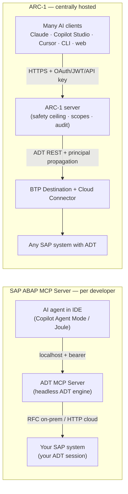

# ARC-1 vs. the SAP ABAP MCP Server — Decision Guide

This page compares **ARC-1** with **SAP's official ABAP MCP Server** (the one bundled with *ABAP
Development Tools for VS Code* and *ADT for Eclipse*) so you can decide which to run — **only
ARC-1, only the SAP ABAP MCP Server, or both together.**

!!! note "Neutral by design"
    This is a decision aid, not a sales page. The two products were built for *different jobs* and
    the honest answer for many teams is **"use both"**. Where ARC-1 is stronger it says so; where the
    SAP server is stronger it says so just as plainly. Pick the column that matches **your** situation,
    not the one with more checkmarks.

!!! info "How the facts here were gathered (2026-06-16)"
    The SAP server's facts were taken from a **live install** running in Eclipse on the author's
    machine (`ADT MCP Server` v1.0.0, MCP protocol `2025-06-18`, Jetty 12.1.9) bound to an on-premise
    **S/4HANA 2023** system, cross-checked against SAP's GA announcements at Sapphire 2026 and SAP
    Community posts (linked under [Sources](#sources)). Tool names, schemas and the creatable-object
    list below were read directly from that running server. The SAP server evolves quickly — treat
    counts and tool names as a snapshot, not a contract.

---

## 1. At a glance

| | **ARC-1** | **SAP ABAP MCP Server** |
|---|---|---|
| **What it is** | Independent MCP server that translates AI tool calls into ADT REST calls | MCP server SAP ships *inside* ADT for VS Code / Eclipse |
| **Vendor / support** | Community open-source (MIT); no SAP support contract | SAP SE; first-party, supported, on SAP's roadmap |
| **Where it runs** | BTP Cloud Foundry, Docker, npm/`npx`, or local stdio | A headless ADT engine on your laptop (`localhost` only) |
| **Primary design center** | **Centrally hosted, multi-user, admin-governed** | **Single developer, zero-config, inside the IDE** |
| **Auth to the *server*** | XSUAA OAuth · OIDC JWT · API key · (stdio = none) | Auto-generated bearer token on `localhost` |
| **Auth to *SAP*** | Per-user principal propagation, or shared service user | Your own ADT logon session / SAP user |
| **Central config / policy** | Yes — server-wide safety ceiling, scopes, audit | No — each developer's machine, no policy layer |
| **MCP clients** | Any (Claude, Copilot Studio, Cursor, CLI, JetBrains, web…) | Local IDE agents (Copilot Agent Mode, Joule) + any local client |
| **System reach** | Any system with ADT — on-prem ECC 7.4+, NW, S/4 on-prem, RISE, Cloud, BTP | On-prem (RFC) + Public Cloud/BTP (HTTP); RAP/ABAP-Cloud focus |
| **Object types** | Classic **and** modern (PROG, FUGR, TABL, DOMA, DTEL, MSAG, ENHO… + CLAS, CDS, RAP) | RAP/ABAP-Cloud-centric; broader on some on-prem systems; no Dynpro/WebDynpro |
| **Reads source over MCP?** | Yes — `SAPRead` / `SAPSearch` are first-class tools | Not on the tested release — reading is the IDE editor's job (see §6) |
| **Server-side AI** | None — uses *your* LLM (Claude/GPT/Gemini/…) | Optional **Joule** AI (SAP-ABAP-1 model) for ATC fixes & generation |
| **Cost** | Free (you pay only your infra + your LLM) | Extension free; **Joule AI features are licensed** (AI units; free promo to Sep 2026) |

**One-line verdict:** if you are **one developer working in your IDE on a modern ABAP/RAP system**,
the SAP server is the most frictionless, best-integrated choice. If you need **a shared, governed,
audited endpoint for many users / non-IDE agents / on-prem & classic ABAP / SQL · git · transports ·
dumps**, that is exactly what ARC-1 is for. Many teams run **both**.

---

## 2. Decision guide — only ARC-1, only SAP, or both?

Start here. The detail sections below justify each row.

### Pick the SAP ABAP MCP Server if…

- You work **inside VS Code or Eclipse** and want the AI to act on the code you already have open.
- Your system is **S/4HANA (Cloud/RISE/recent on-prem) or BTP ABAP** and your work is **RAP / ABAP
  Cloud / clean-core**.
- You want **zero setup** — reuse your ADT logon, flip one checkbox, done.
- You want **SAP's own AI** (Joule / SAP-ABAP-1) for ATC fix proposals and RAP+Fiori generation, and
  you have (or will buy) the licence.
- You value a **first-party, supported, roadmap-backed** tool and the integrated **debugger /
  completion / form editors** that come with the IDE.

### Pick ARC-1 if…

- You need a **shared, always-on MCP endpoint** that **many users or agents** connect to (a team
  server, CI, an agent platform) rather than a per-laptop process.
- You need **non-IDE clients**: Microsoft Copilot Studio, Joule Studio, Gemini CLI, a custom agent,
  a web app — anything that speaks remote MCP over HTTP.
- You need **central governance**: read-only by default, package allowlists, per-action deny rules,
  per-user scopes, rate limits, and a **central audit trail** of every call.
- You need **per-user SAP identity at scale** — XSUAA + BTP Destination Service principal
  propagation maps each AI user to their own SAP user.
- You work on **on-prem ECC / NetWeaver / older S/4** or with **classic objects** (reports, function
  groups, DDIC domains/data elements, message classes, enhancements) — or you need **free SQL,
  git (gCTS/abapGit), transport release, or ST22 dump / trace analysis**.
- You want to keep your **choice of LLM** (Claude, GPT, Gemini, Mistral, …) and not route through
  SAP's AI hub.

### Run both if… (common for teams that have adopted VS Code ADT)

- Developers use the **SAP server in-IDE** for fast, context-aware editing, debugging, RAP generation
  and Joule AI fixes **on their personal dev systems**, **and**
- The team/platform runs **ARC-1 centrally** for the things the SAP server doesn't do: governed
  multi-user access, non-IDE agents, classic-object and on-prem reach, SQL, git, transports, runtime
  diagnostics, and a central audit log.

They don't conflict — the tool namespaces differ (`sap-abap-adt` vs `SAPRead`/`SAPWrite`/…), and an
agent can have both connected at once.

### Scenario cheat-sheet

| Your situation | Recommended |
|---|---|
| Solo dev, RAP on S/4 Cloud/BTP, lives in VS Code | **SAP server** |
| Solo dev, modern types, wants SAP-tuned AI fixes | **SAP server** (+ Joule licence) |
| Team wants one governed endpoint with audit + scopes | **ARC-1** |
| AI agent on **Copilot Studio / Joule Studio / a website** | **ARC-1** (remote MCP + JWT) |
| On-prem ECC 7.4 / NetWeaver / pre-2023 S/4 | **ARC-1** |
| Heavy **classic ABAP** (reports, FUGR, DDIC, messages, enhancements) | **ARC-1** |
| Need **SQL / git / transport release / ST22 dumps / traces** | **ARC-1** |
| Migration / clean-core at scale across many systems | **ARC-1** (often **+** SAP server per dev) |
| Modern shop that adopted VS Code ADT **and** runs agent platforms | **Both** |

---

## 3. What each product is

=== "ARC-1"

    A standalone **TypeScript MCP server** (npm package `arc-1`, Docker image
    `ghcr.io/marianfoo/arc-1`) that implements the Model Context Protocol and turns AI tool calls into
    **ADT REST** requests (`/sap/bc/adt/*`) — the same public API the Eclipse ADT client uses.

    - **Distribution:** `npx arc-1`, global npm install, Docker, or a deployed BTP Cloud Foundry app.
    - **Maturity:** production, write-capable, multi-user. Open source (MIT), community-maintained.
    - **Design center:** a **centrally hosted, admin-governed, multi-tenant** proxy — one server, many
      AI users, each mapped to their own SAP identity, every call audited and policy-checked.
    - **Tool model:** **12 intent tools** (e.g. `SAPRead`, `SAPWrite`) with a `type`/`action`
      parameter, instead of 200+ endpoint tools — keeps the LLM's tool list small. A "hyperfocused"
      mode collapses to a single ~200-token tool for tight context windows.

=== "SAP ABAP MCP Server"

    An MCP server SAP **bundles inside its IDE tooling** — *ABAP Development Tools for VS Code*
    (publisher SAP SE, GA at Sapphire 2026, on the VS Code Marketplace) and *ADT for Eclipse*. The MCP
    layer is part of a **larger redesign**: a headless **ABAP Language Server** (the Eclipse ADT client
    repackaged) plus the **ABAP MCP Server** on top.

    - **Distribution:** ships with the extension; **not** a standalone package you host. It runs as a
      small **Streamable-HTTP server on `localhost`** (an auto-selected port, e.g. 2234/2236) launched
      by the IDE.
    - **Maturity:** v1.0.0, GA but explicitly **disabled by default** (enable
      `ABAP > AI: Enable ADT MCP Server`). SAP positions Eclipse as the flagship IDE "until VS Code
      reaches feature parity," but notes the **same MCP tools are offered in both** because they live in
      the shared core layer.
    - **Design center:** **one developer, zero-config**, agentic AI on the code in their IDE.
    - **Tool model:** ~20 narrowly-scoped, **heavily prompt-engineered** tools (USE WHEN / TYPICAL
      WORKFLOW / human-in-the-loop transport selection), grouped by workflow (creation, generation,
      ATC, activation, tests, transport, business services). The set is partly **server-driven** —
      it adapts to what the connected backend offers.

---

## 4. Architecture & where it runs



| Dimension | ARC-1 | SAP ABAP MCP Server |
|---|---|---|
| Process model | A server you deploy (CF app / container / `npx` / stdio) | A `localhost` process the IDE starts for you |
| Network exposure | Remote over HTTPS (or local stdio) | **`localhost` only** + DNS-rebinding guard (Host must be localhost/127.0.0.1) |
| Multi-user | **Yes** — one endpoint, many users | No — one server per developer machine, bound to one ADT session |
| Connection to SAP | ADT REST (HTTP) everywhere, incl. on-prem via Cloud Connector | **RFC** for on-prem/Private Cloud, **HTTP** for Public Cloud/BTP |
| Runtime footprint | Lightweight Node process | A bundled headless ADT/Equinox engine (heavier; the price of full ADT fidelity) |
| Who operates it | You (or your platform team) | SAP's extension; nothing to operate |

**Takeaway:** the SAP server is a *personal* component — there is no notion of "host it for the team."
ARC-1 is a *shared service* — that is its whole point, and also why it asks more of you to stand up.

---

## 5. Authentication & identity

This is one of the sharpest differences and a frequent reason to choose ARC-1 for teams.

| Layer | ARC-1 | SAP ABAP MCP Server |
|---|---|---|
| **Auth to the MCP server** | XSUAA OAuth 2.0 · external OIDC JWT (e.g. Entra ID) · API keys (`key:profile`); stdio has none | A single auto-generated **bearer token** stored in an IDE setting; trusted because it's `localhost`-only |
| **Per-AI-user identity** | Yes — JWT/`clientId`/`userName` flows through every call | No concept of multiple MCP users |
| **Auth to SAP** | **Principal propagation**: each AI user → their own SAP user via BTP Destination Service + Cloud Connector; or a shared service user | Reuses **your** ADT logon session / SAP user |
| **Multiple auth mechanisms at once** | Yes — XSUAA + OIDC + API key can coexist on one server | n/a (single local developer) |
| **SAP-side authorizations** | Enforced by SAP (`S_DEVELOP`, `S_ADT_RES`, `S_TRANSPRT`) **and** ARC-1 scopes as defense-in-depth | Enforced by SAP for **your** user; that's the only gate |

!!! tip "What this means in practice"
    On the SAP server, "who is the AI acting as?" is simply **you** — clean and correct for a single
    developer on their own system. ARC-1 answers the harder enterprise question: *"a shared agent
    serves 50 people — how does each call run as the right SAP user, with the right rights, and leave
    an audit record?"* If you only ever have the first question, the SAP server's model is simpler. If
    you have the second, ARC-1 is built for it.

---

## 6. Central configuration & governance

The SAP server has **no policy/config layer** — by design. It is a developer tool: it does what your
SAP user is allowed to do, on your machine, full stop. There is nothing for an admin to centrally
configure, restrict, or audit across users, because there is no "across users."

ARC-1's reason to exist is the opposite: an **admin-controlled safety ceiling** that every call passes
through, no matter which user or client made it.

| Governance control | ARC-1 | SAP ABAP MCP Server |
|---|---|---|
| Read-only by default | **Yes** — writes are opt-in (`SAP_ALLOW_WRITES`) | No server-side gate (your SAP auth is the only limit) |
| Separate gates for data preview / free SQL / transport writes / git writes | **Yes**, each independent | n/a |
| **Package allowlist** (e.g. `$TMP`, `Z*`, subtree) enforced fail-closed on every mutation | **Yes** | No |
| **Per-action deny** (e.g. block `SAPWrite.delete`) | **Yes** (`SAP_DENY_ACTIONS`) | No |
| **Scopes** (read / write / data / sql / transports / git / admin) | **Yes**, per user/profile | No |
| **Rate limiting** (per-IP OAuth, per-user MCP, server-wide SAP semaphore) | **Yes**, three layers | No |
| **Central audit log** of every call with user identity | **Yes** (stderr / file / **BTP Audit Log**) | No central log; activity is implicit in the SAP system |
| Where config lives | Central (server env/CLI/`.env`), one source of truth | Per-developer IDE settings + `~/.adtls/destinations.json` |

!!! warning "The honest counterpoint"
    For a **single developer on a sandbox / personal dev tier**, all of this governance is overhead
    they don't need. "It just runs as me with my rights" is the *right* amount of control there. ARC-1's
    governance earns its keep when an AI endpoint is **shared**, **automated**, or **pointed at systems
    where uncontrolled writes are unacceptable** — not on a lone developer's `$TMP` playground.

---

## 7. Capabilities & tool surface

### 7.1 The SAP server's tools (live read, 2026-06-16 — 20 tools)

| Group | Tools | What they do |
|---|---|---|
| **Object creation** (server-driven, 4 steps) | `get_all_creatable_objects` · `get_object_type_details` · `run_validation` · `create_object` | Enumerate creatable types on the backend, fetch the per-type form schema, validate, then create. The type list comes **from the backend**, so it tracks new object types automatically. |
| **RAP generators** | `generators-list_generators` · `generators-get_schema` · `generators-generate_objects` | Backend "generator" framework, e.g. `x-ui-service` (full RAP + Fiori UI) and `webapi-service` (API only). |
| **Activation & tests** | `activate_objects` · `run_unit_tests` | Activate URIs (returns syntax diagnostics on failure); run ABAP Unit. |
| **ATC** | `atc_run` · `atc_get_result` · `atc_execute_deterministic_quickfixes` · `atc_apply_ai_fix` · `atc_get_ai_fix_result` | Run ATC, poll results, apply deterministic quickfixes, and — with **Joule** — apply **AI-generated fixes** to eligible findings. |
| **Transport** | `transport-get` · `transport-create` · `transport-unifiedDifference` | Validate/list TRs, create a TR (always after a human picks), paginated unified diff of a TR. Tool prompts force **human-in-the-loop** TR selection. |
| **Business services** | `business_services-fetch_services` · `business_services-fetch_service_information` | Read OData services from a service binding (for Fiori app generation handoff). |
| **Destinations** | `list_destinations` | List the ADT destinations configured in the IDE. |

Notable about this surface:

- **No source-read, search, or where-used tool** was present on the tested S/4HANA 2023 backend.
  SAP's roadmap adds an *"ABAP object search"* MCP tool, but on **newer backends only** (announced for
  BTP 2611 / S/4 Cloud Public 2702 / Private 2027). **In the IDE this doesn't matter** — the agent reads
  code through the editor / virtual workspace (Copilot can "find a function and read it" because the
  *workspace*, not the MCP server, serves the file). **For a non-IDE MCP client on an older system,
  it does matter:** there may be no way to read source via MCP alone.
- **No `resources` or `prompts`** — it's a pure *tools* server.
- It does **not** expose free SQL, git, transport *release/delete*, or runtime diagnostics (ST22 dumps,
  traces).
- Its real superpower is the **server-driven creation + generator framework** and (with a licence) the
  **Joule AI fix/generation** — neither of which ARC-1 has.

### 7.2 ARC-1's tools (12 intent tools)

| Tool | Covers |
|---|---|
| `SAPRead` | Read source & metadata for **any** ADT object type; `grep`; where-used; version history; method-level surgery reads |
| `SAPSearch` | `quick_search`, `tadir_lookup` (ADT / DB / both) |
| `SAPWrite` | Create / update / delete; class- & method-section surgery; RAP scaffolding & `generate_behavior_implementation`; `batch_create` |
| `SAPActivate` | Activate (single & batch, ED064-aware); publish/unpublish service bindings |
| `SAPNavigate` | Go-to-definition, references, where-used, completion |
| `SAPQuery` | Free SQL **and** table-data preview (both admin-gated) |
| `SAPTransport` | `create` · `assign` · `list` · `history` · `release` · `delete` (gated) |
| `SAPGit` | Full gCTS / abapGit: clone, pull, push, stage, commit, branches, repos… (gated) |
| `SAPContext` | Dependency / contract / compressed-context extraction for LLMs |
| `SAPLint` | abaplint (offline) + Pretty Printer + formatter settings |
| `SAPDiagnose` | `syntax` · `atc` · `quickfix`/`apply_quickfix` · ABAP Unit · **ST22 dumps** · **traces** · gateway/system messages · RAP preflight · CDS test-case suggestions |
| `SAPManage` | Package create/delete/move (DEVC) · FLP catalogs/groups/tiles · feature probe · cache stats |

### 7.3 Capability matrix

| Capability | ARC-1 | SAP ABAP MCP Server |
|---|:---:|:---:|
| Create objects | ✅ (AFF + classic builders) | ✅ (server-driven, auto-tracks new types) |
| Update / edit source | ✅ incl. method/section surgery | ⚠️ via IDE editor + LS (not an MCP write tool on tested release) |
| Activate | ✅ | ✅ |
| Run ABAP Unit | ✅ | ✅ |
| ATC run + results | ✅ | ✅ |
| ATC **deterministic** quickfix | ✅ (`quickfix`/`apply_quickfix`) | ✅ |
| ATC **AI** fix (model-generated) | ❌ (use your client LLM manually) | ✅ **Joule / SAP-ABAP-1** (licensed) |
| RAP + Fiori generators (x-ui-service) | ⚠️ scaffolding + skills, not the backend generator catalog | ✅ native generator framework |
| Read source **over MCP** | ✅ `SAPRead` | ❌ on tested release (IDE editor reads instead) |
| Search / where-used **over MCP** | ✅ | ❌ on tested release (roadmap: newer backends) |
| Free SQL | ✅ (gated) | ❌ |
| Table data preview | ✅ (gated) | ❌ |
| Git (gCTS / abapGit) | ✅ (gated) | ❌ |
| Transport create / assign / list / diff | ✅ | ✅ |
| Transport **release / delete** | ✅ (gated) | ❌ |
| Runtime diagnostics — **ST22 dumps, traces** | ✅ | ❌ |
| Pretty Printer / offline lint | ✅ | ⚠️ formatting via IDE, no abaplint |
| Integrated **debugger** | ❌ (MCP is RPC) | ✅ (in the IDE) |
| Inline completion / form editors | ❌ | ✅ (in the IDE) |
| Server-side AI model | ❌ (bring your own LLM) | ✅ Joule (SAP-ABAP-1) |

⚠️ = available but indirectly / partially, or only inside the IDE.

---

## 8. System & object-type reach

| | ARC-1 | SAP ABAP MCP Server |
|---|---|---|
| On-prem S/4HANA | ✅ | ✅ (via RFC; RAP/ABAP-Cloud focus) |
| **On-prem ECC 7.4+ / NetWeaver 7.5x** | ✅ | ⚠️ extension supports old releases for basics, but AI features need BTP/AI Core |
| RISE / Private Cloud | ✅ | ✅ |
| S/4HANA Cloud Public | ✅ | ✅ |
| BTP ABAP (Steampunk) | ✅ | ✅ |
| **Classic procedural** (PROG, FUGR/FUNC, includes) | ✅ | ⚠️ creatable on some on-prem backends (seen live on S/4 2023); not the focus |
| **DDIC** (TABL, STRU) | ✅ | ✅ (TABL/DT, TABL/DS seen live) |
| **DOMA / DTEL / MSAG / SHLP / ENHO / XSLT** | ✅ | ❌ (not in the creatable set observed) |
| Modern (CLAS, INTF, DDLS, DDLX, DCLS, BDEF, SRVD, SRVB, DRAS…) | ✅ | ✅ |
| **Dynpro / Web Dynpro / module pools** | ⚠️ limited (ADT itself is thin here) | ❌ explicitly excluded by SAP |

!!! note "Live nuance worth knowing"
    On the tested **on-prem S/4HANA 2023** system, the SAP server's `get_all_creatable_objects`
    returned **classic** types too — Program, Function Group/Module/Include, Database Table, Structure,
    Interface, Lock Object, Type Group — i.e. broader than a strict "modern-only" reading. But it still
    **omitted** core DDIC types (DOMA, DTEL), message classes (MSAG), search helps (SHLP), and
    enhancements (ENHO), and there was **no way to read or search** any of them over MCP. ARC-1 covers
    those types and the read/search path.

---

## 9. MCP client & IDE compatibility

| Client | ARC-1 | SAP ABAP MCP Server |
|---|:---:|:---:|
| GitHub Copilot (Agent Mode) in VS Code/Eclipse | ✅ | ✅ (auto-listed as `sap-abap-adt`) |
| SAP Joule (in-IDE) | ✅ | ✅ |
| Claude Desktop | ✅ | ⚠️ only if pointed at the localhost URL+token (not its intended use) |
| **Microsoft Copilot Studio** (remote agents) | ✅ | ❌ (no remote endpoint) |
| **SAP Joule Studio** (custom agents) | ✅ | ❌ |
| Cursor | ✅ | ⚠️ shares the VS Code extension family; in-IDE only |
| Gemini CLI / custom CLI agents | ✅ | ⚠️ localhost only |
| JetBrains / web apps / CI | ✅ | ❌ |

The SAP server is reachable by **any local MCP client** that points at its `localhost` URL with the
bearer token — but it is **localhost-only by design**, so "team server" and "cloud agent platform"
use cases are off the table. ARC-1 is the one you expose (securely) to remote and automated clients.

---

## 10. Security posture (summary)

| | ARC-1 | SAP ABAP MCP Server |
|---|---|---|
| Transport security | HTTPS; CORS allowlist; OAuth/JWT/API-key | `localhost` + DNS-rebinding guard + bearer token |
| Blast radius if token leaks | Token/JWT scoped + rate-limited; admin can revoke | Anyone *on that machine* who reads the token gets the developer's full ADT rights |
| Write safety | Default-deny + allowlists + deny-actions + scopes | Whatever the developer's SAP user can do |
| Auditability | Central, per-user, structured (incl. BTP Audit Log) | Rely on the SAP system's own logging |
| Secrets handling | `.env`/service keys redacted in logs; never committed | Token in IDE settings; destinations in `~/.adtls/` |

Neither is "insecure" — they make **different trust assumptions**. The SAP server trusts the
developer's own machine and SAP authorizations. ARC-1 assumes a shared, possibly hostile-adjacent
environment and adds layers accordingly.

---

## 11. Setup effort

Both are **easy for the local single-developer case** — that's worth saying plainly, because it's the
SAP server's home turf and ARC-1 matches it there:

=== "SAP ABAP MCP Server (local)"

    1. Install the *ABAP Development Tools for VS Code* extension (or use Eclipse ADT).
    2. Create a destination / logon to your SAP system.
    3. Enable **`ABAP > AI: Enable ADT MCP Server`**.
    4. Your IDE AI agent (Copilot Agent Mode / Joule) auto-discovers `sap-abap-adt`.

    **Effort: minutes. Zero infrastructure.** This is the benchmark for frictionless.

=== "ARC-1 (local stdio)"

    ```bash
    npx arc-1@latest --url https://your-sap-host:44300 --user YOUR_USER
    ```

    **Effort: minutes.** One command; point your MCP client at it. As easy as the SAP server for a
    single developer.

=== "ARC-1 (the target architecture)"

    Centrally hosted on **BTP Cloud Foundry** with XSUAA OAuth, BTP Destination Service + Cloud
    Connector for principal propagation, and the audit-log sink. This unlocks the multi-user/governed
    story — and it's **more work**: BTP entitlements, destinations, role collections, deployment.

!!! important "The key trade-off in one sentence"
    ARC-1 is *just as easy as the SAP server* when run locally — but running it locally is **not where
    its value is**. Its design center is the **central, governed deployment**, which costs real setup.
    The SAP server is purpose-built for the local case and asks for **nothing**. Choose based on which
    *architecture* you actually need, not on the 5-minute quick-start (both win that).

---

## 12. Cost & licensing

| | ARC-1 | SAP ABAP MCP Server |
|---|---|---|
| The server itself | Free, open source (MIT) | Free (ships with the extension) |
| AI model | **Bring your own** (you pay your LLM provider) | **Joule for Developers** AI features are licensed — consumption-based **AI units** (free promotional period through **September 2026**) |
| Infrastructure | Your BTP CF / container / host | Your laptop (none extra) |
| Vendor lock-in | None (any LLM, any ADT system) | AI features tie to SAP's GenAI hub / AI Core |

The SAP server's **non-AI** tools (create, activate, test, ATC run, transport) don't need the Joule
licence; the **AI** tools (`atc_apply_ai_fix`, AI generation) do, and need BTP/AI Core — so on a pure
on-prem system without AI Core, the AI tools won't function even though they're listed.

---

## 13. Using them together

A pattern that works well for a modern team that has adopted VS Code ADT:

- **Per developer, in the IDE:** the SAP server for context-aware editing, debugging, ABAP
  Unit/ATC, RAP+Fiori generation, and Joule AI fixes on their **personal dev system**.
- **Centrally, for everyone & for agents:** ARC-1 as the **governed, audited** endpoint for
  multi-user access, **non-IDE agents** (Copilot Studio, Joule Studio, CI), **on-prem/classic** reach,
  and the operations the SAP server omits — **SQL, git, transport release, ST22 dumps/traces**.

They coexist cleanly: distinct tool namespaces, and an agent can hold both connections. A reasonable
division of labour is *"SAP server writes & generates the modern code you're editing; ARC-1 governs
access, reaches the rest of the estate, and handles ops."*

---

## 14. Where each genuinely wins

=== "SAP ABAP MCP Server is better at…"

    - **Zero-config** in-IDE experience; reuses your ADT session.
    - **First-party & supported**, on SAP's roadmap, evolving fast.
    - **Server-driven creation + RAP/Fiori generators** that auto-track backend capabilities.
    - **Joule AI** (SAP-ABAP-1) fix proposals & generation — a model tuned on ABAP.
    - The surrounding **IDE**: debugger, completion, navigation, form editors, virtual workspace.
    - **Human-in-the-loop** transport selection baked into the tools.
    - Identical tools across **Eclipse and VS Code**.

=== "ARC-1 is better at…"

    - **Central, multi-user hosting** with one governed endpoint.
    - **Enterprise auth**: XSUAA + OIDC + API key, and **per-user principal propagation**.
    - **Governance**: read-only default, package allowlists, deny-actions, scopes, rate limits, and a
      **central audit log**.
    - **Reach**: on-prem ECC/NetWeaver/older S/4, and **classic objects** (PROG, FUGR, DDIC, MSAG,
      ENHO…), plus **read/search over MCP** everywhere.
    - **Ops breadth**: free SQL, git, transport release/delete, **ST22 dumps & traces**.
    - **Any MCP client** (Copilot Studio, Joule Studio, CLI, web, JetBrains) and **any LLM**.
    - **Works anywhere ADT does**, with no cloud/AI-Core dependency and no licence.

### ARC-1's honest limitations

To keep this balanced: ARC-1 is **not** a drop-in replacement for the SAP server's IDE experience.

- It's **community open source** — no SAP support contract or SLA.
- **You** operate and secure it (for the central deployment).
- **No server-side AI model** — output quality is whatever your chosen LLM produces.
- **No IDE UX** — no debugger, no inline completion, no form editors; it's RPC tools.
- Its ADT layer is **hand-maintained**; new SAP object types/editors may need ARC-1 code, whereas
  SAP's server-driven framework adapts automatically.
- For a **lone developer on a modern dev system living in the IDE**, the SAP server is simply the
  better-fitting, lower-friction tool — and ARC-1 doesn't pretend otherwise.

---

## Sources

Live verification (this machine, 2026-06-16): `tools/list` and sample `tools/call` against the running
`ADT MCP Server` v1.0.0 on `localhost`, bound to an on-prem S/4HANA 2023 destination.

SAP & community references:

- [ABAP Development Tools for VS Code — Everything You Need to Know](https://community.sap.com/t5/technology-blog-posts-by-sap/abap-development-tools-for-vs-code-everything-you-need-to-know/ba-p/14258129)
- [ABAP Development Tools for VS Code — Your Questions Answered](https://community.sap.com/t5/technology-blog-posts-by-sap/abap-development-tools-for-visual-studio-code-your-questions-answered/ba-p/14400848)
- [The Future of ABAP is Here: VS Code ADT, Zero-Config MCP, and AI Co-pilots](https://community.sap.com/t5/technology-blog-posts-by-members/the-future-of-abap-is-here-vs-code-adt-zero-config-mcp-and-ai-co-pilots/ba-p/14408186)
- [ABAP development tools for VS Code is now available on the Marketplace](https://community.sap.com/t5/technology-blog-posts-by-sap/abap-development-tools-for-visual-studio-code-is-now-available-on-the-vs/ba-p/14402120)
- [Our 2026 Roadmap for Joule for Developers ABAP AI capabilities](https://community.sap.com/t5/technology-blog-posts-by-sap/our-2026-roadmap-for-joule-for-developers-abap-ai-capabilities/ba-p/14360358)
- [SAP Help Portal — ABAP Development Tools for Visual Studio Code](https://help.sap.com/docs/abap-cloud/abap-development-tools-for-visual-studio-code/abap-development-tools-for-visual-studio-code)
- [SAP's official MCP servers list](https://likweitan.github.io/sap-mcp-servers-official/) (CAP, Fiori, UI5, MDK — the ADT MCP server ships *in the IDE*, not as an npm package)

ARC-1 references: [Architecture](architecture.md) · [Auth overview](enterprise-auth.md) ·
[Authorization & roles](authorization.md) · [Configuration reference](configuration-reference.md) ·
[Tools reference](tools.md) · [Security guide](security-guide.md).
