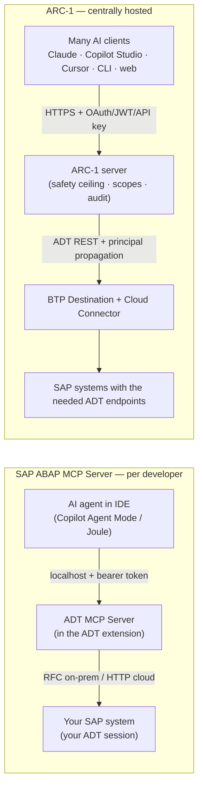

# ARC-1 vs. the SAP ABAP MCP Server — Decision Guide

This page compares **ARC-1** with **SAP's official ABAP MCP Server** (the *ADT MCP Server* bundled
with *ABAP Development Tools for VS Code* and *ADT for Eclipse*) so you can decide which to run —
**only ARC-1, only the SAP ABAP MCP Server, or both together.**

!!! note "Neutral by design"
    This is a decision aid, not a sales page. The two products were built for *different jobs* and
    the honest answer for many teams is **"use both."** Where ARC-1 is stronger it says so; where the
    SAP server is stronger it says so just as plainly. Pick the column that matches **your** situation,
    not the one with more checkmarks.

!!! info "How the facts here were sourced — public vs. snapshot"
    Two kinds of evidence are mixed below, and the difference matters:

    - **Public / primary sources** (strongest): SAP's Marketplace listing, the **SAP Help "Model
      Context Protocol Tools"** page (which lists the toolset and a per-tool *Joule License* column),
      the SAP Help *Enabling/Configuring ADT MCP Server* pages, SAP-samples workshop material
      (RAP130), SAP News, the ARC-1 repository/docs, and the MCP specification. The **20-tool set,
      the exact tool IDs, and the licensing split below are confirmed against SAP Help.** See
      [Sources](#sources).
    - **Author's live snapshot (2026-06-16, label these as observed, not product-wide):** a running
      `ADT MCP Server` v1.0.0 in Eclipse on the author's machine — MCP protocol `2025-06-18` (the
      revision *that server reported*; newer MCP revisions exist), Jetty 12.1.9 — bound to **one**
      on-prem **S/4HANA 2023** backend. Tool counts, creatable-object lists and "no resources/prompts"
      are **backend/version dependent**; treat them as a snapshot, not a guarantee.

**One-line verdict:** if you are **one developer working in your IDE on a modern ABAP/RAP system**,
the SAP server is the most frictionless, best-integrated choice. If you need **a shared, governed,
audited endpoint for many users / non-IDE agents / on-prem & classic ABAP / SQL · git · transports ·
dumps**, that is ARC-1's design center. Many teams run **both**.

---

## 1. At a glance

| | **ARC-1** | **SAP ABAP MCP Server** |
|---|---|---|
| **What it is** | Independent MCP server translating AI tool calls into ADT REST calls | The *ADT MCP Server* SAP ships *inside* ADT for VS Code / Eclipse |
| **Vendor / support** | Community open-source (MIT); no SAP support contract | SAP SE, first-party. The **extension is official/GA**, but SAP flags the **MCP server itself as experimental, "not intended for productive use"** |
| **Where it runs** | BTP Cloud Foundry, Docker, npm/`npx`, or local stdio | A local server the IDE starts on `localhost` only |
| **Primary design center** | **Centrally hosted, multi-user, admin-governed** | **Single developer, local, inside the IDE** |
| **Auth to the *server*** | XSUAA OAuth · OIDC JWT · API key · (stdio = none) | Auto-generated bearer token on `localhost` |
| **Auth to *SAP*** | Per-user principal propagation, or shared service user | Your own ADT logon session / SAP user |
| **Central governance** | Yes — server-wide safety ceiling, scopes, central audit | No central multi-user policy/audit layer (local IDE settings + your SAP authorizations) |
| **MCP clients** | Any (Claude, Copilot Studio, Cursor, CLI, JetBrains, web…) | Intended for local IDE agents; any local client *can* connect with URL+token |
| **System reach** | Systems exposing the ADT REST endpoints a tool needs (on-prem→cloud) | On-prem/Private Cloud via RFC, Public Cloud/BTP via HTTP; RAP/ABAP-Cloud focus |
| **Object types** | Classic **and** modern (PROG, FUGR, TABL, DOMA, DTEL, MSAG, ENHO… + CLAS, CDS, RAP) | RAP/ABAP-Cloud-centric (broader on some on-prem backends); Dynpro/Web Dynpro not planned |
| **Reads source over MCP?** | Yes — `SAPRead`/`SAPSearch` are first-class tools | Not in the documented toolset — reading is the IDE editor/virtual-workspace's job (see §6) |
| **Server-side AI** | None — uses *your* LLM (Claude/GPT/Gemini/…) | Optional **Joule** AI (SAP-ABAP-1 model) for ATC AI-fix tools |
| **Cost** | Free (you pay only your infra + your LLM) | Extension free; **only the 2 ATC AI-fix tools require a Joule licence** (per SAP Help) |

---

## 2. Decision guide — only ARC-1, only SAP, or both?

Start here. The detail sections below justify each row.

### Pick the SAP ABAP MCP Server if…

- You work **inside VS Code or Eclipse** and want the AI to act on the code you already have open.
- Your system is **S/4HANA (Cloud/RISE/recent on-prem) or BTP ABAP** and your work is **RAP / ABAP
  Cloud / clean-core**.
- You want **near-zero setup** — reuse your ADT logon, enable one setting, done.
- You want **SAP's own AI** (Joule / SAP-ABAP-1) for ATC fix proposals, and you have (or will buy) the
  licence for it.
- You value a **first-party** tool and the integrated **debugger / completion / form editors** that
  come with the IDE — and you are comfortable that SAP currently labels the MCP server *experimental*.

### Pick ARC-1 if…

- You need a **shared, always-on MCP endpoint** that **many users or agents** connect to (a team
  server, CI, an agent platform) rather than a per-laptop process.
- You need **non-IDE clients**: Microsoft Copilot Studio, Joule Studio, Gemini CLI, a custom agent,
  a web app — anything that speaks remote MCP over HTTP.
- You need **central governance**: read-only by default, package allowlists, per-action deny rules,
  per-user scopes, rate limits, and a **central audit trail** of every call.
- You need **per-user SAP identity at scale** — XSUAA + BTP Destination Service principal
  propagation maps each AI user to their own SAP user.
- You work on **on-prem ECC / NetWeaver / older S/4** or with **classic objects** (reports, function
  groups, DDIC domains/data elements, message classes, enhancements) — or you need **free SQL,
  git (gCTS/abapGit), transport release, or ST22 dump / trace analysis**.
- You want to keep your **choice of LLM** (Claude, GPT, Gemini, Mistral, …).

### Run both if… (common for teams that have adopted VS Code ADT)

- Developers use the **SAP server in-IDE** for fast, context-aware editing, debugging, RAP generation
  and Joule AI fixes **on their personal dev systems**, **and**
- The team/platform runs **ARC-1 centrally** for the things the SAP server doesn't do: governed
  multi-user access, non-IDE agents, classic-object and on-prem reach, SQL, git, transport release,
  and runtime diagnostics, with a central audit log.

They don't conflict — the tool namespaces differ (`abap_*` vs `SAPRead`/`SAPWrite`/…), and an agent
can hold both connections at once. *This is a reasoned architecture recommendation, not a
vendor-endorsed pattern.*

### Scenario cheat-sheet

| Your situation | Recommended |
|---|---|
| Solo dev, RAP on S/4 Cloud/BTP, lives in VS Code | **SAP server** |
| Solo dev, modern types, wants SAP-tuned AI fixes | **SAP server** (+ Joule licence) |
| Team wants one governed endpoint with audit + scopes | **ARC-1** |
| AI agent on **Copilot Studio / Joule Studio / a website** | **ARC-1** (remote MCP + JWT) |
| On-prem ECC 7.4 / NetWeaver / pre-2023 S/4 | **ARC-1** (validate per tool — see §8) |
| Heavy **classic ABAP** (reports, FUGR, DDIC, messages, enhancements) | **ARC-1** |
| Need **SQL / git / transport release / ST22 dumps / traces** | **ARC-1** |
| Migration / clean-core at scale across many systems | **ARC-1** (often **+** SAP server per dev) |
| Modern shop that adopted VS Code ADT **and** runs agent platforms | **Both** |

---

## 3. What each product is

=== "ARC-1"

    A standalone **TypeScript MCP server** (npm package `arc-1`, Docker image
    `ghcr.io/marianfoo/arc-1`) that implements the Model Context Protocol and turns AI tool calls into
    **ADT REST** requests (`/sap/bc/adt/*`) — the same public API the Eclipse ADT client uses.

    - **Distribution:** `npx arc-1`, global npm install, Docker, or a deployed BTP Cloud Foundry app.
    - **Maturity:** the project **positions itself** as production-ready, write-capable and multi-user;
      it is open source (MIT), community-maintained (no independent SLA/adoption evidence is claimed
      here).
    - **Design center:** a **centrally hosted, admin-governed, multi-tenant** proxy — one server, many
      AI users, each mapped to their own SAP identity, every call audited and policy-checked.
    - **Tool model:** **12 intent tools** (e.g. `SAPRead`, `SAPWrite`) with a `type`/`action`
      parameter, instead of 200+ endpoint tools. A "hyperfocused" mode collapses to a single
      ~200-token tool for tight context windows.

=== "SAP ABAP MCP Server"

    The **ADT MCP Server** SAP **bundles inside its IDE tooling** — *ABAP Development Tools for VS
    Code* (publisher SAP SE, the official ADT extension, free on the Marketplace) and *ADT for
    Eclipse*. The MCP layer is part of a **larger redesign**: a headless **ABAP Language Server** (the
    Eclipse ADT client repackaged) plus the **ABAP MCP Server** on top.

    - **Distribution:** ships with the extension; **not** a standalone package you host. When enabled it
      runs as a **local HTTP server** at `http://localhost:<port>/mcp` (default port **2236**), started
      by the IDE.
    - **Maturity / status:** the **extension is official and GA**, but SAP's own material states *"The
      ADT MCP Server is an experimental feature that may change at any time without notice. It is not
      intended for productive use."* It is **disabled by default** (enable `adt.mcpServer.enabled`, UI
      label "Adt: Enable MCP Server" — labels may vary by release).
    - **Design center:** **one developer, local**, agentic AI on the code in their IDE.
    - **Tool model:** **20 tools** (per SAP Help, see §7.1), heavily prompt-engineered (USE WHEN /
      TYPICAL WORKFLOW / human-in-the-loop transport selection), grouped by workflow. Part of the set
      is **server-driven** — it adapts to what the connected backend offers.

---

## 4. Architecture & where it runs



| Dimension | ARC-1 | SAP ABAP MCP Server |
|---|---|---|
| Process model | A server you deploy (CF app / container / `npx` / stdio) | A `localhost` process the IDE starts for you |
| Network exposure | Remote over HTTPS (or local stdio) | **`localhost` only** + auto-generated bearer token (a Host-header / DNS-rebinding guard was also observed in teardown) |
| Multi-user | **Yes** — one endpoint, many users | No — one server per developer machine, bound to one ADT session |
| Connection to SAP | ADT REST (HTTP) everywhere, incl. on-prem via Cloud Connector | **RFC** for on-prem/Private Cloud, **HTTP** for Public Cloud/BTP |
| Runtime footprint | Lightweight Node process | Bundled inside the ADT engine (heavier; the price of full ADT fidelity) |
| Who operates it | You (or your platform team) | SAP's extension; nothing to operate |

**Takeaway:** the SAP server is a *personal* component — there is no notion of "host it for the team."
ARC-1 is a *shared service* — that is its whole point, and also why it asks more of you to stand up.

---

## 5. Authentication & identity

This is one of the sharpest differences and a frequent reason teams choose ARC-1.

| Layer | ARC-1 | SAP ABAP MCP Server |
|---|---|---|
| **Auth to the MCP server** | XSUAA OAuth 2.0 · external OIDC JWT (e.g. Entra ID) · API keys (`key:profile`); stdio has none | A single auto-generated **bearer token**, trusted because the server is `localhost`-only |
| **Per-AI-user identity** | Yes — JWT/`clientId`/`userName` flows through every call | No concept of multiple MCP users |
| **Auth to SAP** | **Principal propagation**: each AI user → their own SAP user via BTP Destination Service + Cloud Connector; or a shared service user | Reuses **your** ADT logon session / SAP user |
| **Multiple auth mechanisms at once** | Yes — XSUAA + OIDC + API key can coexist | n/a (single local developer) |
| **SAP-side authorizations** | Enforced by SAP (`S_DEVELOP`, `S_ADT_RES`, `S_TRANSPRT`) **and** ARC-1 scopes as defense-in-depth | Enforced by SAP for **your** user |

!!! note "Both share one hard limit"
    Neither tool can grant SAP rights the backend user doesn't have. **ARC-1 can only restrict
    further; the SAP backend's own authorizations still decide final access** in both products.

!!! tip "What this means in practice"
    On the SAP server, "who is the AI acting as?" is simply **you** — clean and correct for a single
    developer on their own system. ARC-1 answers the harder enterprise question: *"a shared agent
    serves 50 people — how does each call run as the right SAP user, with the right rights, and leave
    an audit record?"* If you only ever have the first question, the SAP server's model is simpler.

---

## 6. Central configuration & governance

The SAP ADT MCP Server **does not provide a central multi-user policy, scope and audit layer
comparable to ARC-1.** In SAP's model, control is primarily **local IDE configuration plus the
developer's SAP authorizations and backend workflow controls** such as the human-in-the-loop transport
selection its tools enforce. That is appropriate for a personal developer tool — there simply is no
"across users" dimension to govern.

ARC-1's reason to exist is the opposite: an **admin-controlled safety ceiling** that every call passes
through, regardless of which user or client made it.

| Governance control | ARC-1 | SAP ABAP MCP Server |
|---|---|---|
| Read-only by default | **Yes** — writes are opt-in (`SAP_ALLOW_WRITES`) | No server-side gate (your SAP authorizations are the limit) |
| Separate gates for data preview / free SQL / transport writes / git writes | **Yes**, each independent | n/a (those tools aren't exposed) |
| **Package allowlist** (e.g. `$TMP`, `Z*`, subtree) enforced fail-closed on every mutation | **Yes** | No |
| **Per-action deny** (e.g. block `SAPWrite.delete`) | **Yes** (`SAP_DENY_ACTIONS`) | No |
| **Scopes** (read / write / data / sql / transports / git / admin) | **Yes**, per user/profile | No |
| **Rate limiting** (per-IP OAuth, per-user MCP, server-wide SAP semaphore) | **Yes**, three layers | No |
| **Central audit log** of every call with user identity | **Yes** (stderr / file / **BTP Audit Log**) | No central log; activity is implicit in the SAP system |
| Local configuration | Central server env/CLI/`.env`, one source of truth | Per-developer IDE settings (enable flag, port) + `~/.adtls/destinations.json` + the developer's SAP auth |

!!! warning "The honest counterpoint"
    For a **single developer on a sandbox / personal dev tier**, ARC-1's governance is overhead they
    don't need. "It runs as me with my rights" is the *right* amount of control there. ARC-1's
    governance earns its keep when an AI endpoint is **shared**, **automated**, or **pointed at systems
    where uncontrolled writes are unacceptable** — not on a lone developer's `$TMP` playground.

---

## 7. Capabilities & tool surface

### 7.1 The SAP server's tools — 20 tools (SAP Help canonical list)

The table below uses the **exact tool IDs published on the SAP Help "Model Context Protocol Tools"
page**, including its per-tool **Joule License** column.

| Toolset | Tool IDs | Joule licence |
|---|---|---|
| **ABAP Server Destinations** | `abap_lists_destinations` | Not required |
| **ABAP Object Creation** | `abap_creation-get_all_creatable_objects` · `abap_creation-get_object_type_details` · `abap_creation-run_validation` · `abap_creation-create_object` | Not required |
| **ABAP Object Activation** | `abap_activate_objects` | Not required |
| **ABAP Transport** | `abap_transport-get` · `abap_transport-create` · `abap_transport-unifiedDifference` | Not required |
| **Execute ABAP Unit Test** | `abap_run_unit_tests` | Not required |
| **ABAP Repository Object Generation** | `abap_generators-list_generators` · `abap_generators-get_schema` · `abap_generators-generate_objects` | Not required |
| **ABAP Business Service** | `abap_business_services-fetch_services` · `abap_business_services-fetch_service_information` | Not required |
| **ABAP Test Cockpit** | `abap_run_atc` · `abap_atc_get_result` · `abap_atc_execute_deterministic_quickfixes` · `abap_atc_apply_ai_fix` · `abap_atc_get_ai_fix_result` | **Required** for the two AI-fix tools (`abap_atc_apply_ai_fix`, `abap_atc_get_ai_fix_result`); others not required |

!!! note "Names: documented vs. tested build"
    The IDs above are SAP's **published** list. The build tested live on 2026-06-16 returned the **same
    20 tools** and the same grouping, with **two minor ID variants** — `abap_list_destinations`
    (vs. documented `abap_lists_destinations`) and `abap_atc_run` (vs. documented `abap_run_atc`).
    Treat exact separators as build-dependent and trust your client's own `tools/list` over any
    article. The set is also **backend/version dependent** — newer backends may add tools (SAP's
    roadmap includes an *ABAP object search* tool).

Notable about this surface:

- **No source-read, search, or where-used tool** is in the documented set. **In the IDE this doesn't
  matter** — the agent reads code through the editor / virtual workspace (Copilot can "find a function
  and read it" because the *workspace*, not the MCP server, serves the file). **For a non-IDE MCP
  client, it does matter:** there may be no way to read source via the MCP server alone.
- On the tested backend the server exposed **only tools** (`resources/list` and `prompts/list`
  returned *Method not found*) — an observed snapshot, not a documented guarantee.
- It does **not** expose free SQL, git, transport *release/delete*, or runtime diagnostics (ST22
  dumps, traces) — none appear in SAP's public examples or the tested server.
- Its real strengths are the **server-driven creation + generator framework** (e.g. an *OData UI
  Service from Scratch*) and, **with a Joule licence**, the **AI-fix tools** — neither of which ARC-1
  has.

### 7.2 ARC-1's tools (12 intent tools)

| Tool | Covers |
|---|---|
| `SAPRead` | Read source & metadata for **any** ADT object type; `grep`; where-used; version history; method-level surgery reads |
| `SAPSearch` | `quick_search`, `tadir_lookup` (ADT / DB / both) |
| `SAPWrite` | Create / update / delete; class- & method-section surgery; RAP scaffolding & `generate_behavior_implementation`; `batch_create` |
| `SAPActivate` | Activate (single & batch, ED064-aware); publish/unpublish service bindings |
| `SAPNavigate` | Go-to-definition, references, where-used, completion |
| `SAPQuery` | Free SQL **and** table-data preview (both admin-gated) |
| `SAPTransport` | `create` · `assign` · `list` · `history` · `release` · `delete` (gated) |
| `SAPGit` | Full gCTS / abapGit: clone, pull, push, stage, commit, branches, repos… (gated) |
| `SAPContext` | Dependency / contract / compressed-context extraction for LLMs |
| `SAPLint` | abaplint (offline) + Pretty Printer + formatter settings |
| `SAPDiagnose` | `syntax` · `atc` · `quickfix`/`apply_quickfix` · ABAP Unit · **ST22 dumps** · **traces** · gateway/system messages · RAP preflight · CDS test-case suggestions |
| `SAPManage` | Package create/delete/move (DEVC) · FLP catalogs/groups/tiles · feature probe · cache stats |

All gated operations also depend on the target system exposing the needed ADT/OData services and the
SAP user being authorized.

### 7.3 Capability matrix

| Capability | ARC-1 | SAP ABAP MCP Server |
|---|:---:|:---:|
| Create objects | ✅ (AFF + classic builders) | ✅ (server-driven, auto-tracks new types) |
| Update / edit source | ✅ incl. method/section surgery | ⚠️ via IDE editor + LS (no MCP write-source tool in the documented set) |
| Activate | ✅ | ✅ |
| Run ABAP Unit | ✅ | ✅ |
| ATC run + results | ✅ | ✅ |
| ATC **deterministic** quickfix | ✅ (`quickfix`/`apply_quickfix`) | ✅ |
| ATC **AI** fix (model-generated) | ❌ (use your client LLM manually) | ✅ **Joule** — requires a Joule licence |
| RAP + repository-object generators | ⚠️ scaffolding + skills, not the backend generator catalog | ✅ native generator framework |
| Read source **over MCP** | ✅ `SAPRead` | ❌ not in the documented toolset (IDE editor reads instead) |
| Search / where-used **over MCP** | ✅ | ❌ not in the documented toolset (roadmap: object-search tool) |
| Free SQL | ✅ (gated) | ❌ |
| Table data preview | ✅ (gated) | ❌ |
| Git (gCTS / abapGit) | ✅ (gated) | ❌ |
| Transport create / get / diff | ✅ | ✅ |
| Transport **release / delete** | ✅ (gated) | ❌ |
| Runtime diagnostics — **ST22 dumps, traces** | ✅ | ❌ |
| Pretty Printer / offline lint | ✅ | ⚠️ formatting via IDE, no abaplint |
| Integrated **debugger** | ❌ (MCP is RPC) | ✅ (in the IDE) |
| Inline completion / form editors | ❌ | ✅ (in the IDE) |
| Server-side AI model | ❌ (bring your own LLM) | ✅ Joule (SAP-ABAP-1), licensed |

⚠️ = available but indirectly / partially, or only inside the IDE.

---

## 8. System & object-type reach

!!! note "Read this as four separate axes — they don't move together"
    SAP's stack mixes three distinct things the draft must not conflate: **(a) base IDE/backend
    connectivity**, **(b) which MCP tools a given backend exposes**, and **(c) Joule/ABAP-AI
    availability + licensing**. ARC-1 adds a fourth: **(d) which ADT REST endpoints a given system
    actually exposes**, which varies by release and decides per-tool coverage.

| | ARC-1 | SAP ABAP MCP Server |
|---|---|---|
| On-prem S/4HANA | ✅ where ADT endpoints exist | ✅ (via RFC; RAP/ABAP-Cloud focus) |
| **On-prem ECC 7.4+ / NetWeaver** | ⚠️ validate **per tool** — older ECC/NW vary widely in ADT endpoint coverage | ⚠️ extension connects to old releases for basics; AI features need BTP/AI Core |
| RISE / Private Cloud | ✅ | ✅ |
| S/4HANA Cloud Public | ✅ | ✅ |
| BTP ABAP (Steampunk) | ✅ | ✅ |
| **Classic procedural** (PROG, FUGR/FUNC, includes) | ✅ | ⚠️ creatable on some on-prem backends (observed live on S/4 2023); not the focus |
| **DDIC** (TABL, STRU) | ✅ | ✅ (TABL/DT, TABL/DS observed live) |
| **DOMA / DTEL / MSAG / SHLP / ENHO / XSLT** | ✅ | ❌ (not in the creatable set observed) |
| Modern (CLAS, INTF, DDLS, DDLX, DCLS, BDEF, SRVD, SRVB, DRAS…) | ✅ | ✅ |
| **Dynpro / Web Dynpro / module pools** | ⚠️ limited (ADT itself is thin here) | ❌ not planned (SAP states classic Dynpro/Web Dynpro are not in the current focus) |

!!! note "Live nuance worth knowing (observed on one S/4HANA 2023 on-prem backend)"
    On the tested system, the SAP server's `abap_creation-get_all_creatable_objects` returned **classic**
    types too — Program, Function Group/Module/Include, Database Table, Structure, Interface, Lock
    Object, Type Group — i.e. broader than a strict "modern-only" reading. But it still **omitted** core
    DDIC types (DOMA, DTEL), message classes (MSAG), search helps (SHLP), and enhancements (ENHO), and
    there was **no way to read or search** any of them over MCP. This is a backend-driven snapshot, not a
    product-wide guarantee. ARC-1 covers those types and the read/search path where the backend exposes
    the endpoints.

---

## 9. MCP client & IDE compatibility

| Client | ARC-1 | SAP ABAP MCP Server |
|---|:---:|:---:|
| GitHub Copilot (Agent Mode) in VS Code/Eclipse | ✅ | ✅ (the primary client SAP demonstrates) |
| SAP Joule (in-IDE) | ✅ | ✅ |
| Claude Desktop | ✅ | ⚠️ technically, if pointed at the localhost URL+token |
| **Microsoft Copilot Studio** (remote agents) | ✅ | ❌ (no remote endpoint) |
| **SAP Joule Studio** (custom agents) | ✅ | ❌ |
| Cursor / other VS-Code-family editors | ✅ | ⚠️ in-IDE; needs a client that supports the virtual-workspace filesystem |
| Gemini CLI / custom CLI agents | ✅ | ⚠️ localhost only |
| JetBrains / web apps / CI | ✅ | ❌ |

**SAP's supported/intended scenario is a local IDE agent against a local ADT MCP Server.** A local
MCP-compatible client *can* technically connect to the `localhost` URL with the token, but the server
is **not designed as a remote, centrally hosted team endpoint** — so "team server" and "cloud agent
platform" use cases are off the table. ARC-1 is the one you expose (securely) to remote and automated
clients. SAP also notes that an agent must support **VS Code's virtual-workspace filesystem** to read
repository objects in the IDE.

---

## 10. Security posture (summary)

| | ARC-1 | SAP ABAP MCP Server |
|---|---|---|
| Trust boundary | Shared/remote — HTTPS, CORS allowlist, OAuth/JWT/API-key | **Local-machine** — `localhost` + bearer token |
| Blast radius if token leaks | Token/JWT scoped + rate-limited; admin can revoke | Anyone *on that machine* who reads the token gets the developer's ADT rights (observed; confirm token storage with SAP docs) |
| Write safety | Default-deny + allowlists + deny-actions + scopes | The developer's SAP authorizations are the gate; **SAP authorizations remain final** |
| Auditability | Central, per-user, structured (incl. BTP Audit Log) | The SAP system's own logging |
| Secrets handling | `.env`/service keys redacted in logs; never committed | Token in IDE settings; destinations in `~/.adtls/` |

Neither is "insecure" — they make **different trust assumptions**. The SAP server assumes a
**local-machine trust boundary** and relies on the developer's SAP authorizations. ARC-1 assumes a
shared, possibly hostile-adjacent environment and adds layers accordingly.

---

## 11. Setup effort

Both are **easy for the local single-developer case** — that's worth saying plainly, because it's the
SAP server's home turf and ARC-1 matches it there:

=== "SAP ABAP MCP Server (local)"

    1. Install the *ABAP Development Tools for VS Code* extension (or use Eclipse ADT).
    2. Create a destination / logon to your SAP system.
    3. Enable the setting **`adt.mcpServer.enabled`** (UI label "Adt: Enable MCP Server" — labels may
       vary by release). The server starts at `http://localhost:<port>/mcp` (default port **2236**).
    4. Your IDE AI agent (Copilot Agent Mode / Joule) discovers the tools.

    **Effort: minutes. Zero infrastructure.** This is the benchmark for frictionless. (Remember SAP
    marks the MCP server *experimental, not for productive use*.)

=== "ARC-1 (local stdio)"

    ```bash
    npx arc-1@latest --url https://your-sap-host:44300 --user YOUR_USER
    ```

    **Effort: minutes.** One command; point your MCP client at it. As easy as the SAP server for a
    single developer.

=== "ARC-1 (the target architecture)"

    Centrally hosted on **BTP Cloud Foundry** with XSUAA OAuth, BTP Destination Service + Cloud
    Connector for principal propagation, and the audit-log sink. This unlocks the multi-user/governed
    story — and it's **more work**: BTP entitlements, destinations, role collections, deployment.

!!! important "The key trade-off in one sentence"
    ARC-1 is *just as easy as the SAP server* when run locally — but running it locally is **not where
    its value is**. Its design center is the **central, governed deployment**, which costs real setup.
    The SAP server is purpose-built for the local case and asks for **nothing**. Choose based on which
    *architecture* you actually need, not on the 5-minute quick-start (both win that).

---

## 12. Cost & licensing

| | ARC-1 | SAP ABAP MCP Server |
|---|---|---|
| The server itself | Free, open source (MIT) | Free (ships with the official extension) |
| AI model | **Bring your own** (you pay your LLM provider) | Per SAP Help, **only `abap_atc_apply_ai_fix` and `abap_atc_get_ai_fix_result` require a Joule licence**; the other 18 tools do not |
| Joule / ABAP-AI commercial terms | n/a | SAP/community sources describe consumption-based **AI units** with a promotional free period through **September 2026** — **confirm current SKU / region / terms with SAP** |
| Infrastructure | Your BTP CF / container / host | Your laptop (none extra) |
| Vendor lock-in | None (any LLM, any ADT system) | AI-fix tools tie to SAP's GenAI hub / AI Core |

So the SAP server's **18 non-AI tools** (destinations, creation, activation, unit test, ATC run/result,
deterministic quickfix, transport, generators, business services) carry **no Joule licence**; only the
**two AI-fix tools** do, and those need BTP/AI Core — so on a pure on-prem system without AI Core they
won't function even if listed.

---

## 13. Using them together

A pattern that works well for a modern team that has adopted VS Code ADT (a **recommended
architecture**, not a vendor-endorsed one):

- **Per developer, in the IDE:** the SAP server for context-aware editing, debugging, ABAP
  Unit/ATC, repository-object generation and Joule AI fixes on their **personal dev system**, **and**
- **Centrally, for everyone & for agents:** ARC-1 as the **governed, audited** endpoint for
  multi-user access, **non-IDE agents** (Copilot Studio, Joule Studio, CI), **on-prem/classic** reach,
  and the operations the SAP server omits — **SQL, git, transport release, ST22 dumps/traces**.

They coexist cleanly: distinct tool namespaces (`abap_*` vs `SAPRead`/`SAPWrite`/…), and an agent can
hold both connections. A reasonable division of labour is *"SAP server writes & generates the modern
code you're editing; ARC-1 governs access, reaches the rest of the estate, and handles ops."*

---

## 14. Where each genuinely wins

=== "SAP ABAP MCP Server is better at…"

    - **Near-zero-config** in-IDE experience; reuses your ADT session.
    - **First-party**, on SAP's roadmap, evolving fast (currently labelled experimental).
    - **Server-driven creation + repository-object generators** that auto-track backend capabilities.
    - **Joule AI** (SAP-ABAP-1) ATC fix proposals — a model tuned on ABAP (licensed).
    - The surrounding **IDE**: debugger, completion, navigation, form editors, virtual workspace.
    - **Human-in-the-loop** transport selection baked into the tools.
    - The same MCP tooling offered across **Eclipse and VS Code** (per SAP/community materials).

=== "ARC-1 is better at…"

    - **Central, multi-user hosting** with one governed endpoint.
    - **Enterprise auth**: XSUAA + OIDC + API key, and **per-user principal propagation**.
    - **Governance**: read-only default, package allowlists, deny-actions, scopes, rate limits, and a
      **central audit log**.
    - **Reach**: classic objects (PROG, FUGR, DDIC, MSAG, ENHO…) and **read/search over MCP** wherever
      the backend exposes the endpoints.
    - **Ops breadth**: free SQL, git, transport release/delete, **ST22 dumps & traces**.
    - **Any MCP client** (Copilot Studio, Joule Studio, CLI, web, JetBrains) and **any LLM**.
    - **No cloud/AI-Core dependency and no licence** for any of its tools.

### ARC-1's honest limitations

To keep this balanced: ARC-1 is **not** a drop-in replacement for the SAP server's IDE experience.

- It's **community open source** — no SAP support contract or SLA; "production-ready" is the project's
  own positioning.
- **You** operate and secure it (for the central deployment).
- **No server-side AI model** — output quality is whatever your chosen LLM produces.
- **No IDE UX** — no debugger, no inline completion, no form editors; it's RPC tools.
- Its ADT layer is **hand-maintained**; new SAP object types/editors may need ARC-1 code, whereas
  SAP's server-driven framework adapts automatically.
- Per-tool reach depends on the **backend's ADT/OData endpoints** — older ECC/NetWeaver should be
  validated per feature.
- For a **lone developer on a modern dev system living in the IDE**, the SAP server is the
  better-fitting, lower-friction tool — and ARC-1 doesn't pretend otherwise.

---

## Sources

### Public / primary sources

- [ABAP Development Tools for VS Code — Visual Studio Marketplace](https://marketplace.visualstudio.com/items?itemName=SAPSE.adt-vscode) — official SAP SE extension: free, integrated AI/MCP, debugger, Unit, ATC, transports, RFC/HTTP connectivity, additional licence for certain Joule features.
- [SAP Help — Model Context Protocol Tools](https://help.sap.com/docs/ABAP_AI/c7f5ef43ab274d078baf22f995fd2161/243d050c1be846e788f38f8c23c45d3a.html) — **canonical toolset, exact tool IDs, and per-tool Joule License column** (source for §7.1 and §12).
- [SAP Help — Configuring ADT MCP Server](https://help.sap.com/docs/ABAP_AI/c7f5ef43ab274d078baf22f995fd2161/ed94320814734d97801f51a5b6deb802.html) — URL `http://localhost:<port>/mcp`, port preference, auto-generated bearer token.
- [SAP Help — Enabling ADT MCP Server](https://help.sap.com/docs/ABAP_AI/c7f5ef43ab274d078baf22f995fd2161/6f6e72852b9746ffbe083d5a818fbbec.html) — local HTTP server enablement.
- [SAP-samples — RAP130 Exercise 1: Enable the ADT MCP Server](https://github.com/SAP-samples/abap-platform-rap130/blob/main/exercises/ex01/README.md) — `adt.mcpServer.enabled`, default port 2236, Copilot Agent mode, and the **experimental / "not intended for productive use"** warning.
- [SAP News — Agentic AI and ABAP](https://news.sap.com/2026/05/agentic-ai-will-change-the-market/) and [SAP Business AI Release Highlights Q4 2025](https://news.sap.com/2026/01/sap-business-ai-release-highlights-q4-2025/) — SAP-ABAP-1 foundation model availability/training context.
- [SAP Community — ADT for VS Code: Your Questions Answered](https://community.sap.com/t5/technology-blog-posts-by-sap/abap-development-tools-for-visual-studio-code-your-questions-answered/ba-p/14400848) · [Everything You Need to Know](https://community.sap.com/t5/technology-blog-posts-by-sap/abap-development-tools-for-vs-code-everything-you-need-to-know/ba-p/14258129) · [2026 Roadmap for Joule for Developers](https://community.sap.com/t5/technology-blog-posts-by-sap/our-2026-roadmap-for-joule-for-developers-abap-ai-capabilities/ba-p/14360358) — feature scope, classic-model caveats, and the promotional-period context (confirm commercial terms with SAP).
- [Model Context Protocol specification — 2025-06-18](https://modelcontextprotocol.io/specification/2025-06-18) — the revision the tested server reported (newer revisions exist).
- ARC-1: [Architecture](architecture.md) · [Auth overview](enterprise-auth.md) · [Authorization & roles](authorization.md) · [Configuration reference](configuration-reference.md) · [Tools reference](tools.md) · [Security guide](security-guide.md).

### Author's live snapshot (2026-06-16 — observed, not product-wide)

A running `ADT MCP Server` v1.0.0 in Eclipse on the author's machine (MCP protocol `2025-06-18`, Jetty
12.1.9), bound to one on-prem **S/4HANA 2023** backend: `tools/list` returned the 20-tool set (with the
two ID variants noted in §7.1), `resources/list`/`prompts/list` returned *Method not found*, and
`abap_creation-get_all_creatable_objects` returned the creatable-type list discussed in §8. These exact
counts/lists are **backend/version dependent** — verify against your own `tools/list`.
