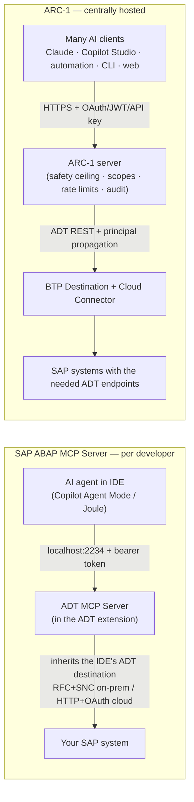

# ARC-1 vs. the SAP ABAP MCP Server — Decision Guide

This page compares **ARC-1** with **SAP's official ABAP MCP Server** (the *ADT MCP Server* bundled
with *ABAP Development Tools for VS Code* and *ADT for Eclipse*) so you can decide which to run —
**only ARC-1, only the SAP ABAP MCP Server, or both together.**

!!! note "Neutral by design — and not either/or"
    This is a decision aid, not a sales page. The two products were built for *different jobs* and the
    honest answer for many teams is **"use both"** — and you are **not limited to these two**: MCP is
    composable, so you can run ARC-1, the SAP ADT MCP Server, the [SAP docs/notes MCP
    servers](#14-its-not-eitheror-the-composable-mcp-ecosystem) and a skills layer side by side. Where
    ARC-1 is stronger it says so; where the SAP server is stronger it says so just as plainly.

!!! info "How the facts here were sourced — public vs. snapshot"
    - **Public / primary sources** (strongest): SAP's Marketplace listing, the **SAP Help "Model
      Context Protocol Tools"** page (toolset + per-tool *Joule License* column), SAP Help
      *Enabling/Configuring ADT MCP Server*, SAP-samples (RAP130), SAP News, the
      [ARC-1 repo/docs](https://github.com/marianfoo/arc-1), and the MCP spec. The **20-tool set, exact
      IDs, and licensing split** below are confirmed against SAP Help. See [Sources](#sources).
    - **Author's live snapshot (2026-06-16 — observed, not product-wide):** a running `ADT MCP Server`
      v1.0.0 in **Eclipse** (port **2234**, MCP protocol `2025-06-18` *as that server reported it* —
      newer MCP revisions exist; Jetty 12.1.9) bound to **one** on-prem **S/4HANA 2023** backend. Tool
      counts and creatable-object lists are **backend/version dependent** — treat them as a snapshot.

**One-line verdict:** if you are **one developer working in your IDE on a modern ABAP/RAP system**,
the SAP server is the most frictionless, best-integrated choice. If you need **a shared, governed,
audited endpoint for many users / non-IDE agents (Copilot Studio, automation, CI) / on-prem & classic
ABAP / SQL · git · transports · dumps**, that is ARC-1's design center. Many teams run **both**.

---

## 1. At a glance

| | **ARC-1** | **SAP ABAP MCP Server** |
|---|---|---|
| **What it is** | Independent MCP server translating AI tool calls into ADT REST calls | The *ADT MCP Server* SAP ships *inside* ADT for VS Code / Eclipse |
| **Vendor / support** | Community open-source (MIT); no SAP support contract | SAP SE, first-party. The **extension is official/GA**, but SAP flags the **MCP server itself as experimental, "not intended for productive use"** |
| **Where it runs** | BTP Cloud Foundry, Docker, npm/`npx`, or local stdio | A local HTTP server the IDE starts on `localhost` (default port **2234**) |
| **Distribution** | npm · Docker · **`.mcpb` one-click bundle** · **Claude Code plugin (+18 skills)** · cross-agent skills CLI · BTP connector | Bundled in the SAP ADT extension (VS Code + Eclipse) |
| **Auth to the *server*** | XSUAA OAuth · OIDC JWT · API key · (stdio = none) | Auto-generated bearer token on `localhost` |
| **Auth to *SAP*** | Per-user principal propagation, or shared service user | **Inherits the IDE's ADT destination** — RFC (SNC/SSO) on-prem, HTTP+OAuth cloud |
| **Central governance** | Yes — safety ceiling, scopes, package allowlist, **rate limits**, central audit | None (local IDE settings + your SAP authorizations); **no rate limiting** |
| **MCP clients** | Any — Claude, **Copilot Studio, automation/CI**, Cursor, CLI, JetBrains, web | Intended for local IDE agents; any local client *can* connect with URL+token |
| **System reach** | Systems exposing the ADT REST endpoints a tool needs (on-prem→cloud) | **Connects to old & new** (ADT VS Code supports down to NW 7.3 EHP1 SP04); modern/RAP/AI need newer/cloud backends |
| **Object types** | Classic **and** modern (PROG, FUGR, TABL, DOMA, DTEL, MSAG, ENHO… + CLAS, CDS, RAP) | 24 creatable types observed (CLAS, INTF, CDS, RAP, FUGR, PROG, TABL…); **no DOMA/DTEL/MSAG/SHLP/ENHO**; Dynpro not planned |
| **Writes to SAP?** | Yes — create/update/delete + surgery + RAP scaffolding | **Yes — creates & generates objects** (`abap_creation-create_object`, `abap_generators-*`); editing existing source is done in the IDE editor |
| **Server-side AI** | None — uses *your* LLM (Claude/GPT/Gemini/…) | Optional **Joule** AI (model not publicly pinned) for the 2 ATC AI-fix tools — licensed |
| **Cost** | Free (you pay only your infra + your LLM) | Extension free; **only the 2 ATC AI-fix tools need a Joule licence** (BTP-hosted, not on pure on-prem) |

---

## 2. Decision guide — only ARC-1, only SAP, or both?

### Pick the SAP ABAP MCP Server if…

- You work **inside VS Code or Eclipse** and want the AI to act on the code you already have open.
- Your system is **S/4HANA (Cloud/RISE/recent on-prem) or BTP ABAP** and your work is **RAP / ABAP
  Cloud / clean-core**.
- You want **near-zero setup** — reuse your ADT logon, enable one setting, done.
- You want **SAP's own AI** for ATC fix proposals (Joule), and you have the BTP-hosted Joule licence.
- You value a **first-party** tool and the integrated **debugger / completion / form editors** — and
  you are comfortable that SAP currently labels the MCP server *experimental*.

### Pick ARC-1 if…

- You need a **shared, always-on MCP endpoint** for **many users or agents** (team server, CI, an
  agent platform) rather than a per-laptop process.
- You need **non-IDE clients**: **Microsoft Copilot Studio, automation/CI scenarios**, Joule Studio,
  Gemini CLI, a custom agent, a web app — anything that speaks remote MCP over HTTP.
- You need **central governance**: read-only by default, package allowlists, per-action deny rules,
  per-user scopes, **rate limits**, and a **central audit trail**.
- You need **per-user SAP identity at scale** (XSUAA + BTP Destination Service principal propagation).
- You work on **on-prem ECC / NetWeaver / older S/4** or with **classic objects** (reports, function
  groups, DDIC domains/data elements, message classes, enhancements) — or you need **free SQL,
  git (gCTS/abapGit), transport release, or ST22 dump / trace analysis**.
- You want to keep your **choice of LLM** (Claude, GPT, Gemini, Mistral, …).

### Run both — and add more — if… (common for teams on VS Code ADT)

- Developers use the **SAP server in-IDE** for context-aware editing, debugging, RAP generation and
  Joule AI fixes **on their personal dev systems**, **and**
- The team/platform runs **ARC-1 centrally** for governed multi-user access, **non-IDE agents**, on-prem
  & classic reach, SQL, git, transport release, and runtime diagnostics — with a central audit log,
- plus **docs/notes MCP servers and a skills layer** (see §14). They don't conflict — namespaces differ
  (`abap_*` vs `SAPRead`/`SAPWrite`/…) and an agent can hold several connections at once. *This is a
  reasoned architecture recommendation, not a vendor-endorsed pattern.*

### Scenario cheat-sheet

| Your situation | Recommended |
|---|---|
| Solo dev, RAP on S/4 Cloud/BTP, lives in VS Code | **SAP server** |
| Solo dev, modern types, wants SAP-tuned AI fixes | **SAP server** (+ Joule licence) |
| Team wants one governed endpoint with audit + scopes | **ARC-1** |
| AI agent on **Copilot Studio / automation / a website** | **ARC-1** (remote MCP + JWT) |
| On-prem ECC 7.4 / NetWeaver / pre-2023 S/4 | **ARC-1** (validate per tool — see §8) |
| Heavy **classic ABAP** (reports, FUGR, DDIC, messages, enhancements) | **ARC-1** |
| Need **SQL / git / transport release / ST22 dumps / traces** | **ARC-1** |
| Want docs search, SAP Notes, RAP/CDS skills alongside | **Add the docs MCP + skills** (§14) |
| Modern shop that adopted VS Code ADT **and** runs agent platforms | **Both (+ docs MCP + skills)** |

---

## 3. What each product is

=== "ARC-1"

    A standalone **TypeScript MCP server** (npm package `arc-1`, Docker image
    `ghcr.io/marianfoo/arc-1`) that turns AI tool calls into **ADT REST** requests (`/sap/bc/adt/*`) —
    the same public API the Eclipse ADT client uses.

    - **Distribution — "and other stuff":** `npx`/global npm; **Docker**; a **`.mcpb` one-click bundle**
      for Claude Desktop; a **Claude Code plugin** that bundles the server **and 18 SAP skills**
      (RAP, CDS, ABAP Unit, clean-core, UI5); a **cross-agent skills CLI** (`npx skills add` for Cursor,
      Copilot, Codex, Gemini CLI); and a **remote BTP CF connector** (URL + XSUAA OAuth). See
      [Install in Claude](install-in-claude.md).
    - **Maturity:** the project **positions itself** as production-ready, write-capable, multi-user; open
      source (MIT), community-maintained (no independent SLA claimed here).
    - **Design center:** a **centrally hosted, admin-governed, multi-tenant** proxy — one server, many
      AI users, each mapped to their own SAP identity, every call audited and policy-checked.
    - **Tool model:** **12 intent tools** with a `type`/`action` parameter (vs 200+ endpoint tools), plus
      a "hyperfocused" 1-tool mode for tight context windows.

=== "SAP ABAP MCP Server"

    The **ADT MCP Server** SAP **bundles inside its IDE tooling** — *ABAP Development Tools for VS Code*
    (official SAP SE extension, free on the Marketplace) and *ADT for Eclipse*. It sits on a **larger
    redesign**: a headless **ABAP Language Server** (the Eclipse ADT client repackaged) plus the **ABAP
    MCP Server** on top.

    - **Distribution:** ships with the extension; **not** a standalone package you host. When enabled it
      runs as a **local HTTP server** at `http://localhost:<port>/mcp` (port **2234** in the tested
      Eclipse install; SAP-samples VS Code material references 2236; configurable 1024–65535), with an
      **auto-generated bearer token**.
    - **Maturity / status:** the **extension is official and GA**, but SAP's own material states *"The ADT
      MCP Server is an experimental feature that may change at any time without notice. It is not
      intended for productive use."* It is **disabled by default** (Eclipse: *ABAP Development → MCP
      Server → Enable ADT MCP Server*; VS Code: `adt.mcpServer.enabled` / "Adt: Enable MCP Server").
    - **AI:** the AI capabilities are **Joule for Developers**, a separately-licensed BTP-hosted service —
      see §12. **The specific model is not publicly pinned** (it is *not* simply "SAP-ABAP-1"); SAP's
      GenAI Hub orchestrates a mix of foundation models plus an SAP ABAP-trained model.
    - **Tool model:** **20 tools** (per SAP Help, §7.1), heavily prompt-engineered, partly **server-driven**
      (adapts to what the connected backend offers).

---

## 4. Architecture & where it runs



| Dimension | ARC-1 | SAP ABAP MCP Server |
|---|---|---|
| Process model | A server you deploy (CF app / container / `npx` / stdio) | A `localhost` process the IDE starts for you |
| Network exposure | Remote over HTTPS (or local stdio) | **`localhost` only** + auto-generated bearer token (a Host-header / DNS-rebinding guard was also observed in teardown) |
| Multi-user | **Yes** — one endpoint, many users | No — one server per developer machine, tied to the IDE session |
| Multiple SAP systems | One SAP system per server instance (a central BTP deployment routes to its configured destination; many systems → many instances/destinations) | **Yes** — every tool takes a `destination` arg, so one running server spans all the systems your IDE has configured |
| Connection to SAP | ADT REST (HTTP) everywhere, incl. on-prem via Cloud Connector | **Inherits the IDE destination**: RFC (SNC/SSO) on-prem, HTTP (OAuth) cloud |
| Runtime footprint | Lightweight Node process | Bundled inside the ADT engine (heavier; the price of full ADT fidelity) |
| Who operates it | You (or your platform team) | SAP's extension; nothing to operate |

---

## 5. Authentication & identity

Two distinct questions: **(a) how the AI client authenticates to the MCP server**, and **(b) how the
server authenticates to SAP.**

| Layer | ARC-1 | SAP ABAP MCP Server |
|---|---|---|
| **Auth to the MCP server** | XSUAA OAuth 2.0 · external OIDC JWT (e.g. Entra ID) · API keys (`key:profile`); stdio has none | A single auto-generated **bearer token**, trusted because the server is `localhost`-only |
| **Per-AI-user identity** | Yes — JWT/`clientId`/`userName` flows through every call | No concept of multiple MCP users |
| **Auth to SAP** | **Principal propagation** — each AI user → their own SAP user via BTP Destination Service + Cloud Connector; or a shared service user | **Inherits the IDE's existing ADT destination** — it does not authenticate to SAP itself |
| **SAP-side authorizations** | Enforced by SAP (`S_DEVELOP`, `S_ADT_RES`, `S_TRANSPRT`) **and** ARC-1 scopes as defense-in-depth | Enforced by SAP for **your** user |

!!! info "What SSO the SAP server actually uses (it rides the IDE destination)"
    The ADT MCP Server doesn't log in on its own — it reuses whatever connection the IDE already has, so
    the available SSO depends on the IDE and release:

    - **On-premise / Private Cloud — via RFC.** *ADT for VS Code* v1 initially supported **SNC with SSO**
      destinations only (plain username/password / non-SNC RFC was on the roadmap for a later release).
      *ADT for Eclipse* (what this snapshot ran) supports the **full range**: username/password (Basic),
      **SAP logon / reentrance tickets** (SSO), and **SNC** (Kerberos/SPNEGO, X.509 certificates). RFC
      ports: **48xx** = RFC with SNC, **33xx** = RFC without SNC.
    - **Public Cloud / BTP — via HTTP** with **OAuth** (and SAML/IdP-based SSO).

    So "SSO" here means SNC (Kerberos/SPNEGO/X.509) and SAP logon/reentrance tickets for on-prem, OAuth/SAML
    for cloud — inherited from the IDE. (ARC-1, by contrast, terminates client auth itself via
    XSUAA/OIDC/API-key, then maps to SAP via principal propagation, Basic, BTP service-key OAuth, or a
    cookie file for SSO-only systems.)

!!! note "Both share one hard limit"
    Neither tool can grant SAP rights the backend user doesn't have. **ARC-1 can only restrict further;
    the SAP backend's own authorizations still decide final access** in both products.

---

## 6. Central configuration & governance

The SAP ADT MCP Server **does not provide a central multi-user policy, scope and audit layer comparable
to ARC-1.** Control is **local IDE configuration plus the developer's SAP authorizations and backend
workflow controls** (e.g. the human-in-the-loop transport selection its tools enforce) — appropriate for
a personal developer tool with no "across users" dimension. It also has **no rate limiting**.

ARC-1's reason to exist is the opposite: an **admin-controlled safety ceiling** every call passes through.

| Governance control | ARC-1 | SAP ABAP MCP Server |
|---|---|---|
| Read-only by default | **Yes** — writes are opt-in (`SAP_ALLOW_WRITES`) | No server-side gate (your SAP authorizations are the limit) |
| Separate gates for data preview / free SQL / transport / git writes | **Yes**, each independent | n/a (those tools aren't exposed) |
| **Package allowlist** (`$TMP`, `Z*`, subtree) enforced fail-closed on every mutation | **Yes** | No |
| **Per-action deny** (e.g. block `SAPWrite.delete`) | **Yes** (`SAP_DENY_ACTIONS`) | No |
| **Scopes** (read / write / data / sql / transports / git / admin) | **Yes**, per user/profile | No |
| **Rate limiting** | **Yes** — per-IP OAuth, per-user MCP, server-wide SAP semaphore | **No** |
| **Central audit log** with user identity | **Yes** (stderr / file / **BTP Audit Log**) | No central log; activity is implicit in the SAP system |
| Configuration locus | Central server env/CLI/`.env` | Per-developer IDE settings (enable flag, port) + the developer's SAP auth |

!!! warning "The honest counterpoint"
    For a **single developer on a sandbox / personal dev tier**, ARC-1's governance is overhead they
    don't need. ARC-1's controls earn their keep when an AI endpoint is **shared**, **automated**, or
    **pointed at systems where uncontrolled writes are unacceptable** — not on a lone developer's `$TMP`
    playground.

---

## 7. Capabilities & tool surface

### 7.1 The SAP server's tools — 20 tools (SAP Help canonical list)

Exact tool IDs from the SAP Help **"Model Context Protocol Tools"** page, including its per-tool **Joule
License** column.

| Toolset | Tool IDs | Joule licence |
|---|---|---|
| **ABAP Server Destinations** | `abap_lists_destinations` | Not required |
| **ABAP Object Creation** | `abap_creation-get_all_creatable_objects` · `abap_creation-get_object_type_details` · `abap_creation-run_validation` · `abap_creation-create_object` | Not required |
| **ABAP Object Activation** | `abap_activate_objects` | Not required |
| **ABAP Transport** | `abap_transport-get` · `abap_transport-create` · `abap_transport-unifiedDifference` | Not required |
| **Execute ABAP Unit Test** | `abap_run_unit_tests` | Not required |
| **ABAP Repository Object Generation** | `abap_generators-list_generators` · `abap_generators-get_schema` · `abap_generators-generate_objects` | Not required |
| **ABAP Business Service** | `abap_business_services-fetch_services` · `abap_business_services-fetch_service_information` | Not required |
| **ABAP Test Cockpit** | `abap_run_atc` · `abap_atc_get_result` · `abap_atc_execute_deterministic_quickfixes` · `abap_atc_apply_ai_fix` · `abap_atc_get_ai_fix_result` | **Required** for the 2 AI-fix tools; others not required |

!!! note "Names: documented vs. tested build"
    The IDs above are SAP's **published** list. The build tested live returned the **same 20 tools** with
    **two minor ID variants** — `abap_list_destinations` (vs documented `abap_lists_destinations`) and
    `abap_atc_run` (vs documented `abap_run_atc`). Trust your client's own `tools/list` over any article;
    the set is **backend/version dependent** (SAP's roadmap includes an *ABAP object search* tool).

**It does write** — `abap_creation-create_object` creates objects and `abap_generators-generate_objects`
generates them (tables, CDS views, behavior definitions, service definitions/bindings, even an *OData UI
Service from Scratch*). What it does **not** expose is an MCP tool to **edit the source of an existing
object** — that is done in the IDE editor (the agent reads/edits through the editor + virtual workspace,
not via an MCP tool). Other notable gaps in the documented set: **no source-read / search / where-used
tool** (matters for non-IDE clients), and **no free SQL, git, transport release/delete, or runtime
diagnostics (ST22 dumps, traces)**. On the tested backend the server exposed **only tools** (no MCP
`resources`/`prompts`) — an observed snapshot.

### 7.2 ARC-1's tools (12 intent tools)

| Tool | Covers |
|---|---|
| `SAPRead` | Read source & metadata for **any** ADT object type; `grep`; where-used; version history; method-level surgery reads |
| `SAPSearch` | `quick_search`, `tadir_lookup` (ADT / DB / both) |
| `SAPWrite` | Create / update / delete; class- & method-section surgery; RAP scaffolding & `generate_behavior_implementation`; `batch_create` |
| `SAPActivate` | Activate (single & batch, ED064-aware); publish/unpublish service bindings |
| `SAPNavigate` | Go-to-definition, references, where-used, completion |
| `SAPQuery` | Free SQL **and** table-data preview (both admin-gated) |
| `SAPTransport` | `create` · `assign` · `list` · `history` · `release` · `delete` (gated) |
| `SAPGit` | Full gCTS / abapGit: clone, pull, push, stage, commit, branches, repos… (gated) |
| `SAPContext` | Dependency / contract / compressed-context extraction for LLMs |
| `SAPLint` | abaplint (offline) + Pretty Printer + formatter settings |
| `SAPDiagnose` | `syntax` · `atc` · `quickfix`/`apply_quickfix` · ABAP Unit · **ST22 dumps** · **traces** · gateway/system messages · RAP preflight · CDS test-case suggestions |
| `SAPManage` | Package create/delete/move (DEVC) · FLP catalogs/groups/tiles · feature probe · cache stats |

All gated operations also depend on the target system exposing the needed ADT/OData services and the SAP
user being authorized.

### 7.3 Capability matrix

| Capability | ARC-1 | SAP ABAP MCP Server |
|---|:---:|:---:|
| **Create objects** | ✅ | ✅ `create_object` |
| **Generate objects** (RAP/CDS/Fiori service) | ⚠️ scaffolding + skills | ✅ native generator framework |
| Edit existing source | ✅ incl. method/section surgery | ⚠️ via IDE editor + LS (no MCP edit-source tool) |
| Activate | ✅ | ✅ |
| Run ABAP Unit | ✅ | ✅ |
| ATC run + results | ✅ | ✅ |
| ATC **deterministic** quickfix | ✅ | ✅ |
| ATC **AI** fix | ❌ (use your client LLM manually) | ✅ **Joule** — requires a licence |
| Read source **over MCP** | ✅ `SAPRead` | ❌ not in the documented toolset (IDE editor reads instead) |
| Search / where-used **over MCP** | ✅ | ❌ not in the documented toolset (roadmap item) |
| Free SQL · table preview | ✅ (gated) | ❌ |
| Git (gCTS / abapGit) | ✅ (gated) | ❌ |
| Transport create / get / diff | ✅ | ✅ |
| Transport **release / delete** | ✅ (gated) | ❌ |
| Runtime diagnostics — **ST22 dumps, traces** | ✅ | ❌ |
| Pretty Printer / offline lint | ✅ | ⚠️ formatting via IDE, no abaplint |
| Integrated **debugger** | ❌ (MCP is RPC) | ✅ (in the IDE) |
| Inline completion / form editors | ❌ | ✅ (in the IDE) |
| Server-side AI model | ❌ (bring your own LLM) | ✅ Joule (licensed; model not publicly pinned) |
| Rate limiting | ✅ (3 layers) | ❌ |
| Multiple SAP systems in one server | ❌ (one system per instance) | ✅ (`destination` arg per tool) |
| Token efficiency (hyperfocused / context compression / method surgery) | ✅ | ❌ (verbose tool descriptions) |

⚠️ = available but indirectly / partially, or only inside the IDE.

---

## 8. System & object-type reach

!!! note "Read this as four separate axes — they don't move together"
    Don't conflate **(a) IDE/backend connectivity**, **(b) which MCP tools a backend exposes**, **(c)
    Joule/ABAP-AI availability + licensing** (BTP-hosted), and — for ARC-1 — **(d) which ADT REST
    endpoints a given system exposes** (varies by release, decides per-tool coverage).

**The SAP server connects to old systems too.** ADT for VS Code is documented to support releases **down
to NetWeaver 7.3 EHP1 SP04**, and Eclipse ADT reaches further still. What is *not* available on older /
non-cloud backends is the **ABAP-Cloud-model** workflows (RAP/CDS/generators need newer backends) and the
**Joule AI** features (BTP-hosted, licensed) — **connectivity is not the limiter**.

| | ARC-1 | SAP ABAP MCP Server |
|---|---|---|
| On-prem S/4HANA | ✅ where ADT endpoints exist | ✅ (RFC; RAP/ABAP-Cloud focus) |
| **On-prem ECC 7.4+ / NetWeaver 7.3 EHP1 SP04+** | ⚠️ validate **per tool** — older ECC/NW vary in ADT endpoint coverage | ✅ connects; modern/RAP/AI features gated by backend & BTP/AI Core |
| RISE / Private Cloud · S/4 Cloud Public · BTP ABAP | ✅ | ✅ |
| **Classic procedural** (PROG, FUGR/FUNC, includes) | ✅ | ✅ creatable (observed live on S/4 2023); not the marketing focus |
| **DDIC** (TABL, STRU) | ✅ | ✅ (TABL/DT, TABL/DS) |
| **DOMA / DTEL / MSAG / SHLP / ENHO / XSLT** | ✅ | ❌ (not in the creatable set observed) |
| Modern (CLAS, INTF, DDLS, DDLX, DCLS, BDEF, SRVD, SRVB, DRAS…) | ✅ | ✅ |
| **Dynpro / Web Dynpro / module pools** | ⚠️ limited (ADT itself is thin here) | ❌ not planned (SAP states classic Dynpro/Web Dynpro are not in the current focus) |

!!! note "The 24 creatable types observed live (one S/4HANA 2023 on-prem backend)"
    `abap_creation-get_all_creatable_objects` returned **24** types — broader than "modern-only":
    **CLAS, INTF, FUGR (group/module/include), PROG (program/include), TABL (table/structure), ENQU
    (lock object), TYPE (type group), DTEB (entity buffer), CHDO, NROB, NONT, RONT** plus the modern
    **DDLS, DDLX, DCLS, DRAS, DRTY, BDEF, SRVD, SRVB**. **Absent:** DOMA, DTEL, MSAG, SHLP, ENHO, XSLT,
    and all Dynpro/Web Dynpro. This is a **backend-driven snapshot**, not a product-wide guarantee — and
    even where *create* is supported there is **no read/search** over MCP. ARC-1 covers the absent types
    and the read/search path where the backend exposes the endpoints.

---

## 9. MCP client & IDE compatibility

| Client | ARC-1 | SAP ABAP MCP Server |
|---|:---:|:---:|
| GitHub Copilot (Agent Mode) in VS Code/Eclipse | ✅ | ✅ (the primary client SAP demonstrates) |
| SAP Joule (in-IDE) | ✅ | ✅ |
| Claude Desktop / Code | ✅ (`.mcpb` / plugin) | ⚠️ technically, if pointed at the localhost URL+token |
| **Microsoft Copilot Studio** (remote agents) | ✅ | ❌ (no remote endpoint) |
| **Automation / CI / scripts** | ✅ | ❌ (localhost, per-developer) |
| **SAP Joule Studio** (custom agents) | ✅ | ❌ |
| Cursor / other VS-Code-family editors | ✅ | ⚠️ in-IDE; needs virtual-workspace filesystem support |
| Gemini CLI / custom CLI agents | ✅ | ⚠️ localhost only |
| JetBrains / web apps | ✅ | ❌ |

**SAP's supported/intended scenario is a local IDE agent against a local ADT MCP Server.** A local
MCP-compatible client *can* connect to the `localhost` URL with the token, but the server is **not designed
as a remote, centrally hosted team endpoint**. **ARC-1 is the one you expose (securely) to remote and
automated clients — Copilot Studio agents, CI pipelines, web apps, scheduled automation.**

---

## 10. Security posture (summary)

| | ARC-1 | SAP ABAP MCP Server |
|---|---|---|
| Trust boundary | Shared/remote — HTTPS, CORS allowlist, OAuth/JWT/API-key | **Local-machine** — `localhost` + bearer token |
| Blast radius if token leaks | Token/JWT scoped + rate-limited; admin can revoke | Anyone *on that machine* who reads the token gets the developer's ADT rights (observed; confirm token storage with SAP docs) |
| Write safety | Default-deny + allowlists + deny-actions + scopes | The developer's SAP authorizations are the gate; **SAP authorizations remain final** |
| Auditability | Central, per-user, structured (incl. BTP Audit Log) | The SAP system's own logging |
| Secrets handling | `.env`/service keys redacted in logs; never committed | Token in IDE settings; destinations in the IDE config |
| Supply-chain hardening | Dependabot · CodeQL · Trivy image scan · npm provenance · SHA-pinned actions · `SECURITY.md` | Closed-source; covered by SAP's PSRT process |

Neither is "insecure" — they make **different trust assumptions**. The SAP server assumes a **local-machine
trust boundary** and relies on SAP authorizations; ARC-1 assumes a shared, possibly hostile-adjacent
environment and adds layers accordingly.

---

## 11. Setup effort

Both are **easy for the local single-developer case** — that's the SAP server's home turf, and ARC-1
matches it there:

=== "SAP ABAP MCP Server (local)"

    1. Install *ABAP Development Tools for VS Code* (or use Eclipse ADT) and log on to your SAP system.
    2. Enable the server — Eclipse: *ABAP Development → MCP Server → Enable ADT MCP Server*; VS Code:
       `adt.mcpServer.enabled`. It starts at `http://localhost:<port>/mcp` (default **2234** here;
       SAP-samples references 2236) and **auto-generates a bearer token**.
    3. Point your IDE AI agent (Copilot Agent Mode / Joule) at it.

    **Effort: minutes. Zero infrastructure.** (Remember SAP marks it *experimental, not for productive use*.)

=== "ARC-1 (local)"

    ```bash
    npx arc-1@latest --url https://your-sap-host:44300 --user YOUR_USER
    ```

    Or one-click via the **`.mcpb`** bundle in Claude Desktop, or the **Claude Code plugin** (server + 18
    skills). **Effort: minutes** — as easy as the SAP server for a single developer.

=== "ARC-1 (the target architecture)"

    Centrally hosted on **BTP Cloud Foundry** with XSUAA OAuth, BTP Destination Service + Cloud Connector
    for principal propagation, and the audit-log sink. This unlocks the multi-user/governed story — and
    it's **more work**: BTP entitlements, destinations, role collections, deployment.

!!! important "The key trade-off in one sentence"
    ARC-1 is *just as easy as the SAP server* when run locally — but local isn't where its value is. Its
    design center is the **central, governed deployment**, which costs real setup. The SAP server is
    purpose-built for the local case and asks for **nothing**. Choose by the *architecture* you need.

---

## 12. Cost & licensing

| | ARC-1 | SAP ABAP MCP Server |
|---|---|---|
| The server itself | Free, open source (MIT) | Free (ships with the official extension) |
| Non-AI tools | Free | **Free** — 18 of 20 tools need no Joule licence |
| AI tools | n/a (you bring your own LLM) | **`abap_atc_apply_ai_fix` + `abap_atc_get_ai_fix_result` require a Joule for Developers licence** |
| AI model | Your choice (Claude/GPT/Gemini/…) | **Not publicly pinned** — SAP GenAI Hub orchestrates a mix of foundation models + an SAP ABAP model (do **not** assume "SAP-ABAP-1") |
| Licensing model | Your LLM provider's pricing | **Joule Premium** package; separate licence; **consumption-based AI Units** activated via SAP for Me; a valid SAP Build or ABAP licence required |
| Where the AI runs | Your LLM endpoint | A **BTP-hosted hub** (auth + licence + BTP AI Core) |
| Infrastructure | Your BTP CF / container / host | Your laptop (none extra) |

!!! warning "On-premise reality + a commercial caveat"
    Because Joule for Developers is delivered through a **BTP cloud hub** and licensed separately, a **pure
    on-premise system with no BTP / Joule-for-Developers entitlement does not get the AI-fix tools** — they
    won't function there, though the other 18 tools still work. Exact SKUs, AI-Unit pricing, regional terms
    and any promotional period **change and should be confirmed with SAP** (e.g. via SAP for Me).

---

## 13. A note on SAP's API policy (unsettled)

Both products ultimately call SAP's **ADT REST endpoints** (`/sap/bc/adt/*`). A fair, honest summary:

- **The official ADT MCP Server is unaffected** — it is SAP's own first-party client of its own APIs.
- **ARC-1 (and other community tools** like [`abap-adt-api`](https://github.com/marcellourbani/abap-adt-api),
  abapGit, abaplint) use the **same ADT endpoints**, which SAP has **not published as a released, stable,
  third-party API contract** (they are the protocol behind the ADT client; see *"Joys and sorrows of the
  ABAP Developer Tools API"*).
- The prevailing understanding is that using these endpoints for development tooling is **acceptable**, but
  there is **no official SAP statement** classifying third-party ADT-API consumption as supported, and
  SAP's evolving [API Policy](https://community.sap.com/t5/technology-q-a/impacts-of-sap-api-policy-v4-2026-on-existing-customer-integrations/qaq-p/14381879)
  governs released-vs-internal APIs. **Treat third-party ADT-API use as not-officially-confirmed** — likely
  fine for dev/test, but watch SAP's guidance, especially for production scenarios.

This is informational, not legal advice — confirm your own situation with SAP.

---

## 14. It's not either/or — the composable MCP ecosystem

You are **not locked into one MCP server**. MCP clients can connect to several at once, and a skills layer
adds reusable workflows on top. Beyond the two compared here, high-value additions include:

- **SAP docs MCP** (`mcp-sap-docs`) — unified search over SAP developer docs (ABAP/RAP keyword docs, Clean
  ABAP, BTP, SAP Help, SAP Community). Great for grounding any agent in real documentation.
- **SAP Notes MCP** — search/retrieve SAP Notes & KBAs.
- **Official SAP dev-tooling MCP servers** — Fiori elements, CAP, UI5, UI5 Web Components, MDK (npm-distributed).
- **Skills** — ARC-1 ships **18 SAP skills** (RAP, CDS, ABAP Unit, clean-core, UI5 modernization) usable
  across agents via `npx skills add`.

A curated, regularly-updated catalog of SAP MCP servers, AI skills and Claude plugins lives at
**[github.com/marianfoo/sap-ai-mcp-servers](https://github.com/marianfoo/sap-ai-mcp-servers)** — a good
starting point for assembling the stack that fits you (e.g. *SAP ADT MCP for in-IDE actions + ARC-1 for
governed/remote reach + SAP docs MCP for grounding + skills for workflows*).

---

## 15. Using them together

A pattern that works well for a modern team on VS Code ADT (a **recommended architecture**, not a
vendor-endorsed one):

- **Per developer, in the IDE:** the SAP server for context-aware editing, debugging, ABAP Unit/ATC,
  repository-object generation and Joule AI fixes on their **personal dev system**, **and**
- **Centrally, for everyone & for agents:** ARC-1 as the **governed, audited** endpoint for multi-user
  access, **non-IDE agents** (Copilot Studio, automation/CI), on-prem/classic reach, and the operations
  the SAP server omits — **SQL, git, transport release, ST22 dumps/traces** — plus a **docs/notes MCP and
  skills** (§14) for grounding and reusable workflows.

Namespaces differ (`abap_*` vs `SAPRead`/`SAPWrite`/…) and an agent can hold several connections at once.

---

## 16. Where each genuinely wins

=== "SAP ABAP MCP Server is better at…"

    - **Near-zero-config** in-IDE experience; reuses your ADT session.
    - **First-party**, on SAP's roadmap, evolving fast (currently labelled experimental).
    - **Server-driven creation + repository-object generators** that auto-track backend capabilities
      (incl. *OData UI Service from Scratch*).
    - **Joule AI** ATC fix proposals (licensed, BTP-hosted).
    - The surrounding **IDE**: debugger, completion, navigation, form editors, virtual workspace.
    - **Human-in-the-loop** transport selection baked into the tools.
    - **Multi-destination** — one running server spans every system configured in your IDE (each tool
      takes a `destination` arg), handy when you hop between systems.
    - The same MCP tooling across **Eclipse and VS Code**.

=== "ARC-1 is better at…"

    - **Central, multi-user hosting** with one governed endpoint; usable **outside any IDE** (Copilot
      Studio, automation/CI, web).
    - **Enterprise auth**: XSUAA + OIDC + API key, and **per-user principal propagation**.
    - **Governance**: read-only default, package allowlists, deny-actions, scopes, **rate limits**, central
      audit log.
    - **Reach**: classic objects (PROG, FUGR, DDIC, MSAG, ENHO…) and **read/search over MCP** wherever the
      backend exposes the endpoints.
    - **Ops breadth**: free SQL, git, transport release/delete, **ST22 dumps & traces**.
    - **Any MCP client** and **any LLM**; multiple **distribution** options (`.mcpb`, Claude Code plugin +
      skills, Docker, npm, BTP connector).
    - **Token efficiency** — hyperfocused 1-tool mode (~200 tokens), context compression, and
      method-level surgery keep tight context windows and mid-tier LLMs viable.
    - **No cloud/AI-Core dependency and no licence** for any tool.

### ARC-1's honest limitations

- **Community open source** — no SAP support contract/SLA; "production-ready" is the project's own positioning.
- **You** operate and secure it (for the central deployment).
- **No server-side AI model** — quality is whatever your chosen LLM produces.
- **No IDE UX** — no debugger, no inline completion, no form editors; it's RPC tools.
- Its ADT layer is **hand-maintained**; new SAP object types/editors may need ARC-1 code, whereas SAP's
  server-driven framework adapts automatically.
- Per-tool reach depends on the **backend's ADT/OData endpoints** — older ECC/NetWeaver should be validated
  per feature; and third-party ADT-API use is **not officially confirmed** (§13).
- For a **lone developer on a modern dev system living in the IDE**, the SAP server is the better-fitting,
  lower-friction tool — ARC-1 doesn't pretend otherwise.

---

## Sources

### Public / primary sources

- [ABAP Development Tools for VS Code — Visual Studio Marketplace](https://marketplace.visualstudio.com/items?itemName=SAPSE.adt-vscode) — official SAP SE extension: free, integrated AI/MCP, debugger, Unit, ATC, transports, RFC/HTTP connectivity, additional licence for certain Joule features.
- [SAP Help — Model Context Protocol Tools](https://help.sap.com/docs/ABAP_AI/c7f5ef43ab274d078baf22f995fd2161/243d050c1be846e788f38f8c23c45d3a.html) — **canonical toolset, exact tool IDs, and per-tool Joule License column** (source for §7.1 and §12).
- [SAP Help — Configuring ADT MCP Server](https://help.sap.com/docs/ABAP_AI/c7f5ef43ab274d078baf22f995fd2161/ed94320814734d97801f51a5b6deb802.html) and [Enabling ADT MCP Server](https://help.sap.com/docs/ABAP_AI/c7f5ef43ab274d078baf22f995fd2161/6f6e72852b9746ffbe083d5a818fbbec.html) — URL `http://localhost:<port>/mcp`, port preference, auto-generated bearer token.
- [SAP-samples — RAP130 Exercise 1: Enable the ADT MCP Server](https://github.com/SAP-samples/abap-platform-rap130/blob/main/exercises/ex01/README.md) — `adt.mcpServer.enabled`, Copilot Agent mode, and the **experimental / "not intended for productive use"** warning.
- [SAP Joule for Developers — product page](https://www.sap.com/products/artificial-intelligence/joule-for-developers.html) · [GA announcement: ABAP AI capabilities incl. agentic](https://community.sap.com/t5/artificial-intelligence-blogs-posts/sap-joule-for-developers-abap-ai-capabilities-including-agentic/ba-p/14417633) · [Entering the New Era of Agentic AI for ABAP Development](https://community.sap.com/t5/technology-blog-posts-by-sap/entering-the-new-era-of-agentic-ai-for-abap-development/ba-p/14394643) — Joule licensing (Joule Premium / AI Units), BTP-hosted hub, model mix.
- [SAP Business AI — Release Highlights Q1 2026](https://news.sap.com/2026/04/sap-business-ai-release-highlights-q1-2026/) — Joule model landscape / GenAI Hub.
- ADT connectivity & SSO: [ADT for VS Code — Everything You Need to Know](https://community.sap.com/t5/technology-blog-posts-by-sap/abap-development-tools-for-vs-code-everything-you-need-to-know/ba-p/14258129) · [VS Code now on the Marketplace (Q&A on SNC/SSO, RFC ports)](https://community.sap.com/t5/technology-blog-posts-by-sap/abap-development-tools-for-visual-studio-code-is-now-available-on-the-vs/ba-p/14402120) · [ABAP Tools VS Code Quick Start (software-heroes)](https://software-heroes.com/en/blog/abap-tools-vs-code-quick-start-en) · [Installing ADT for Eclipse — config/SSO/SNC (PDF)](https://help.sap.com/doc/2e9cf4a457d84c7a81f33d8c3fdd9694/Cloud/en-US/inst_guide_abap_development_tools.pdf).
- API policy: [Impacts of SAP API Policy v4/2026 on existing integrations (SAP Community)](https://community.sap.com/t5/technology-q-a/impacts-of-sap-api-policy-v4-2026-on-existing-customer-integrations/qaq-p/14381879) · [Joys and sorrows of the ABAP Developer Tools API](https://community.sap.com/t5/application-development-and-automation-blog-posts/joys-and-sorrows-of-the-abap-developer-tools-api/ba-p/13409390) · [`marcellourbani/abap-adt-api`](https://github.com/marcellourbani/abap-adt-api).
- Ecosystem: [github.com/marianfoo/sap-ai-mcp-servers](https://github.com/marianfoo/sap-ai-mcp-servers) — curated catalog of SAP MCP servers, AI skills and Claude plugins (lists ARC-1, MCP SAP Docs, SAP Notes MCP, and the official SAP dev-tooling servers).
- [Model Context Protocol specification — 2025-06-18](https://modelcontextprotocol.io/specification/2025-06-18) — the revision the tested server reported (newer revisions exist).
- ARC-1: [Install in Claude](install-in-claude.md) · [Architecture](architecture.md) · [Auth overview](enterprise-auth.md) · [Authorization & roles](authorization.md) · [Configuration reference](configuration-reference.md) · [Tools reference](tools.md) · [Security guide](security-guide.md) · [Skills](skills.md).

### Author's live snapshot (2026-06-16 — observed, not product-wide)

A running `ADT MCP Server` v1.0.0 in **Eclipse** (port **2234**, MCP `2025-06-18`, Jetty 12.1.9), bound to
one on-prem **S/4HANA 2023** backend: `tools/list` returned the 20-tool set (with the two ID variants noted
in §7.1), `resources/list`/`prompts/list` returned *Method not found*, and
`abap_creation-get_all_creatable_objects` returned the **24** creatable types in §8. These exact counts and
lists are **backend/version dependent** — verify against your own `tools/list`.
