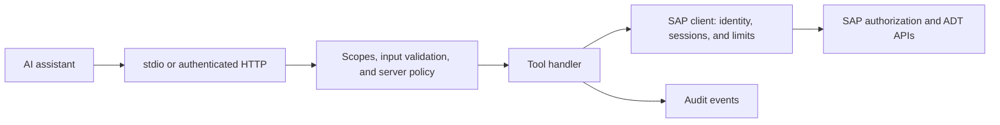

# Architecture

ARC-1 translates MCP tool calls into SAP requests. It runs as a local stdio process or an
authenticated HTTP service. This page follows one request and identifies the code that handles it.

## Request flow



1. **Accept the call.** A local client launches the stdio process. HTTP requests authenticate with
   an API key, OIDC JWT, or XSUAA OAuth.
2. **Choose the SAP identity.** The configured connection uses a shared SAP identity or resolves a
   per-user BTP destination. A failed JWT principal-propagation path does not fall back to shared credentials.
3. **Check the request.** The dispatcher checks user scopes and denied actions, validates inputs,
   and applies the server's capability ceiling.
4. **Call SAP.** The tool handler uses the ADT client. Mutation paths also check the relevant object
   package, transport, or Git gate. SAP performs its own authorization checks.
5. **Return and audit.** The handler parses the response. ARC-1 returns a tool result and records
   the call with sensitive fields redacted.

```text
Permission = server ceiling AND user scope/profile AND SAP authorization
```

An Admin role cannot enable writes on a server configured with `SAP_ALLOW_WRITES=false`.
The full capability rules are in [Authorization](authorization.md).

<a id="high-level-architecture"></a>
<a id="current-model"></a>
<a id="tool-surface"></a>

## Tool discovery

Standard mode groups operations into 12 intent tools. `ARC1_TOOL_MODE=hyperfocused` routes the same
operations through one `SAP` tool. The [tool reference](tools.md) documents their inputs.

[SAPDiagnose](tools/sap-diagnose.md) includes package ATC and harmless AUnit checks for CI.
These actions execute backend workloads and require complete evidence to pass; they are single-target only.

`tools/list` uses configuration, caller permissions, and available SAP discovery evidence. It does
not wait for a SAP probe. Before discovery completes, a capability can appear that the backend later
proves unsupported; an attempted call then returns an error. Stdio clients receive
`notifications/tools/list_changed` when the startup probe completes.

<a id="tool-listing-flow"></a>

Listing a tool does not bypass runtime checks. Every call is checked again, including calls made
from cached client schemas or through the CLI.

## Authentication and SAP identity

| Boundary | Options | Reference |
| --- | --- | --- |
| Assistant → ARC-1 | Local process trust for stdio; API key, OIDC, or XSUAA for HTTP | [Authentication](enterprise-auth.md) |
| ARC-1 → on-premise SAP | Shared Basic/session credentials or BTP principal propagation | [Principal propagation](principal-propagation-setup.md) |
| ARC-1 → BTP ABAP | Local browser OAuth or deployed per-user token exchange | [BTP ABAP](btp-abap-environment.md) |

With strict principal propagation, callers need a JWT suitable for the configured destination path.
The explicit single-target `SAP_PP_STRICT=false` option permits API-key/non-JWT calls through a
separately configured shared client. JWT propagation failures still fail closed.

The default is one target per instance. Experimental BTP
[multi-target mode](multi-target-setup.md) discovers approved destinations and exposes mutation-free
routes. Its shared Basic option has additional restrictions, including exactly one CF instance.

<a id="safety-system"></a>
<a id="rate-limiting-layers-in-the-request-flow"></a>

## Limits and state

| Concern | Behavior | Reference |
| --- | --- | --- |
| Request pressure | Separate per-IP HTTP limits, optional per-user quotas, and a process-wide SAP request cap | [Rate limiting](rate-limiting.md) |
| Data-result memory | Cumulative response-byte budget per tool call and a process-wide data-result concurrency cap | [Configuration](configuration-reference.md) |
| Source cache | Memory by default; optional SQLite; SAP validates cached source with ETags | [Caching](caching.md) |
| Per-user isolation | PP revalidates source as the caller, keys inactive lists by user, and bypasses dependency-payload reuse; multi-target requires cache off | [Caching](caching.md) |
| Audit | Structured events to stderr, optional files, or BTP Audit Log | [Log analysis](log-analysis.md) |

<a id="adt-client-and-http-layer"></a>

## SAP client

The SAP client handles HTTP authentication, CSRF tokens, cookies, MIME negotiation, retries,
and request limits. Domain modules implement reads, object changes, transport operations, checks,
and selected non-ADT services such as UI5 repository access.

Object changes that require a lock use one stateful session for lock, modify, and unlock.
A successful HTTP response is not always proof that an asynchronous SAP operation completed;
individual tool handlers verify the postcondition where the backend provides one.

<a id="cache-probes-and-audit"></a>
<a id="deployment-patterns"></a>

## Deployment

For a shared BTP deployment, XSUAA authenticates MCP users. Destination Service resolves the SAP
connection; Connectivity and Cloud Connector reach on-premise systems. BTP ABAP uses a destination
token exchange instead of Cloud Connector. Follow [BTP setup](btp-overview.md) or
[Deployment](deployment.md) for the configuration steps.

## Where to change code

Paths are relative to the [repository](https://github.com/arc-mcp/arc-1).

| Change | Files |
| --- | --- |
| Tool inputs and descriptions | `src/handlers/schemas.ts`, `src/handlers/tools.ts` |
| Scope/action policy | `src/authz/policy.ts`, `src/handlers/dispatch.ts` |
| Tool implementation | Matching module in `src/handlers/` |
| SAP operation or transport behavior | `src/adt/client.ts`, domain modules in `src/adt/`, `src/adt/http.ts` |
| Mutation safety | `src/adt/safety.ts`, `src/handlers/write-helpers.ts` |
| HTTP authentication | `src/server/http.ts`, the `@arc-mcp/xsuaa-auth` dependency |
| Per-user SAP connections | `src/server/server.ts`, `src/adt/oauth.ts` |
| Multi-target routing | `src/server/multi-target-*.ts`, `src/server/destination-*.ts` |
| Cache and dependency context | `src/cache/`, `src/context/` |
| Audit and logs | `src/server/audit.ts`, `src/server/sinks/`, `src/server/logger.ts` |

For a new action, update the input schema, public tool schema, policy, and handler together.
Then run `npm run validate:policy`, `npm run typecheck`, and the relevant tests.
The [developer guide](https://github.com/arc-mcp/arc-1/blob/main/docs/dev-guide.md) records
per-feature implementation details; [Local development](local-development.md) covers the build loop.
