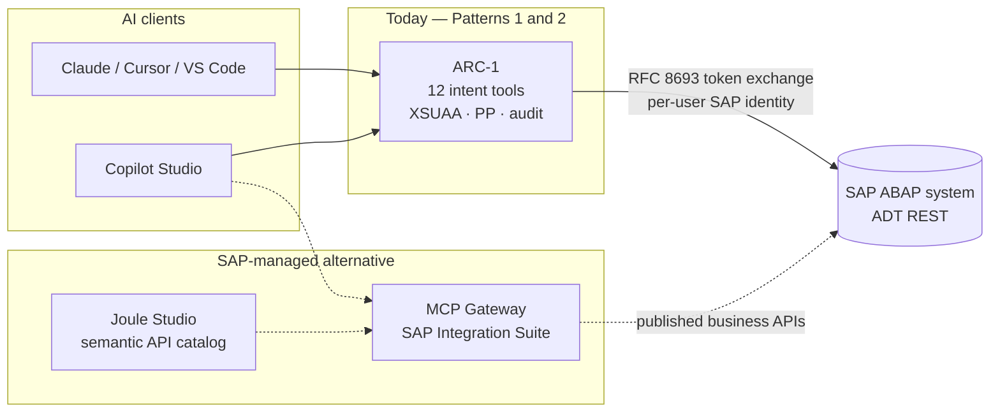

# SAP API Policy & Architecture Alignment

Where ARC-1 sits relative to SAP's published guidance for third-party MCP access, and what the
**SAP API Policy** means for running it against your systems.

!!! warning "The short version"
    ARC-1 is **architecturally very close** to the reference architecture SAP publishes for
    third-party MCP servers — and closing the remaining distance is on our roadmap.

    That is a *different question* from whether the **SAP API Policy** clears your specific use of it.
    ARC-1 drives **ADT REST endpoints** (`/sap/bc/adt/*`), which SAP has not published on the SAP
    Business Accelerator Hub. Under [API Policy v.4.2026a](https://help.sap.com/doc/sap-api-policy/latest/en-US/API_Policy_latest.pdf)
    §1.2 the duty to verify that an endpoint is a Published API sits **with the customer**.

    **Our recommendation: you can run ARC-1 at your own risk — and you should ask your SAP contact
    (account executive, CSP, or partner manager) before rolling it out beyond dev/test.** They are the
    only party who can answer for your contract, your deployment, and your landscape.

    This page is informational and **not legal advice**.

!!! info "Snapshot date"
    Written **2026-07-30** against **SAP API Policy v.4.2026a** and the SAP Architecture Center page
    *Third-Party MCP Access to SAP Solutions*. Both are living documents and SAP's position is moving
    quickly. Re-check the primary sources in [References](#references) before relying on anything here.

---

## 1. Two questions, often conflated

| Question | Who answers it | Where ARC-1 stands |
|---|---|---|
| **Is the architecture sound?** Does the server do what SAP says a third-party MCP server must do — token exchange, no token proxying, scoped auth, rate limits, audit, trace context, stateless scaling? | Engineering; measurable against SAP's published guidance | **Strong.** 18-point evaluation in the [alignment dossier](https://github.com/arc-mcp/arc-1/blob/main/docs/research/2026-07-30-sap-architecture-center-mcp-alignment.md) — met on the large majority, with the deviations named and argued |
| **Is the use permitted?** Does calling these particular SAP endpoints, from an AI agent, comply with the API Policy and your agreements? | **SAP** — your account team and, if it matters commercially, SAP Legal | **Open.** See §3. Not something the project can answer on SAP's behalf |

A tool can be exemplary on the first and still unresolved on the second. That is honestly where ARC-1
is, and where every ADT-based tool is — including `abap-adt-api`, abapGit's ADT bridge, and abaplint's
ADT integrations.

---

## 2. SAP's recommended architecture, and ARC-1's place in it

SAP's [Third-Party MCP Access to SAP Solutions](https://architecture.learning.sap.com/docs/ref-arch/137800)
describes two third-party patterns and one SAP-managed alternative. ARC-1 occupies **both** third-party
patterns depending on how you deploy it.

**What SAP's guidance asks of a third-party server, and how ARC-1 answers it** — condensed; the full
point-by-point evaluation with verdicts, evidence and deliberate deviations is in the
[alignment dossier](https://github.com/arc-mcp/arc-1/blob/main/docs/research/2026-07-30-sap-architecture-center-mcp-alignment.md).

| SAP asks for | ARC-1 |
|---|---|
| Semantic enrichment, not raw API mirroring | 12 intent tools over 200+ ADT endpoints — the founding design principle |
| Never proxy the caller's token downstream; exchange it (RFC 8693) | Principal propagation via the BTP Destination Service (`OAuth2UserTokenExchange` / `OAuth2JWTBearer` / SAML bearer). See [Principal Propagation](principal-propagation-setup.md) |
| Authentication on every inbound and outbound connection | XSUAA → OIDC → API key inbound; SAP-native `S_DEVELOP` / `S_ADT_RES` outbound |
| Scoped, least-privilege authorization | Seven scopes plus a server-wide safety ceiling that user scopes can only *restrict*. See [Authorization](authorization.md) |
| Rate limits that respect SAP quotas | Three layers — **but the per-user layer is off by default**; see §3.4 |
| Full audit of every tool call | Typed audit events with user, client, agent and trace correlation; stderr / file / BTP Audit Log sinks |
| W3C trace context propagated to SAP | Forwarded verbatim on every outbound SAP call |
| Stateless horizontal scaling | Stateless transport and HMAC-derived OAuth registrations; per-process state documented in [Best Practices](deployment-best-practices.md#scaling-out-what-changes-at-more-than-one-instance) |
| OWASP MCP Top 10 | Mapped to ARC-1's security invariants in the [security model](https://github.com/arc-mcp/arc-1/blob/main/docs/security-model.md) |

SAP also states plainly that in **both** third-party patterns the operational and security
responsibility for the platform, runtime, dependencies and credentials sits with the organization
deploying the server — not with SAP. That is the "at your own risk" framing, in SAP's own words, and it
is the honest basis for the recommendation at the top of this page.

---

## 3. What the API Policy actually says

[SAP API Policy v.4.2026a](https://help.sap.com/doc/sap-api-policy/latest/en-US/API_Policy_latest.pdf)
is short — four sections. Paraphrased, with section numbers so you can check the original:

### 3.1 Published vs. non-published APIs (§1.1, §1.2)

APIs on the **SAP Business Accelerator Hub**, or identified in product-specific documentation, are
*Published APIs* and may be used for their documented purpose. Everything else — in particular
anything marked internal or private — must not be accessed by customer or third-party applications,
unless the documentation permits it or SAP authorizes it. The policy notes such interfaces may change
or disappear without notice, and it puts the **verification duty on customers and partners**: confirm
each endpoint you use is a Published API.

There is an explicit carve-out for **customer-developed ABAP interfaces in private cloud and
on-premise deployments**.

**For ARC-1 this is the central open question.** The ADT REST surface (`/sap/bc/adt/*`) is the protocol
behind SAP's own ADT clients. It is **not published on the Business Accelerator Hub** as a third-party
API contract. The carve-out above covers interfaces *you* build, not ADT itself. A minority of what
ARC-1 touches is documented elsewhere (for example the UI5 ABAP Repository OData service and gCTS),
but the dominant surface is ADT.

Worth weighing on the other side, without overstating it: SAP itself ships an ADT-backed MCP server
inside ABAP Development Tools for VS Code and Eclipse (see the
[comparison guide](arc-1-vs-sap-abap-mcp-server.md)). SAP using its own interface is not authorization
for third parties to use it — but it does show ADT-driven MCP tooling is not against SAP's direction of
travel. Only SAP can turn that into an answer.

### 3.2 Agentic and generative AI access (§2.2.2)

The policy restricts using SAP APIs for interaction or integration with **(semi-)autonomous or
generative AI systems that plan, select, or execute sequences of API calls**, *except through
SAP-endorsed architectures, data services, or service-specific pathways intended for that purpose*.
The same clause also restricts scraping and large-scale extraction or replication.

An MCP server driven by an LLM agent is precisely the pattern described. The question is therefore
whether your setup runs "through an SAP-endorsed architecture". The Architecture Center page for
third-party MCP access states that customers and partners **may** use third-party MCP servers subject
to its conditions, which reads as an endorsed pathway for the MCP layer itself. Whether that
endorsement extends to the *underlying ADT endpoints* is not something the page addresses — and it is
exactly the kind of question to put to your SAP contact.

### 3.3 No circumvention of API controls (§3)

SAP may monitor usage and throttle, suspend or terminate access for non-compliance. Customers,
partners and third parties must not bypass, disable or circumvent API controls — explicitly including
via intermediary services, custom code, **proxies, gateways, impersonation techniques** or similar.

ARC-1 is an intermediary, so this clause deserves a direct answer:

- **It adds controls, it does not remove any.** Every call still passes SAP's own authorization
  (`S_DEVELOP`, `S_ADT_RES`, package authority). ARC-1 layers a safety ceiling, scopes, package
  allowlists and deny-actions *on top*. Nothing in ARC-1 disables or weakens a SAP-side control.
- **Principal propagation means no impersonation.** Each MCP user is exchanged to their *own* SAP
  identity, so SAP-side authorization and audit see the real human.
- **Be aware of the shared-identity modes.** A shared service account (`SAP_USER`/`SAP_PASSWORD`) and
  the default-off shared-Basic multi-target identity make SAP see one technical user for many humans.
  That is a legitimate, documented deployment choice — but if you are reasoning about §3, prefer
  principal propagation, which is the recommended topology anyway.

### 3.4 Rate limits and system health (§2.1, §2.2.1)

Specific per-API rate limits, quotas and bulk-extraction limits live in the product documentation, and
§2.2.1(c) prohibits use that risks system performance, stability or security.

ARC-1 has three rate-limiting layers, but **the per-user tool-call limit (`ARC1_RATE_LIMIT`) is off by
default**. On any shared instance, set it. See [Rate Limiting](rate-limiting.md) and the
[Best Practices checklist](deployment-best-practices.md). If you are scaling out, note the limits are
per-process — the effective ceiling multiplies by your instance count.

---

## 4. The MCP Gateway question

SAP's preferred managed answer is the **MCP Gateway in SAP Integration Suite** (Premium and Enhanced
editions). Today it creates MCP servers from three source types:

| Source | What it does |
|---|---|
| API artifact on Integration Cell | Exposes a deployed integration API as MCP tools |
| **HTTP endpoint with an OpenAPI specification** | Wraps a REST service as MCP tools (OpenAPI 3.0.0–3.0.3) |
| RFC-based backend | Exposes selected RFC operations as MCP tools |

All three turn **an API into an MCP server**. As of this writing there is no documented path to
register an **existing external MCP server** — such as ARC-1 — as an upstream tool provider behind the
Gateway. SAP marketing material describes the Gateway as aggregating "external MCP servers", and the
Gateway does front external *systems*; but the documented creation methods are API-to-MCP wrapping, not
MCP-to-MCP federation. Verify the current state before planning around it, and treat this paragraph as
the most likely part of this page to go stale.

**If and when that federation lands, ARC-1 behind the Gateway would close several remaining gaps at
once:** rate limits enforced centrally against real SAP quotas, one governed and monitored entry point,
SAP-managed handling of MCP spec upgrades, and — most importantly — an SAP-operated component in the
path, which materially changes the §2.2.2 "SAP-endorsed architecture" conversation. That is the
alignment target we are building toward.

---

## 5. What we recommend

1. **Dev and test: go ahead.** Run ARC-1 against non-production systems at your own risk. This is where
   nearly all of its value is anyway — it is developer tooling.
2. **Before production or a wider rollout, ask SAP.** Your account executive, Customer Success Partner
   or partner manager. Put the question in writing so you have the answer in writing.
3. **Ask specifically.** Vague questions get vague answers. Useful ones:
    - Does our agreement permit third-party tooling to call ADT REST endpoints (`/sap/bc/adt/*`)?
      Does the answer differ between on-premise, private cloud and public cloud?
    - Does API Policy §2.2.2 permit AI-agent-driven access over those endpoints, and if so under which
      endorsed architecture?
    - Is the Architecture Center guidance for third-party MCP access the applicable pathway for us?
    - Are there rate limits or quotas we should configure against for this access pattern?
4. **Deploy the recommended way regardless.** Principal propagation, `SAP_ALLOW_WRITES=false` unless you
   need writes, a tight `SAP_ALLOWED_PACKAGES`, `ARC1_RATE_LIMIT` set, audit sink wired. It is the right
   posture on the merits, and it is the configuration that makes the conversation above easy.
5. **Re-check periodically.** SAP's API Policy has moved twice recently and drew formal pushback from
   DSAG; the Architecture Center MCP guidance is newer still. Assume this page ages.

!!! note "If SAP tells you no"
    Take SAP's answer over this page. It is their platform, their contract and their support
    commitment. If you would like the project to know what you were told, open a
    [discussion](https://github.com/arc-mcp/arc-1/discussions) — the more real answers the community
    has, the less anyone has to guess.

---

## References

**SAP primary sources**

- [SAP API Policy v.4.2026a (PDF)](https://help.sap.com/doc/sap-api-policy/latest/en-US/API_Policy_latest.pdf) — the authoritative text. Four sections; worth reading in full.
- [Third-Party MCP Access to SAP Solutions](https://architecture.learning.sap.com/docs/ref-arch/137800) — SAP Architecture Center reference architecture; the guidance ARC-1 is measured against.
- [A2A and MCP for Interoperability](https://architecture.learning.sap.com/docs/ref-arch/76ec36) — when SAP recommends MCP vs. A2A.
- [Agentic AI & AI Agents](https://architecture.learning.sap.com/docs/ref-arch/98efa0) — the wider SAP agent architecture.
- [Model Context Protocol in SAP Integration Suite](https://help.sap.com/docs/SAP_INTEGRATION_SUITE/9519789d5664487f8b9cd89eba514477/9eb9239c1b4c458198ca5234d191f8bd.html) — MCP Gateway documentation.
- [SAP Business Accelerator Hub](https://api.sap.com/) — the register of Published APIs referenced by §1.1.

**ARC-1 documents**

- [SAP Architecture Center alignment dossier](https://github.com/arc-mcp/arc-1/blob/main/docs/research/2026-07-30-sap-architecture-center-mcp-alignment.md) — the 18-point evaluation behind §2, including what we deliberately did *not* build.
- [Security model](https://github.com/arc-mcp/arc-1/blob/main/docs/security-model.md) — invariants, residual-risk register, OWASP MCP Top 10 mapping.
- [ARC-1 vs. the SAP ABAP MCP Server](arc-1-vs-sap-abap-mcp-server.md) — including SAP's own ADT-backed MCP server.
- [Security Guide](security-guide.md) · [Authorization](authorization.md) · [Principal Propagation](principal-propagation-setup.md) · [Rate Limiting](rate-limiting.md) · [Best Practices](deployment-best-practices.md)

**Context on the policy debate** (third-party reporting, not SAP positions)

- [DSAG criticises the new SAP API Policy](https://www.cio.com/article/4166172/dsag-criticizes-saps-new-api-policy.html) — the user-group response and SAP's stated intent.
- [SAP user group slams 'uncertainty' in API policy](https://www.theregister.com/2026/04/30/germanspeaking_user_group_slams_uncertainty/) — what remains unclear for customers.
