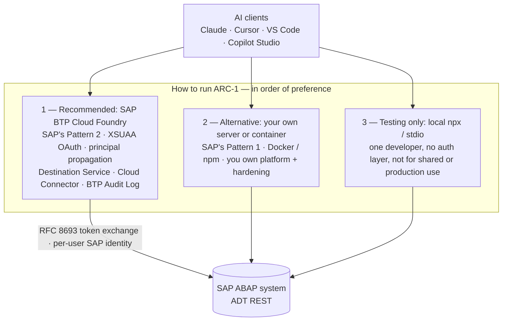

# SAP API Policy & Architecture Alignment

Where ARC-1 sits relative to SAP's published guidance for third-party MCP access, and what the
**SAP API Policy** means for running it against your systems.

!!! warning "The short version"
    ARC-1 is **architecturally very close** to the reference architecture SAP publishes for
    third-party MCP servers — and closing the remaining distance is on our roadmap.

    That is a *different question* from whether the **SAP API Policy** clears your specific use of it.
    ARC-1 drives **ADT REST endpoints** (`/sap/bc/adt/*`) — an interface third parties have built on for
    over a decade, with SAP's own ADT SDK and SAP's own newest tooling on the same endpoints, but one
    that is not listed on the SAP Business Accelerator Hub. Under
    [API Policy v.4.2026a](https://help.sap.com/doc/sap-api-policy/latest/en-US/API_Policy_latest.pdf)
    §1.2 the duty to verify that an endpoint is a Published API sits **with the customer**.

    **Our recommendation: you can run ARC-1 at your own risk — and you should ask your SAP contact
    (account executive, CSP, or partner manager) before rolling it out beyond dev/test.** They are the
    only party who can answer for your contract, your deployment, and your landscape.

    This page is informational and **not legal advice**.

!!! info "Snapshot date"
    Written **2026-07-30** against **SAP API Policy v.4.2026a** and the SAP Architecture Center page
    *Third-Party MCP Access to SAP Solutions*. Both are living documents and SAP's position is moving
    quickly. Re-check the primary sources in [References](#references) before relying on anything here.

---

## 1. Two questions, often conflated

| Question | Who answers it | Where ARC-1 stands |
|---|---|---|
| **Is the architecture sound?** Does the server do what SAP says a third-party MCP server must do — token exchange, no token proxying, scoped auth, rate limits, audit, trace context, stateless scaling? | Engineering; measurable against SAP's published guidance | **Strong.** 18-point evaluation in the [alignment dossier](https://github.com/arc-mcp/arc-1/blob/main/docs/research/2026-07-30-sap-architecture-center-mcp-alignment.md) — met on the large majority, with the deviations named and argued |
| **Is the use permitted?** Does calling these particular SAP endpoints, from an AI agent, comply with the API Policy and your agreements? | **SAP** — your account team and, if it matters commercially, SAP Legal | **Open.** See §3. Not something the project can answer on SAP's behalf |

A tool can be exemplary on the first and still unresolved on the second. That is honestly where ARC-1
is, and where every ADT-based tool is — including `abap-adt-api`, abapGit's ADT bridge, and abaplint's
ADT integrations.

Keeping the two apart is SAP's own framing, not a convenience of ours. SAP Note 3690029 states that
"Clean Core and the API Policy are two independent, orthogonal governance dimensions" — clean core
rates architectural quality and upgrade stability, the API policy governs how SAP's interfaces may be
used. Concretely: an interface can be perfectly clean-core-compliant and still raise the §2.2.2
question, and being API-policy compliant does not make an integration upgrade-safe.

---

## 2. SAP's recommended architecture, and ARC-1's place in it

SAP's [Third-Party MCP Access to SAP Solutions](https://architecture.learning.sap.com/docs/ref-arch/137800)
describes two third-party patterns: an MCP server on a third-party platform (Pattern 1) and a custom
MCP server on SAP BTP (Pattern 2). **ARC-1 can run as either — and the closer you are to Pattern 2,
the closer you are to SAP's guidance.** That is the ranking we recommend:

**Why BTP Cloud Foundry is the recommendation.** It is the only deployment where the full set of
controls SAP's guidance asks for is available at once: XSUAA OAuth at the edge, principal propagation
so each user reaches SAP under their own identity, the Destination Service performing the RFC 8693
token exchange, Cloud Connector for on-premise reachability, and the BTP Audit Log as an audit sink.
Running on your own server is a legitimate Pattern 1 deployment, but platform hardening, credential
lifecycle and TLS termination become yours. Local `npx`/stdio has no auth layer at all — it is a
single-developer convenience for trying ARC-1 out, not a deployment.

See [Deployment](deployment.md) and [BTP Cloud Foundry](btp-cloud-foundry-deployment.md) for the how.

**How ARC-1 measures up against the rest of SAP's guidance** — token exchange, scoped authorization,
audit, trace context, statelessness, OWASP MCP Top 10 — is evaluated point by point, with verdicts and
the deviations argued rather than hidden, in the
[alignment dossier](https://github.com/arc-mcp/arc-1/blob/main/docs/research/2026-07-30-sap-architecture-center-mcp-alignment.md).
Summary: met on the large majority, with the exceptions named there.

SAP also states plainly that in **both** third-party patterns the operational and security
responsibility for the platform, runtime, dependencies and credentials sits with the organization
deploying the server — not with SAP. That is the "at your own risk" framing, in SAP's own words, and it
is the honest basis for the recommendation at the top of this page.

---

## 3. What the API Policy actually says

[SAP API Policy v.4.2026a](https://help.sap.com/doc/sap-api-policy/latest/en-US/API_Policy_latest.pdf)
is short — four sections. Paraphrased, with section numbers so you can check the original:

### 3.1 Published vs. non-published APIs (§1.1, §1.2)

APIs on the **SAP Business Accelerator Hub**, or identified in product-specific documentation, are
*Published APIs* and may be used for their documented purpose. Everything else — in particular
anything marked internal or private — must not be accessed by customer or third-party applications,
unless the documentation permits it or SAP authorizes it. The policy notes such interfaces may change
or disappear without notice, and it puts the **verification duty on customers and partners**: confirm
each endpoint you use is a Published API.

There is an explicit carve-out for **customer-developed ABAP interfaces in private cloud and
on-premise deployments**.

**For ARC-1 this is the open question — but it is more nuanced than "undocumented API".** ADT is not a
back door somebody discovered. Third parties building on ADT is a pattern **SAP itself created and
invited**, and it has been in the open for over a decade:

- **SAP publishes an ADT SDK.** SAP ships an [ADT SDK](https://tools.hana.ondemand.com/#abap) on its
  own tools site so third parties can extend ADT and build their own tooling on it —
  [since 2014](https://community.sap.com/t5/application-development-and-automation-blog-posts/creating-a-abap-in-eclipse-plug-in-using-the-adt-sdk/ba-p/13130846),
  the first time SAP opened its development environment this way. Commercial and community Eclipse
  plugins have shipped on it since.
- **SAP documented how ADT REST APIs are built and consumed.** SAP published a guide on
  [creating and consuming RESTful APIs in ADT](https://www.sap.com/documents/2013/04/12289ce1-527c-0010-82c7-eda71af511fa.html),
  and has described the ABAP language server direction as an
  ["ADT SDK 2.0"](https://community.sap.com/t5/technology-blog-posts-by-sap/abap-development-tools-for-vs-code-everything-you-need-to-know/bc-p/14263439/highlight/true#M186133).
  The REST layer is not a hidden implementation detail SAP has tried to keep closed.
- **A decade of third-party ADT clients.** [abapGit](https://abapgit.org)'s ADT bridge,
  [`abap-adt-api`](https://github.com/marcellourbani/abap-adt-api) and the ABAP remote filesystem
  extension for VS Code, [abaplint](https://abaplint.org), and a long tail of CI and quality tooling
  all speak ADT. This is established, visible, widely-used practice — not a novel access pattern that
  arrived with AI agents.
- **SAP's own newest tooling uses the same endpoints.** ABAP Development Tools for VS Code — and the
  ADT MCP Server bundled inside it — run on ADT (see the
  [comparison guide](arc-1-vs-sap-abap-mcp-server.md)). SAP shipping an ADT-backed *MCP server* is a
  strong signal about direction of travel.

**Where the nuance ends.** The ADT SDK is an *Eclipse client extension* SDK — it lets your plugin use
ADT's client-side APIs inside the IDE. It is not a publication of the ADT HTTP wire protocol as a
third-party API contract, and `/sap/bc/adt/*` is still not listed on the Business Accelerator Hub. A
tool that speaks the wire protocol directly — ARC-1, `abap-adt-api`, abapGit's bridge — is relying on
an interface that is long-standing, SAP-enabled and widely used, but not formally *Published* in the
§1.1 sense. The §1.2 on-premise carve-out covers interfaces *you* build, not ADT.

So the honest position is neither "this is forbidden" nor "this is cleared". It is: **a well-established,
SAP-enabled practice whose formal status under the current policy only SAP can confirm** — which is
exactly why the recommendation is to ask them. A minority of what ARC-1 touches is documented
separately (for example the UI5 ABAP Repository OData service and gCTS), but ADT is the dominant
surface.

### 3.2 Agentic and generative AI access (§2.2.2)

The policy restricts using SAP APIs for interaction or integration with **(semi-)autonomous or
generative AI systems that plan, select, or execute sequences of API calls**, *except through
SAP-endorsed architectures, data services, or service-specific pathways intended for that purpose*.
The same clause also restricts scraping and large-scale extraction or replication.

An MCP server driven by an LLM agent is precisely the pattern described. The question is therefore
whether your setup runs "through an SAP-endorsed architecture". The Architecture Center page for
third-party MCP access states that customers and partners **may** use third-party MCP servers subject
to its conditions, which reads as an endorsed pathway for the MCP layer itself. Whether that
endorsement extends to the *underlying ADT endpoints* is not something the page addresses — and it is
exactly the kind of question to put to your SAP contact.

Treat this as a settled SAP position rather than one clause in one PDF. SAP restates the same
prohibition in customer-facing collateral — the *Clean core integration* white paper (p. 26) lists
"unendorsed agentic or AI access" among usage patterns prohibited across **all** clean core levels —
and applies §2.2.2 at the technology level in SAP Note 3690029, which flags JDBC/ODBC as
"must not be used for systematic/large-scale extraction (API Policy Section 2.2.2)" and marks
ODP-RFC forbidden outright. None of that changes ARC-1's position; it means the clause is being
propagated into SAP's operational guidance, so expect your account team to know it.

### 3.3 No circumvention of API controls (§3)

SAP may monitor usage and throttle, suspend or terminate access for non-compliance. Customers,
partners and third parties must not bypass, disable or circumvent API controls — explicitly including
via intermediary services, custom code, **proxies, gateways, impersonation techniques** or similar.

ARC-1 is an intermediary, so this clause deserves a direct answer:

- **It adds controls, it does not remove any.** Every call still passes SAP's own authorization
  (`S_DEVELOP`, `S_ADT_RES`, package authority). ARC-1 layers a safety ceiling, scopes, package
  allowlists and deny-actions *on top*. Nothing in ARC-1 disables or weakens a SAP-side control.
- **Principal propagation means no impersonation.** Each MCP user is exchanged to their *own* SAP
  identity, so SAP-side authorization and audit see the real human.
- **Be aware of the shared-identity modes.** A shared service account (`SAP_USER`/`SAP_PASSWORD`) and
  the default-off shared-Basic multi-target identity make SAP see one technical user for many humans.
  That is a legitimate, documented deployment choice — but if you are reasoning about §3, prefer
  principal propagation, which is the recommended topology anyway.

### 3.4 Rate limits and system health (§2.1, §2.2.1)

Specific per-API rate limits, quotas and bulk-extraction limits live in the product documentation, and
§2.2.1(c) prohibits use that risks system performance, stability or security.

ARC-1 ships rate limiting for exactly this: three layers — per-IP at the OAuth and MCP edge, per-user
tool-call quotas, and a server-wide cap on concurrent SAP requests — so you can bound agent traffic to
whatever your system tolerates. Configure them against your landscape's quotas; see
[Rate Limiting](rate-limiting.md) for the layers and
[Best Practices](deployment-best-practices.md) for recommended values and how they behave across
multiple instances.

---

## 4. The MCP Gateway question

SAP's preferred managed answer is the **MCP Gateway in SAP Integration Suite** (Premium and Enhanced
editions). Today it creates MCP servers from three source types:

| Source | What it does |
|---|---|
| API artifact on Integration Cell | Exposes a deployed integration API as MCP tools |
| **HTTP endpoint with an OpenAPI specification** | Wraps a REST service as MCP tools (OpenAPI 3.0.0–3.0.3) |
| RFC-based backend | Exposes selected RFC operations as MCP tools |

All three turn **an API into an MCP server**. As of this writing there is no documented path to
register an **existing external MCP server** — such as ARC-1 — as an upstream tool provider behind the
Gateway. SAP marketing material describes the Gateway as aggregating "external MCP servers", and the
Gateway does front external *systems*; but the documented creation methods are API-to-MCP wrapping, not
MCP-to-MCP federation. Verify the current state before planning around it, and treat this paragraph as
the most likely part of this page to go stale.

**If and when that federation lands, ARC-1 behind the Gateway would close several remaining gaps at
once:** rate limits enforced centrally against real SAP quotas, one governed and monitored entry point,
SAP-managed handling of MCP spec upgrades, and — most importantly — an SAP-operated component in the
path, which materially changes the §2.2.2 "SAP-endorsed architecture" conversation. That is the
alignment target we are building toward.

---

## 5. What we recommend

1. **Dev and test: go ahead.** Run ARC-1 against non-production systems at your own risk. This is where
   nearly all of its value is anyway — it is developer tooling.
2. **Start read-only — it is not a lesser mode.** With `SAP_ALLOW_WRITES=false` ARC-1 reads your system
   and reasons about it, but changes nothing. That is often the *better* workflow, not a limitation:
   ask the model to explain the object, find the bug, and **respond with the code fix**, then read the
   diff and apply it yourself in ADT or your IDE. You get the full analytical value — full dependency
   context, ATC findings, where-used, dumps, SQL insight — while every change to the system stays a
   deliberate human action. Many teams never need to turn writes on. It also makes the conversation in
   step 4 much simpler, because nothing is mutating anything.
3. **Before production or a wider rollout, ask SAP.** Your account executive, Customer Success Partner
   or partner manager. Put the question in writing so you have the answer in writing.
4. **Ask specifically.** Vague questions get vague answers. Useful ones:
    - Does our agreement permit third-party tooling to call ADT REST endpoints (`/sap/bc/adt/*`)?
      Does the answer differ between on-premise, private cloud and public cloud?
    - Does API Policy §2.2.2 permit AI-agent-driven access over those endpoints, and if so under which
      endorsed architecture?
    - Is the Architecture Center guidance for third-party MCP access the applicable pathway for us?
    - Are there rate limits or quotas we should configure against for this access pattern?
5. **Deploy the recommended way regardless.** BTP Cloud Foundry with principal propagation, a tight
   `SAP_ALLOWED_PACKAGES` if writes are on, rate limits configured, audit sink wired — the
   [Best Practices checklist](deployment-best-practices.md) is the full list. It is the right posture on
   the merits, and it is the configuration that makes the conversation above easy.
6. **Re-check periodically.** SAP's API Policy has moved twice recently and drew formal pushback from
   DSAG; the Architecture Center MCP guidance is newer still. Assume this page ages.

!!! note "If SAP tells you no"
    Take SAP's answer over this page. It is their platform, their contract and their support
    commitment. If you would like the project to know what you were told, open a
    [discussion](https://github.com/arc-mcp/arc-1/discussions) — the more real answers the community
    has, the less anyone has to guess.

---

## References

**SAP primary sources**

- [SAP API Policy v.4.2026a (PDF)](https://help.sap.com/doc/sap-api-policy/latest/en-US/API_Policy_latest.pdf) — the authoritative text. Four sections; worth reading in full.
- [Third-Party MCP Access to SAP Solutions](https://architecture.learning.sap.com/docs/ref-arch/137800) — SAP Architecture Center reference architecture; the guidance ARC-1 is measured against.
- [A2A and MCP for Interoperability](https://architecture.learning.sap.com/docs/ref-arch/76ec36) — when SAP recommends MCP vs. A2A.
- [Agentic AI & AI Agents](https://architecture.learning.sap.com/docs/ref-arch/98efa0) — the wider SAP agent architecture.
- [Model Context Protocol in SAP Integration Suite](https://help.sap.com/docs/SAP_INTEGRATION_SUITE/9519789d5664487f8b9cd89eba514477/9eb9239c1b4c458198ca5234d191f8bd.html) — MCP Gateway documentation.
- [SAP Business Accelerator Hub](https://api.sap.com/) — the register of Published APIs referenced by §1.1.
- [White paper: Clean core integration](https://www.sap.com/documents/1327955) — restates the §2.2.2 agentic-access prohibition (p. 26) and the clean core / API policy separation (§3.4.4).
- [SAP Note 3690029](https://me.sap.com/notes/3690029) — *Integration Technologies and Frameworks in Context of Clean Core Integration*. Source of the "two independent, orthogonal governance dimensions" wording and the A–D level table for interface technologies.

- [Creating an ABAP in Eclipse plug-in using the ADT SDK](https://community.sap.com/t5/application-development-and-automation-blog-posts/creating-a-abap-in-eclipse-plug-in-using-the-adt-sdk/ba-p/13130846) — SAP Community, on the SDK SAP published for third-party ADT tooling (§3.1).

**ARC-1 documents** — this page covers policy and positioning only; the technical detail lives here:

- [Alignment dossier](https://github.com/arc-mcp/arc-1/blob/main/docs/research/2026-07-30-sap-architecture-center-mcp-alignment.md) — the point-by-point architecture evaluation behind §2, including what we deliberately did *not* build.
- [Security model](https://github.com/arc-mcp/arc-1/blob/main/docs/security-model.md) — invariants, residual-risk register, OWASP MCP Top 10 mapping.
- [ARC-1 vs. the SAP ABAP MCP Server](arc-1-vs-sap-abap-mcp-server.md) — including SAP's own ADT-backed MCP server.
- [Deployment](deployment.md) · [Best Practices](deployment-best-practices.md) · [Authorization](authorization.md) · [Principal Propagation](principal-propagation-setup.md) · [Rate Limiting](rate-limiting.md) · [Security Guide](security-guide.md)

**Context on the policy debate** (third-party reporting, not SAP positions)

- [DSAG criticises the new SAP API Policy](https://www.cio.com/article/4166172/dsag-criticizes-saps-new-api-policy.html) — the user-group response and SAP's stated intent.
- [SAP user group slams 'uncertainty' in API policy](https://www.theregister.com/2026/04/30/germanspeaking_user_group_slams_uncertainty/) — what remains unclear for customers.
