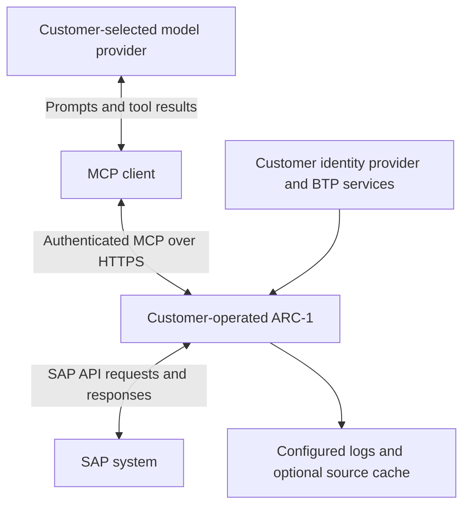

# Security & Trust

ARC-1 connects AI clients to SAP development APIs. Enterprise approval depends on the
software artifact, the deployed configuration, and the customer's client/model environment.
This page gives security reviewers a starting point and links to the supporting evidence.

!!! tip "Reviewing ARC-1 for your organization?"

    Start with [Dependency & Release Security](dependency-security.md) for dependency checks,
    SBOM coverage, and artifact verification. Use the [Hardening Guide](security-guide.md) for
    deployment controls and the [Security Assessment](security-assessment.md) for plain-language
    answers and a checklist you can copy into your review.

## Security posture at a glance

| Review area | Available control | Evidence and boundary |
|---|---|---|
| SAP changes and data access | Writes, table preview, free SQL, transport mutations, and Git mutations require separate opt-ins | [Authorization & Roles](authorization.md). Package restrictions apply to writes; reads rely on SAP authorization. |
| User identity | XSUAA/OIDC for MCP authentication; Principal Propagation for per-user SAP identity | [Authentication](enterprise-auth.md) and [Principal Propagation](principal-propagation-setup.md). MCP authentication alone does not establish per-user identity in SAP. |
| Dependencies and releases | Dependency update automation, vulnerability checks, npm provenance, production npm SBOM | [Dependency & Release Security](dependency-security.md). Coverage and enforcement differ by artifact and workflow. |
| Auditability | Structured events, central redaction, stderr/file/BTP Audit Log sinks | [Audit logging](security-guide.md#9-audit-logging). Storage access, forwarding, retention, and incident monitoring need operator configuration. |
| Vulnerability handling | Private reports, advisories, supported-version policy, severity-based response targets | [Security policy](https://github.com/arc-mcp/arc-1/blob/main/SECURITY.md). Targets are best-effort, non-contractual. |
| Design review | Public engineering threat model, residual risks, and remediation history | [Security model](https://github.com/arc-mcp/arc-1/blob/main/docs/security-model.md) and [review record](https://github.com/arc-mcp/arc-1/blob/main/docs/security-review-2026-06.md). These are maintainer-led, AI-assisted engineering records. |

Use documentation from the source revision of the artifact being evaluated. The website follows
`main` and can describe changes that have not been released. The linked engineering review is a
historical record with an ongoing risk register, not an independent audit of every release.
This evidence pack does not establish ISO 27001 certification, a SOC 2 report, or SAP certification.

## Where data goes and who controls it

The diagram describes a shared HTTP deployment. Local stdio uses process input/output and has
no MCP HTTP authentication. BTP destinations and Cloud Connector depend on the selected topology.

| Boundary | What must be assessed | Owner |
|---|---|---|
| MCP client and model | SAP source, metadata, errors, and approved business-data results can become model input. Review retention, training use, region, other connected tools, and user approvals. | Customer's AI/platform team and selected provider |
| ARC-1 hosting and network | TLS, ingress/egress, host patches, secrets, backups, monitoring, and access to the deployed configuration | Customer's platform/BTP team |
| SAP permissions | Least-privileged SAP roles, accessible systems and data, trust configuration, and transport/change process | Customer's SAP Basis and security team |
| ARC-1 software | Server-side permission checks, release contents, vulnerability handling, and documented limitations | ARC-1 maintainer |
| Logs and cache | Logs contain operational metadata despite redaction. An explicitly selected SQLite cache stores source bodies in cleartext; use an encrypted volume or memory/none as appropriate. | Customer's operations and data owners; see [Caching](caching.md#security) |

Self-hosting ARC-1 does not keep returned SAP information out of the customer's model provider.
ARC-1's SAP permissions also cannot control how a client uses information after receiving it.
Include the entire client/model path in the approval.

## Enterprise assessment

Use the [Security Assessment](security-assessment.md) for short answers to common customer
questions, a deployment checklist, and a decision record you can copy into an approval ticket.
It covers data flow, permissions, dependencies, logs, updates, and available assurance.

Record the selected source revision, the customer's actual configuration, and any conditions
for approval. A supported capability is not evidence that it is enabled in a deployment.

## Recommended initial deployment

1. Evaluate in a development SAP system with an approved MCP client/model configuration.
2. Use per-user identity and least-privileged SAP roles. For production Principal Propagation,
   set `SAP_PP_STRICT=true` explicitly and follow the [BTP topology guide](btp-overview.md).
3. Keep writes, business-data preview, free SQL, transport writes, and Git writes off until the
   relevant use case is approved. Keep optional extensions and experimental UI off initially.
4. For BTP builds from a clone, approve an exact source commit, retain the lockfiles, and capture
   [build and staging evidence](dependency-security.md#btp-builds-from-source). For other
   distributions, approve the artifact identity and scan its contents. Recheck the evidence
   when vulnerability information changes.
5. Verify denial cases, audit attribution, log handling, and the upgrade/rollback process in the
   intended environment. Enable additional capabilities through the customer's change process.

Read-only access still exposes source and metadata and can produce SAP workload, including
checks and tests. Prompt injection in SAP content remains a risk: the server ceiling limits
permitted operations, but does not establish that an allowed request matches the human's intent.
MCP also assigns responsibilities to the host/client for consent and handling tool results; see
the [MCP security principles](https://modelcontextprotocol.io/specification/2025-11-25#security-and-trust-safety).

## Reporting and security updates

Use [private vulnerability reporting](https://github.com/arc-mcp/arc-1/security/advisories/new)
or the fallback contact in [SECURITY.md](https://github.com/arc-mcp/arc-1/blob/main/SECURITY.md).
Track [published advisories](https://github.com/arc-mcp/arc-1/security/advisories) and
[release notes](release-notes.md). The [newsletter](newsletter.md) is an additional update
channel; it does not replace advisory monitoring or the customer's patch process.
