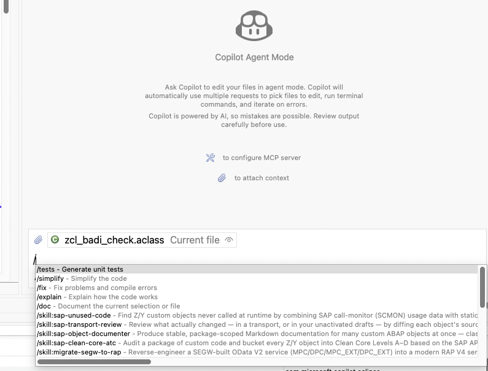

# Use skills in Eclipse

Install skills in a normal local project in your Eclipse workspace, then enable them in Copilot
Agent Mode. They appear in the `/skill:<name>` menu.

You need a working [ARC-1 connection](#arc-1-mcp-in-eclipse) and
[installed workflow skills](skills.md).

## Eclipse Setup

1. Install or update **GitHub Copilot for Eclipse**, sign in, and use **Agent Mode**. Current Copilot for Eclipse supports Agent Mode, MCP, Custom Agents, and Agent Skills. Eclipse 2024-09 or newer is required for the Copilot extension.
2. Create a normal local folder. Pick the command for your OS:

   ```bash
   # macOS / Linux
   mkdir -p ~/ADT_ECLIPSE_ARC1
   ```

   ```powershell
   # Windows PowerShell
   New-Item -ItemType Directory -Force "$env:USERPROFILE\ADT_ECLIPSE_ARC1"
   ```

3. In Eclipse, choose **File** → **Open Projects from File System...** and import that folder into the same workspace as your ABAP projects. Use `~/ADT_ECLIPSE_ARC1` on macOS/Linux or `%USERPROFILE%\ADT_ECLIPSE_ARC1` on Windows.
4. If dot folders are hidden, open the Project Explorer view menu, go to **Filters and Customization**, and disable the `.* resources` filter.
5. Open a terminal in the local project folder and install skills:

   ```bash
   # macOS / Linux
   cd ~/ADT_ECLIPSE_ARC1
   npx skills add arc-mcp/arc-1 --agent github-copilot --list
   npx skills add arc-mcp/arc-1 --agent github-copilot
   ```

   ```powershell
   # Windows PowerShell
   Set-Location "$env:USERPROFILE\ADT_ECLIPSE_ARC1"
   npx skills add arc-mcp/arc-1 --agent github-copilot --list
   npx skills add arc-mcp/arc-1 --agent github-copilot
   ```

6. In Eclipse, open **Window** → **Preferences** → **GitHub Copilot** → **Chat** and turn on **Enable Skills**. This controls whether Agent Skills can enrich chat context.
7. Start a new Copilot Chat in **Agent Mode**, type `/`, and confirm entries such as `/skill:sap-unused-code` or `/skill:generate-rap-service` appear. Use a skill explicitly with `/skill:<name>`, or ask a task that matches a skill description and let Copilot load relevant context.



## Optional instructions and custom agents

Keep detailed workflows in skills. For short always-on guidance, use **Preferences** →
**GitHub Copilot** → **Custom Instructions**, or add `.github/copilot-instructions.md` to the local
project. **Load custom instructions from** selects which projects contribute instructions.

A named custom agent is optional. Store it as `.github/agents/<name>.agent.md` and manage it under
**Preferences** → **GitHub Copilot** → **Custom Agents**. This does not control skill discovery.

## ARC-1 MCP In Eclipse

In Copilot Chat, choose **Configure Tools...** or open **Preferences** → **GitHub Copilot** → **MCP**.

Use one of these ARC-1 connection patterns:

**Local quickstart-style `npx` config** — Eclipse starts ARC-1 directly as an MCP server. This is the same local shape as the [Quickstart](quickstart.md), adapted for Copilot's MCP configuration:

```json
{
  "servers": {
    "arc1-local": {
      "command": "npx",
      "args": ["-y", "arc-1@latest"],
      "env": {
        "SAP_URL": "https://your-sap-host:44300",
        "SAP_USER": "YOUR_USER",
        "SAP_PASSWORD": "YOUR_PASS",
        "SAP_CLIENT": "100"
      }
    }
  }
}
```

On Windows, if Eclipse cannot resolve `npx`, use `"command": "npx.cmd"` or the absolute path returned by `where.exe npx`.

**BTP Cloud Foundry URL login** — use this when ARC-1 is deployed centrally with XSUAA/OAuth. Configure only the `/mcp` URL and let Copilot complete the browser login:

```json
{
  "servers": {
    "arc1-btp": {
      "url": "https://<your-administrator-provided-route>/mcp"
    }
  }
}
```

After connecting, ask Copilot to call `SAPRead(type="SYSTEM")` and verify the returned system.
See [Quickstart](quickstart.md) for server setup or [XSUAA setup](xsuaa-setup.md) for BTP login.

## Troubleshooting

- Use a new Agent Mode chat after adding or updating skills.
- Check that the local skills folder is imported as an Eclipse project, not just present on disk.
- Confirm **Enable Skills** is turned on under **Window** → **Preferences** → **GitHub Copilot** → **Chat**.
- Type `/` in a fresh Agent Mode chat and look for `/skill:<name>` entries. If newly added skills do not appear, close the chat and restart Eclipse.
- Skills do not appear in the **Custom Agents** table; that table is only for `.github/agents/<name>.agent.md`.
- Custom instructions are separate from skills. Use the workspace text box or a project `.github/copilot-instructions.md` only for a short always-on baseline.
- On Windows, `~` means your user profile; in PowerShell examples use `$env:USERPROFILE`, and in Explorer paths use `%USERPROFILE%`.
- Keep one local skills project in the workspace instead of scattering instruction files across many ABAP projects.
- If an XSUAA/OIDC MCP login gets stale in Eclipse, see [XSUAA Setup → Eclipse GitHub Copilot](xsuaa-setup.md#eclipse-github-copilot).

References: [SAPDEV.EU Agentic Skills for ABAP Development](https://www.sapdev.eu/agentic-skills-for-abap-development/), [GitHub Copilot for Eclipse](https://github.com/microsoft/copilot-for-eclipse), [GitHub Changelog: Copilot in Eclipse skills and custom-instructions preference](https://github.blog/changelog/2026-06-02-github-copilot-in-eclipse-byok-skills-and-chat-updates/), [GitHub Docs: MCP in Eclipse](https://docs.github.com/en/copilot/how-tos/provide-context/use-mcp-in-your-ide/extend-copilot-chat-with-mcp), [GitHub Docs: custom agents in Eclipse](https://docs.github.com/en/copilot/how-tos/use-copilot-agents/cloud-agent/create-custom-agents-in-your-ide), and [`skills` CLI](https://github.com/vercel-labs/skills#readme).

[All skills](skills.md)
