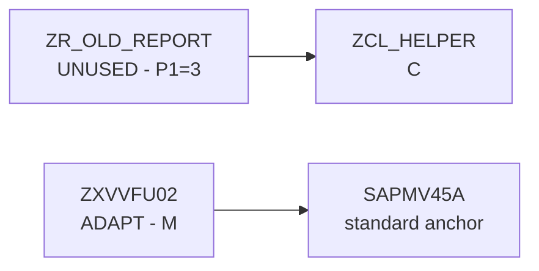

# SAP Migration Dossier

Create an evidence-backed migration dossier instead of a one-object fix report. This skill composes ARC-1 inventory, usage, dependency, ATC, clean-core, and documentation workflows into a package/scope-level audit with optional persistent review and visualization artifacts.

For the design rationale learned from `sergio-gracia/ecc-s4h-migrator-auditor`, read `references/auditor-patterns.md` when the user asks for persistent artifacts, human review, imported extracts, or HTML/graph output.

## First Decisions

Do not silently collapse the workflow to the simplest chat answer when the user wants an audit. Ask for missing decisions, but keep it to these three:

| Decision | Options |
|---|---|
| Scope | package, recursive package, namespace/prefix, object list, uploaded/local extract |
| Evidence depth | `standard` ARC-1 only, `deep` with governed `SAPQuery` tables, `reviewed` with draft cards and validation gate |
| Output | chat only, local folder, Markdown, HTML, JSONL/CSV, Mermaid/Graphviz, static dashboard |

If the user does not specify output and the scope has more than a few objects, recommend a local folder:

```
docs/migration-dossiers/<scope-slug>/<YYYY-MM-DD>/
```

## Evidence Profiles

### Standard

Use existing ARC-1 read and analysis tools. This works without free SQL and is the default when the admin has not enabled SQL.

Collect:
- object inventory via `SAPRead(type="DEVC")` or `SAPSearch`
- source/metadata via `SAPRead`
- dependencies via `SAPContext` and `SAPNavigate(action="references")`
- ATC findings via `SAPDiagnose(action="atc")`
- API release state via `SAPRead(type="API_STATE")` or mcp-sap-docs when available
- versions and transport history via `SAPRead(type="VERSIONS")` and `SAPTransport(action="history")`

### Deep

Use only when the user wants ECC-style enhancement coverage and the ARC-1 server allows `SAP_ALLOW_FREE_SQL=true`. Check authorization and scope first; do not run unbounded system-wide queries.

Add optional table evidence:
- runtime usage from SCMON/SUSG using the `sap-unused-code` workflow
- classic exits via `MODATTR`, `MODACT`, `MODSAP`, `TRDIR` for `ZX*` includes
- classic BAdIs via `SXC_ATTR` / `SXC_EXIT` if present
- standard modifications via `SMODILOG` / `SMODISRC`
- cross-reference tables (`CROSS`, `WBCROSSGT`) only for narrowed object sets; prefer `SAPContext`/`SAPNavigate` first

If any table is unavailable or forbidden, record the gap in `methodology.md` and continue with the standard profile.

### Reviewed

Use when the dossier will be customer-facing or used for planning decisions. Create draft assessment cards first; final reports must include only `validated` or `corrected` cards unless the user explicitly requests a draft report.

Card status values:

```
ai_draft | validated | corrected | skipped | ai_error
```

Decision enums:

```
REMOVE | KEEP | ADAPT | COVERED_BY_STANDARD | UNDETERMINED
```

Keep clean-core level and unused-code status separate:

```
cleanCoreLevel: A | B | C | D | unknown
usageStatus: USED | LIKELY_UNUSED | UNUSED | INDETERMINATE
```

## Workflow

### 1. Bootstrap and Scope

If `system-info.md` is absent and live ARC-1 access is available, run the `bootstrap-system-context` workflow first. Record SID, client, release, system type, HANA availability, feature flags, and whether ATC, transports, SCMON/SUSG, and free SQL are available.

Resolve scope:
- Package: `SAPRead(type="DEVC", name="<package>")`
- Prefix: call `SAPSearch` per relevant type (`PROG`, `CLAS`, `FUGR`, `FUNC`, `DDLS`, `BDEF`, `SRVD`, `TABL`)
- Object list: resolve each ambiguous item with `SAPSearch`
- Local extract: parse the supplied JSON and mark evidence source as imported, not live ARC-1

Stop and ask before auditing more than 100 objects unless the user explicitly chose a persistent dossier mode.

### 2. Build the Inventory

For each object, collect a compact inventory row:

```
id, type, name, package, description, loc, author, changedOn,
sourceHash, hasSource, dynamicCallHints, transportHistory, versionInfo
```

Prefer ARC-1 source reads over raw table extraction. Use `SAPRead(type="CLAS", method="*")` for class APIs, `SAPRead(type="DDLS", include="elements")` for CDS fields, and `SAPRead(type="ENHO")` for enhancement metadata when object names are known.

For local artifacts, write:

```
inventory.json
inventory.csv
methodology.md
```

### 3. Add Usage and Retirement Evidence

Use the `sap-unused-code` workflow when SCMON/SUSG data is available. Otherwise, record `usageStatus=INDETERMINATE` and say which runtime source was missing.

For each unused or likely-unused object, add static reference evidence:

```
SAPNavigate(action="references", type="<type>", name="<name>")
```

Do not recommend deletion solely from a zero-usage observation. State whether the measured source is SCMON, SUSG, ST03N, or unavailable.

### 4. Add Migration and Clean-Core Evidence

Run ATC per object or per manageable batch:

```
SAPDiagnose(action="atc", type="<type>", name="<name>", variant="<variant>")
```

Use `sap-clean-core-atc` logic for package-level Clean Core A-D rollups. Use `migrate-custom-code` only for selected objects or findings that the user wants to explain or remediate; do not attempt mass automated fixes as part of a dossier.

Record per object:

```
atcPriority1, atcPriority2, atcPriority3,
worstCleanCoreLevel, topViolations[], successorHints[]
```

### 5. Create Draft Assessment Cards

Create cards for objects with migration relevance:
- user exits / `ZX*` includes
- BAdI implementations
- enhancement implementations (`ENHO`)
- standard modifications
- high-risk Clean Core C/D objects
- used objects with priority-1 ATC findings
- unused large objects that might remove migration scope

Each card must include bounded context:

```
object id, type, package, standard anchor if known,
LOC, last change, usage evidence, dynamic-call flag,
top dependencies/callers, ATC summary, clean-core level,
source excerpt or full source if small
```

Draft assessments must be strict JSON-compatible records:

```json
{
  "status": "ai_draft",
  "classification": "REMOVE",
  "effort": "S",
  "confidence": 0.82,
  "functionalSummary": "...",
  "rationale": "...",
  "risks": ["..."],
  "questions": ["..."],
  "evidenceRefs": ["inventory:ZCL_FOO", "atc:ZCL_FOO:1"]
}
```

If confidence is low, source is truncated, usage is missing, or dynamic calls exist, lower confidence and add concrete customer questions.

### 6. Review Gate

If the user selected `reviewed`, write draft cards and ask for review decisions rather than publishing them as final.

Supported review actions:
- validate as-is
- correct classification/effort/rationale
- add note
- skip

For local artifacts, use append-only files where practical:

```
cards.jsonl
reviews.jsonl
review-summary.md
```

The final reviewed dossier includes only `validated` and `corrected` cards. If the user asks for a draft report, label it prominently as unreviewed and keep a separate filename such as `draft-report.html`.

### 7. Generate Outputs

Let the user choose one or more outputs:

| Output | Use |
|---|---|
| `report.md` | editable consultant handoff |
| `report.html` | self-contained executive dossier, printable to PDF |
| `inventory.csv` / `cards.csv` | Excel, BI, or PMO planning |
| `inventory.json` / `cards.jsonl` | reruns, review queues, integration |
| `graph.mmd` | Mermaid dependency/risk visualization |
| `dashboard.html` | local filtering/search without a server |

Recommended report sections:
1. Executive summary
2. Scope and methodology
3. Usage and retirement candidates
4. Standard modifications / SPAU risk
5. Clean-core level distribution
6. ATC priority findings
7. Reviewed migration cards
8. Open questions and assumptions
9. Integrity and evidence appendix

Always declare evidence gaps: missing SCMON/SUSG, blocked SQL tables, unavailable ATC variants, incomplete cross-reference indexes, dynamic calls, generated source, and unreviewed cards.

## Visualization

When visualization is requested, generate a bounded graph rather than the whole system. Default to the top 50 high-risk or high-fanout nodes unless the user asks for more.

Mermaid example:



Use color classes for risk when emitting Mermaid or HTML:
- red: standard modifications, Clean Core D, ATC P1
- amber: ADAPT, Clean Core C, likely unused
- green: REMOVE candidates with no runtime/static blockers
- blue: KEEP / covered by standard

## Safety Rules

- Do not run unscoped system-wide extraction.
- Do not use `SAPQuery` unless free SQL is enabled and the user chose deep evidence.
- Do not treat zero ATC findings as clean if the object is `$TMP` or ATC skipped it.
- Do not delete, update, activate, or transport objects from this skill.
- Do not publish AI-only assessments as final decisions unless explicitly labeled draft.
- Preserve SAP authorization and ARC-1 server safety ceilings; gaps are report findings, not reasons to bypass controls.
